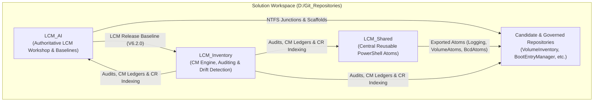

# Workspace Active Context & LCM Operational Manifest

**Last Updated:** 2026-09-04  
**Workspace Root:** `D:\Git_Repositories`  
**Governance Framework:** Lifecycle Model (LCM V6.2.0)  
**Parent Workspace:** `D:\VSCode-Workspaces\Solution.code-workspace`

---

## 1. Core LCM Methodology Pillars

The workspace operates on a triadic governance and implementation structure:

1. **[LCM_AI](file:///d:/Git_Repositories/LCM_AI/README.md) (Governance & Methodology Baseline Authority):**
   * Releases and maintains the authoritative LCM standard (currently `V6.2.0`).
   * Owns repository templates (`templates/repo-scaffold/`), onboarding engines (`Invoke-LCMOnboardRepo.ps1`), and quality gates (`WorkspaceQualityGates.psm1`, `Test-WorkspaceReadiness.ps1`).
   * Projects governance via NTFS directory junctions into onboarded repositories.

2. **[LCM_Inventory](file:///d:/Git_Repositories/LCM_Inventory/README.md) (Configuration Management & Auditing):**
   * Tracks lifecycle state across all 33+ directories under `D:\Git_Repositories\`.
   * Classifies directories: `active-design-workshop`, `lcm-governed`, `standard-git`, `non-git`, `legacy-retired`, `parent-infra`.
   * Manages append-only CM audit trail (`logs/cm_activity.log`), baseline snapshots (`data/baselines/`), and global Change Request (CR) indexes.

3. **[LCM_Shared](file:///d:/Git_Repositories/LCM_Shared/README.md) (Central Reusable PowerShell Atoms):**
   * Decoupled library of reusable functional modules:
     * `Logging.psm1`: Structured session logging and transcript capture.
     * `VolumeAtoms.psm1`: Low-level volume, serial, `fltmc`, and EFI System Partition resolution.
     * `BcdAtoms.psm1`: Boot Configuration Data parser and dual-format backup generator.
     * `PrivatePaths.psm1` & `TranscriptTools.psm1`: Path resolution and transcript tools.

---

## 2. Environment & Tooling Invariants

* **Tooling Authority Root:** `D:\Tools\`
* **Python Runtime:** Python 3.14 Base at `D:\Tools\Python314\python.exe` and Shared Virtualenv at `D:\Git_Repositories\.venv\Scripts\python.exe` (with `google-antigravity` SDK).
* **PowerShell Runtime:** PowerShell 7 (`pwsh.exe` 7.0+) at `D:\Tools\PowerShell\7\pwsh.exe`.
* **Visual Differential Review:** Beyond Compare 5 at `D:\Tools\Beyond Compare 5\BCompare.exe` via `Invoke-BeyondCompareReview.ps1` / `Submit-ReviewResult.ps1` (`RR.ps1`).
* **Fast Search & Content Indexing:** `Everything.exe` and `es.exe` (v1.5.0.1418b (x64)+) at `D:\Tools\Everything 1.5a\` (Transitioning to `D:\Tools\Everything\`).
  * Index Database: `A:\EverythingIndex\Everything.db` (Indexed roots: `D:\Git_Repositories\**`, `D:\Tools\**`, `D:\OneDrive\Documents\**`).
  * IPC Communication: `\\.\pipe\Everything IPC`.
* **Permanent Memory Architecture:** LCM durable memory is formally anchored across reboots in:
  1. `.agents/ACTIVE_CONTEXT.md` (Workspace state and active work streams)
  2. `.copilot/CopilotTools.md` (Tool paths and indexer specifications)
  3. `.agents/rules/` (Authoritative invariant rules)
  4. [`.agents/OPERATOR_ADVICE.md`](./OPERATOR_ADVICE.md) (Operator know-how and working agreements; read it before using a tool it mentions, refresh it on "save all")
* **IDE Settings ([.vscode/settings.json](file:///d:/Git_Repositories/.vscode/settings.json)):**
  * `antigravity.toolExecutionPolicy`: `always-proceed`
  * `antigravity.fileAccessPolicy`: `allow`
  * `antigravity.terminalExecutionPolicy`: `always-proceed`
  * `antigravity.autoExecuteCommands`: `true`
  * `files.eol`: `\r\n` (CRLF)
  * `files.encoding`: `utf8` (without BOM)
  * `git.ignoredRepositories`: Includes all 10 non-git directories.

---

## 3. LCM Governance Rules & Exceptions

All rules in [.agents/rules/](file:///d:/Git_Repositories/.agents/rules/) are authoritative:

1. **[ReviewCommitGovernancePolicy.md](file:///d:/Git_Repositories/.agents/rules/ReviewCommitGovernancePolicy.md):**
   * `RULE-REV-001`: Commits require prior validated review disposition (`ACCEPTED` / `ACCEPTED_WITH_EDITS`).
   * `RULE-REV-004`: Review-gating takes strict precedence over general permissions.
   * **Exemption:** `HaSSD06` workspace is **exempt** from mandatory review-gating.
2. **[MethodEfficiencyPolicy.md](file:///d:/Git_Repositories/.agents/rules/MethodEfficiencyPolicy.md):**
   * `RULE-EFF-001`: Mechanical telemetry, baseline snapshots, and logs are automatically accepted without review gates.
   * `RULE-EFF-002`: Zero-test cascade on log/evidence mutations.
   * `RULE-EFF-004`: Direct agent execution without chat planning blocks; gating handled exclusively downstream via Beyond Compare (`RR.ps1`).
3. **[ElevationPolicy.md](file:///d:/Git_Repositories/.agents/rules/ElevationPolicy.md):**
   * `RULE-ELEV-001` through `RULE-ELEV-003`: Explicit `execution_context` in `LCM_Inventory/config.json`; `-NoElevation` support for automated runners.
4. **[LanguagePolicy.md](file:///d:/Git_Repositories/.agents/rules/LanguagePolicy.md):**
   * English required across code, comments, and docs (with translation task exceptions).
5. **[RepositoryContextPolicy.md](file:///d:/Git_Repositories/.agents/rules/RepositoryContextPolicy.md):**
   * `RULE-CTX-001`: Active document / path scope resolution.
   * `RULE-CTX-002`: Fast-tier ingestion (`LCM_Inventory/config.json`, `README.md`, proposals) with unonboarded candidate fallback.
   * `RULE-CTX-003`: Zero redundant scan invariant.
   * `RULE-CTX-004`: Continuous methodology triad awareness.

---

## 4. Active Work Streams & Task State

### Stream A: Home Assistant / Tuya $\rightarrow$ IKEA Migration ([HaSSD06](file:///d:/Git_Repositories/HaSSD06/))
* **Goal:** Migrate 11 Tuya WLAN smart plugs to IKEA Zigbee (INSPELNING / TRETAKT) on Zigbee2MQTT (Sonoff MG24 Dongle, Channel 25).
* **Key Artifacts:**
  * Mapping matrix: [tuya_ikea_mapping_matrix.csv](file:///d:/Git_Repositories/tuya_ikea_mapping_matrix.csv)
  * Checklist: [HaSSD06/MIGRATION_CHECKLIST.md](file:///d:/Git_Repositories/HaSSD06/MIGRATION_CHECKLIST.md)
  * MCP Server: `homeassistant-readonly` (`http://192.168.10.6:8123`)

### Stream B: Workspace AI & Antigravity Setup
* Shared `.venv` installed and verified (Python 3.14 + `google-antigravity` SDK).
* Antigravity settings configured to `always-proceed` + `allow` across all `.vscode/settings.json`.
* Rule `RULE-EFF-004` (Agent direct execution + Beyond Compare review gating) active and enforced.

### Stream C: CI Stabilization & Pester v5 Modernization
* **Completed Repositories:**
  * `VolumeInventory`: Pester v5 tests verified, pre-push hook active (`1a252c5`).
  * `BootEntryManager`: Modernized assertions to Pester v5, pre-push hook active, reviewed & pushed (`031caa2`).
  * `LCM_Shared`: Modernized assertions to Pester v5, pre-push hook active, reviewed & pushed (`06c4c86`).
  * `LCM_AI`: Quality gate `Assert-PesterV5Syntax` and pre-push scaffold deployed, reviewed & pushed (`40e345b`).
  * `LCM_Inventory`: `Invoke-BeyondCompareReview.ps1` fixed (`HEAD` default, absolute paths, interactive desktop launcher `/it`), reviewed & pushed (`391fa4f`).
* **Session Snapshot:** Authoritative state saved in [**`LCM_Inventory/docs/ACTIVE_SESSION_CONTEXT.md`**](file:///d:/Git_Repositories/LCM_Inventory/docs/ACTIVE_SESSION_CONTEXT.md) and [**`LCM_Inventory/data/session_state/SESSION_SNAPSHOT_20260818.json`**](file:///d:/Git_Repositories/LCM_Inventory/data/session_state/SESSION_SNAPSHOT_20260818.json).

