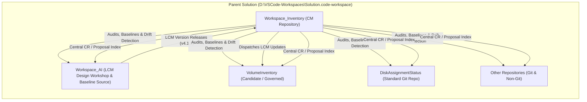

# Workspace_Inventory: Configuration Management (CM) System

Establishes `Workspace_Inventory` as a dedicated, Git-tracked Configuration Management (CM) repository under `D:\Git_Repositories\` to manage configuration baselines, repository states, LCM versioning, commit/push audit trails, and multi-repo Change Requests across the entire solution workspace.

---

## 1. System Vision & Architecture

`Workspace_Inventory` acts as the central CM engine and authoritative catalog for all 33+ directories and repositories under `D:\Git_Repositories\`.



---

## 2. Core Capabilities & Requirements

### A. Comprehensive Repository State & Inventory Tracking
* **Audit Every Directory**: Scans all directories under `D:\Git_Repositories\` to categorize them:
  * `active-design-workshop` (`Workspace_AI`)
  * `lcm-governed` (Repositories with active LCM junctions & `.lcm/config.json`)
  * `standard-git` (Git initialized, un-onboarded to LCM)
  * `non-git` (Directories without `.git`)
  * `legacy-retired` (`Workspace_AC`, `Workspace_GC`)
  * `parent-infra` (`.agents`, `.copilot`, `.github`, `.venv`, `.vscode`)
* **LCM Absorption & Version Tracking**:
  * Track `absorbed_lcm_version` (the exact LCM version when first onboarded).
  * Track `current_lcm_version` (the currently deployed version).
  * Flag version drift and outdated repositories.
* **Specialized Tracking for `Workspace_AI`**:
  * Lifecycle State (`State1_ActiveWorkshop` / `State2_Verification` / `State3_ReleasedBaseline` / `State4_UnlockedProposal`).
  * Current release version and readiness test status.

### B. LCM Version Propagation & Automated Updates
* **Centralized Update Engine (`Invoke-LCMUpdate.ps1`)**:
  * Updates any target repo from its current LCM version to the latest published `Workspace_AI` release.
  * Preserves repository-specific overrides (`.lcm/overrides.json`).
  * Verifies and re-establishes NTFS directory junctions (`.agents/rules/core`, `.copilot/Rules/core`).

### C. Commit, Push & Activity Audit Logging
* **Multi-Repo Activity Tracker (`Record-WorkspaceActivity.ps1`)**:
  * Audits and logs commit hashes, branch changes, dirty working copies, and unpushed commits (`ahead`/`behind` relative to GitHub remotes).
  * Maintains an append-only CM event ledger (`logs/cm_ledger.log` / `logs/cm_ledger.json`).

### D. Central Change Request (CR) / Proposal Management
* **Change Request Registry (`Find-ChangeRequest.ps1` / `data/change_requests.json`)**:
  * Indexes all Markdown proposals (`Docs/Methods/Proposals/*.md` and `.copilot/History/Logs/Proposals.json`).
  * Tracks CR status across lifecycle: `proposed`, `under-review`, `approved`, `implemented`, `verified`, `closed`, `rejected`.
  * Enables fast searching and cross-repository impact analysis.

### E. Solution Baselines & Drift Detection
* **Baseline Snapshots (`data/baselines/`)**:
  * Capture full workspace snapshots (every repo's exact commit SHA + LCM version + git status) for tagged releases.
  * Drift detection against approved baselines.

---

## 3. Directory Layout for `Workspace_Inventory`

```
D:\Git_Repositories\Workspace_Inventory\
├── .git/                                 # Initialized Git repository
├── .github/                              # GitHub workflows & repo metadata
│   └── workflows/
│       └── workspace-audit.yml           # CI/CD audit workflow
├── .agents/                              # Rule governance (junction to Workspace_AI)
│   └── rules/core                        # Directory junction -> Workspace_AI/.agents/rules
├── .copilot/                             # Copilot rules (junction to Workspace_AI)
│   └── Rules/core                        # Directory junction -> Workspace_AI/.copilot/Rules
├── data/                                 # Machine-readable CM databases
│   ├── inventory.json                    # Full workspace repo inventory & states
│   ├── change_requests.json              # Central index of all CRs / proposals
│   └── baselines/                        # Versioned workspace snapshots
│       └── baseline-v4.1.0.json
├── docs/                                 # Human-readable documentation & reports
│   ├── INVENTORY_DASHBOARD.md            # Live generated inventory table
│   ├── CM_POLICIES.md                    # Configuration Management policies & invariants
│   └── CHANGE_REQUEST_INDEX.md           # Master list of all open & closed CRs
├── logs/                                 # CM event & activity history
│   └── cm_activity.log                   # Append-only audit trail
├── modules/                              # Reusable CM PowerShell modules
│   ├── WorkspaceCM.psm1                  # Core CM module (auditing, state, baselines)
│   └── ChangeRequestManager.psm1         # CR indexing & lifecycle management
├── tools/                                # Executable CLI scripts
│   ├── Invoke-WorkspaceAudit.ps1         # Full scan & report generator
│   ├── Invoke-LCMUpdate.ps1              # Single/batch repo LCM version updater
│   ├── Find-ChangeRequest.ps1            # Search and query change requests
│   ├── New-WorkspaceBaseline.ps1         # Snapshot current solution baseline
│   └── Test-WorkspaceDrift.ps1           # Drift analysis vs baseline
├── .gitignore                            # Standard git ignore
└── README.md                             # Repository overview and usage instructions
```

---

## 4. Proposed Implementation Steps

### Phase 1: Repository Scaffolding & Git Initialization
- [ ] [NEW] Initialize `D:\Git_Repositories\Workspace_Inventory` with `git init -b main`.
- [ ] [NEW] Create `.gitignore`, `README.md`, `docs/CM_POLICIES.md`.
- [ ] [NEW] Establish rule governance links to `Workspace_AI` via directory junctions.

### Phase 2: Core Data Models & Schemas
- [ ] [NEW] Define JSON schema and initial state for `data/inventory.json` covering all 33 directories with full classification, Git metadata, and LCM absorption info.
- [ ] [NEW] Define schema for `data/change_requests.json` and seed current known CRs (`STEP-001` through `STEP-098`, `CGL-001` through `CGL-012`).
- [ ] [NEW] Define baseline schema for `data/baselines/baseline-v4.1.0.json`.

### Phase 3: PowerShell CM Engine Modules
- [ ] [NEW] Implement `modules/WorkspaceCM.psm1`:
  - `Get-WorkspaceRepoState`: Deep inspection of any target directory.
  - `Update-WorkspaceInventory`: Scans all 33 directories and writes `data/inventory.json` + `docs/INVENTORY_DASHBOARD.md`.
  - `Test-WorkspaceDrift`: Checks for dirty state, unpushed commits, unabsorbed repos, and outdated LCM versions.
  - `New-WorkspaceBaseline`: Creates timestamped JSON baseline.
- [ ] [NEW] Implement `modules/ChangeRequestManager.psm1`:
  - `Get-ChangeRequests`: Scans all repos for proposal markdown and registries.
  - `Find-ChangeRequest`: Query CRs by ID, repo, status, date, or text.

### Phase 4: CLI Entrypoints & LCM Propagation Tools
- [ ] [NEW] Implement `tools/Invoke-WorkspaceAudit.ps1` for one-command complete workspace scanning.
- [ ] [NEW] Implement `tools/Invoke-LCMUpdate.ps1` to trigger LCM version upgrades on individual or batch repositories.
- [ ] [NEW] Implement `tools/Find-ChangeRequest.ps1` and `tools/New-WorkspaceBaseline.ps1`.

### Phase 5: Verification & Baseline Commit
- [ ] Run full audit via `Invoke-WorkspaceAudit.ps1` to populate `inventory.json` and generate `INVENTORY_DASHBOARD.md`.
- [ ] Verify junction links, JSON schemas, and PowerShell script syntax.
- [ ] Create initial CM baseline commit in `Workspace_Inventory`.

---

## 5. Verification Plan

### Automated Verification
* Run `powershell -ExecutionPolicy Bypass -Command "Import-Module .\modules\WorkspaceCM.psm1 -Force; Update-WorkspaceInventory"` to test discovery across all 33 directories.
* Validate JSON validity and schema compliance for `data/inventory.json`, `data/change_requests.json`, and `data/baselines/baseline-v4.1.0.json`.
* Run drift detection against initialized baseline.

### Manual Verification
* Inspect generated `docs/INVENTORY_DASHBOARD.md` to confirm every repository is accurately categorized with its Git state, LCM absorbed version, and current version.
