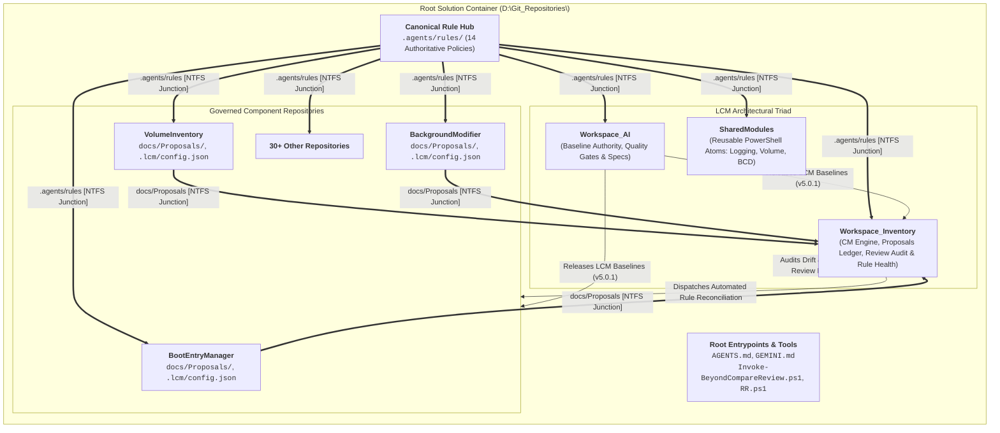
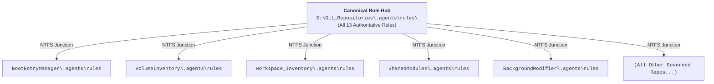
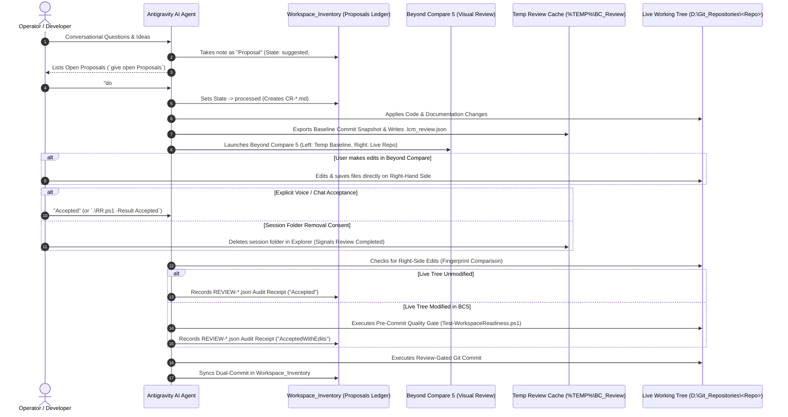

# Workspace_AI Lifecycle Model (LCM) System Architecture

Module: docs/Architecture.md  
Purpose: Authoritative architectural specification for the Lifecycle Model (LCM) multi-repository governance framework.  
Path: D:/Git_Repositories/Workspace_AI/docs/Architecture.md  
Authors: Rolf, Workspace_AI Engine  
Version: 5.1.0  
Status: Authoritative Architecture  
Date: 2026-08-23  

---

## 1. System Topology & Decoupled Governance Architecture

The **Lifecycle Model (LCM) Version 5.1.0** operates across a decoupled multi-repository container architecture centered at `D:\Git_Repositories\`. It distinctly separates **Design & Baseline Authority (`Workspace_AI`)**, **Operational Configuration Management (`Workspace_Inventory`)**, **Reusable Atomic Modules (`SharedModules`)**, and the **Root Container Hub**:



---

## 2. Hub-and-Spoke Rule Discovery Architecture

To eliminate rule divergence across multi-repository workspaces, LCM employs a **Hub-and-Spoke NTFS Junction Projection** model:



### Invariants:
1. **Single Source of Truth (`RULE-AUTH-001`)**: All 13 core governance rules reside canonically at `D:\Git_Repositories\.agents\rules\`.
2. **Zero Drift Spoke Deployment**: Every child repository contains an `.agents\rules` directory junction pointing to the root hub.
3. **Mandatory Matrix Sync (`RULE-AUTH-002`)**: Any rule modification requires simultaneous updates to both [`AGENTS.md`](file:///d:/Git_Repositories/AGENTS.md) and [`Workspace_AI/docs/LCM-Rules-Cross-Reference.md`](file:///d:/Git_Repositories/Workspace_AI/docs/LCM-Rules-Cross-Reference.md).
4. **Git Insulation**: `.agents/` is included in each child repository's `.gitignore` to prevent committing physical rule duplicates during git pulls or clones.

---

## 3. Two-Tier Proposal & Review Governance Stream

The LCM review engine establishes a structured, non-blocking two-tier proposal and review workflow (`RULE-LCM-001` through `RULE-LCM-006`):



### 3.1 Visual Review Lifecycle & Acceptance Protocols

1. **Workspace Isolation (`%TEMP%\BC_Review\`)**:
   * Baseline commit snapshots are extracted to `%TEMP%\BC_Review\<RepoName>-<SHA>\`.
   * Each session writes an immutable `.lcm_review.json` recording `SessionStartedAt`, `BaseCommit`, and `CommitDate`.
   * The Left-Hand Side represents the read-only baseline commit; the Right-Hand Side represents the live working tree.
2. **Acceptance by Session Folder Removal**:
   * Deleting the specific repository review session folder in `%TEMP%\BC_Review\` by the user acts as an explicit signal of review completion and user consent.
3. **Automated Right-Side Edit & Save Detection (`AcceptedWithEdits`)**:
   * If the user modifies and saves files on the Right-Hand Side in Beyond Compare, the system automatically detects the difference against the pre-review fingerprint.
   * The review result is classified as `AcceptedWithEdits`, which automatically triggers a full pre-commit quality gate re-run to ensure syntax and test validity before committing.
4. **Maintenance Exemption**:
   * Running `.\Clear-BCReviewTemp.ps1 -All` is strictly classified as a **maintenance purge** across all sessions and never triggers review acceptance or commits.

### 3.2 Review Granularity & Exemption Hierarchy:
* **Review Granularity**: Configurable via `Invoke-ProposalAction.ps1 -SetGranularity <coarse|tight>`.
  * `coarse` (Default): Single review stop prior to commit across the change set.
  * `tight`: Stepwise review stops between intermediate sub-tasks.
* **Exemption Policy**: `Workspace_Inventory` is **the sole exempt repository** from visual diff review because it contains purely tool-generated CM ledger data. The Root Container and all child repositories strictly require Beyond Compare 5 visual review.

---

## 4. Configuration Management & Governance Diagnostics

Configuration Management is administered through specialized CLI tools in `Workspace_Inventory/tools/`:

```
+-----------------------------------------------------------------------------------------------+
|                           LCM CONFIGURATION MANAGEMENT ENGINE                                 |
+-----------------------------------------------------------------------------------------------+
| 1. Diagnostics:    Test-LCMRuleHealth.ps1     -> Audits junctions, duplicates, versions       |
| 2. Reconciliation: Repair-LCMRules.ps1        -> 1-command auto-heal, re-links & syncs        |
| 3. Proposal CLI:   Get-OpenProposals.ps1      -> Fast query for open #n proposals            |
| 4. Review Queue:   Get-ReposUnderReview.ps1   -> Scans workspace for active review stops      |
| 5. Action Runner:  Invoke-ProposalAction.ps1  -> Batch processor for 'do', 'delete', 'defer'  |
| 6. Audit Logging:  Submit-ReviewResult.ps1    -> Generates immutable REVIEW-*.json receipts   |
+-----------------------------------------------------------------------------------------------+
```

---

## 5. Standardized Repository Layout Standard

Every governed repository conforms to the standard LCM directory layout:

```
<GovernedRepository>/
├── .git/                     # Git distributed version control database
├── .agents/
│   └── rules                 # [NTFS Directory Junction] -> D:\Git_Repositories\.agents\rules
├── .lcm/
│   ├── config.json           # Target metadata, absorbed version (v5.0.1), execution context
│   └── overrides.json        # Documented rule deviations & custom hooks
├── .vscode/                  # Workspace IDE settings (CRLF, UTF-8, strict Pester)
├── docs/
│   ├── README.md             # Component summary & index linking tripartite docs
│   ├── Architecture.md       # User-facing mental model, workflows, topology
│   ├── Requirements.md       # Technical design constraints & normative invariants
│   ├── Implementation.md     # Code realization, modules, exported cmdlets, schemas
│   └── Proposals/            # 1-file-per-CR Markdown proposals (CR-*.md)
├── install/
│   └── Installation.md       # Procedural deployment, configuration & update runbook
├── modules/                  # Production PowerShell modules (*.psm1, *.psd1)
├── tools/                    # Operational and CLI runner scripts
├── tests/                    # Pester v5 test suites (*.Tests.ps1)
└── .gitignore                # Standard exclusions (includes .agents/, scratch/)
```

---

## 6. Governed Upgrade Workflow (`Invoke-LCMUpdate.ps1`)

Automated upgrades enforce a **Proposal-First Permission Model**:
1. **Default Mode (Proposal-Only)**: Calling `Invoke-LCMUpdate.ps1 -TargetRepository <Repo>` generates a proposal document in the target repo's `docs/Proposals/` and executes a read-only DryRun simulation.
2. **Execute Mode (`-Execute`)**: Requires explicit operator instruction (`do #n Proposals`) to deploy junctions, instantiate templates, execute quality gates, and stage the baseline commit.
