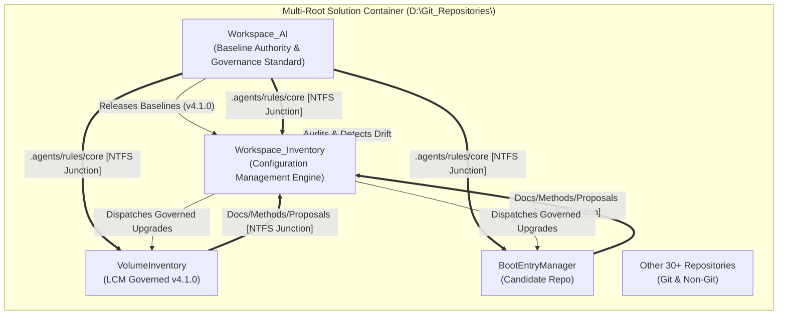

# Workspace_AI Lifecycle Model (LCM) System Architecture

Module: docs/Architecture.md  
Authors: Rolf, Workspace_AI Engine  
Version: 4.1.0  
Status: Authoritative Standard  
Date: 2026-08-15  

---

## 1. Executive Summary & Topology

The Workspace Lifecycle Model (LCM) v4.1.0 establishes an AI-assisted, multi-repository governance and configuration management architecture.

The system decouples **Governance Authority & Baseline Release** from **Operational Configuration Management (CM)** through a dual-repository model:



---

## 2. System Prerequisites Architecture

To operate the LCM tools, AI agents, and quality gates, the host system relies on five foundational prerequisites:

```
+-------------------------------------------------------------------------+
|                       SYSTEM PREREQUISITES                              |
+-------------------------------------------------------------------------+
| 1. PowerShell 7 (pwsh.exe 7.0+) -> Strict runtime engine for all tools  |
| 2. Git for Windows             -> Distributed version control & SHA logs|
| 3. NTFS Filesystem             -> Directory junctions & file hardlinks  |
| 4. Python for Antigravity      -> .venv (Python 3.10+), SDK & agy CLI   |
| 5. Antigravity IDE / VS Code   -> Multi-root Solution.code-workspace    |
+-------------------------------------------------------------------------+
```

### A. PowerShell 7 (`pwsh.exe`) Runtime
* All tools in `tools/` and modules in `modules/` are strictly designed for **PowerShell 7.0+** (`D:\Tools\PowerShell\7\pwsh.exe`).
* Adheres to `PowerShellRules.md`: UTF-8 without BOM, strict CRLF line endings, explicit parameter definitions, and strict error handling (`$ErrorActionPreference = 'Stop'`).

### B. NTFS Link Projection Architecture
* Eliminates file duplication and out-of-sync rule copies across 33+ repositories.
* **Directory Junctions (`mklink /J`)**:
  * Used for folder projection across repositories on the same volume.
  * Injects `.agents/rules/core` and `.copilot/Rules/core` from `Workspace_AI` into target repositories.
  * Injects target `Docs/Methods/Proposals` into `Workspace_Inventory/change_requests/<RepoName>`.
* **File Hardlinks (`mklink /H`)**:
  * Injects top-level root agent entry points (`AGENTS.md`, `GEMINI.md`, `.copilot/instructions.md`) directly into repository roots.

### C. Python Environment for Google Antigravity
* Located in the workspace container virtual environment (`D:\Git_Repositories\.venv`).
* Installs `google-antigravity` Python SDK, `agy` CLI, and AI agent dependencies.
* Exposes agent subagent workflows, MCP servers, and background scheduling.

---

## 3. Configuration Management (CM) Architecture

### A. Dual-Repository Governance Topology
1. **[`Workspace_AI`](file:///D:/Git_Repositories/Workspace_AI)**:
   * Acts as the immutable baseline source and design laboratory.
   * Holds the canonical rules, prompt instructions, quality gates, and scaffold templates.
2. **[`Workspace_Inventory`](file:///D:/Git_Repositories/Workspace_Inventory)**:
   * Acts as the operational CM engine.
   * Maintains `data/inventory.json` and renders `docs/INVENTORY_DASHBOARD.md`.
   * Audits repository states, absorbed LCM versions, dirty working copies, and unpushed commits.

### B. 1-File-Per-CR Junction-Mirrored Architecture
* **Single Source of Truth**: Proposals are physically stored in the target repository's `Docs/Methods/Proposals/`.
* **Central Discovery**: `Workspace_Inventory/change_requests/<RepoName>` mirrors the proposals live via NTFS junctions.
* **1-File-Per-CR Standard**: Every CR is a standalone Markdown document (`CR-yyyyMMdd_HHmmss.md`) with YAML frontmatter:
  ```markdown
  ---
  cr_id: CR-20260815_231129
  origin_repo: VolumeInventory
  title: Upgrade VolumeInventory to LCM Version 4.1.0
  status: proposed
  target_lcm_version: 4.1.0
  bundle_id: unassigned
  author: Rolf
  created_at: 2026-08-15 23:11:29
  ---
  ```

### C. Change Request Bundles (Batch Test Suites)
* Located in `Workspace_Inventory/data/bundles/` (e.g. `BUNDLE-2026-01.json`).
* Aggregates multiple individual CRs into cohesive test milestone suites (e.g., `Test-WorkspaceReadiness.ps1`), eliminating test sequence explosion.

---

## 4. 4-Phase Repository Onboarding Engine

The automated repository onboarding and update engine ([`Invoke-LCMOnboardRepo.ps1`](file:///D:/Git_Repositories/Workspace_AI/tools/Invoke-LCMOnboardRepo.ps1)) follows a strict 4-phase progression:

```
[ Phase 1: Discovery & Pre-Flight Audit ]
  - Verify directory path and Git status
  - Disallow self-onboarding on Workspace_AI
  - Discover parameter tokens (REPO_NAME, PRIMARY_LANG, MODULE_ROOT, AUTHOR)
  - Verify state (Unonboarded vs Update mode)
        │
        ▼
[ Phase 2: Seeding Governance Rules ]
  - Create NTFS Directory Junction: .agents/rules/core -> Workspace_AI/.agents/rules
  - Create NTFS Directory Junction: .copilot/Rules/core -> Workspace_AI/.copilot/Rules
  - Create File Hardlinks: AGENTS.md, GEMINI.md, .copilot/instructions.md
        │
        ▼
[ Phase 3: Template Instantiation & Parameterization ]
  - Expand templates from templates/repo-scaffold/
  - Generate target-local .lcm/config.json and .lcm/overrides.json
  - Instantiate .vscode/settings.json, tasks.json, docs/, and tools/
        │
        ▼
[ Phase 4: Verification & Baseline Commit ]
  - Perform physical integrity audit across files, junctions, and JSON schemas
  - Stage and create initial LCM baseline commit in target repository
  - Refresh CM inventory and Change Request index
```

---

## 5. Governed Upgrade Workflow (`Invoke-LCMUpdate.ps1`)

Automated upgrades enforce a **Proposal-First Permission Model**:
1. **Default Mode (Proposal-Only)**: Calling `Invoke-LCMUpdate.ps1 -TargetRepository <Repo>` creates a `CR-yyyyMMdd_HHmmss.md` proposal document in the target repo and executes a read-only DryRun simulation.
2. **Execute Mode (`-Execute`)**: Requires explicit operator switch to deploy junctions, instantiate templates, verify integrity, and create the baseline commit.
