# Workspace_AI Lifecycle Model (LCM) System Architecture

Module: docs/Architecture.md  
Purpose: Authoritative architectural specification for the Lifecycle Model (LCM) multi-repository governance framework.  
Path: D:/Git_Repositories/Workspace_AI/docs/Architecture.md  
Authors: Rolf, Workspace_AI Engine  
Version: 7.5.0  
Status: Authoritative Architecture  
Date: 2026-09-19  

---

## 1. System Topology & Decoupled Governance Architecture

The **Lifecycle Model (LCM) Version 7.0.0** operates across a decoupled multi-repository container architecture centered at `D:\Git_Repositories\`. It distinctly separates **Design & Baseline Authority (`Workspace_AI`)**, **Operational Configuration Management (`Workspace_Inventory`)**, **Reusable Atomic Modules (`SharedModules`)**, and the **Root Container Hub**:

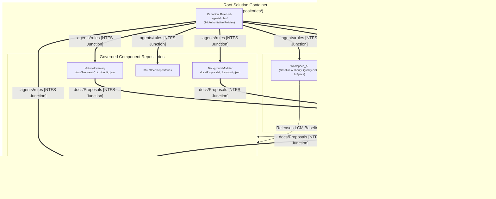

---

## 2. Hub-and-Spoke Rule Discovery Architecture

To eliminate rule divergence across multi-repository workspaces, LCM employs a **Hub-and-Spoke NTFS Junction Projection** model:

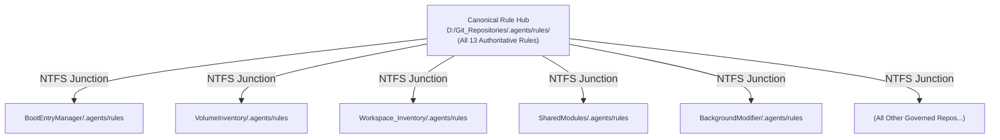

### Invariants:
1. **Single Source of Truth (`RULE-AUTH-001`)**: All 13 core governance rules reside canonically at `D:\Git_Repositories\.agents\rules\`.
2. **Zero Drift Spoke Deployment**: Every child repository contains an `.agents\rules` directory junction pointing to the root hub.
3. **Mandatory Matrix Sync (`RULE-AUTH-002`)**: Any rule modification requires simultaneous updates to both [`AGENTS.md`](file:///d:/Git_Repositories/AGENTS.md) and [`Workspace_AI/docs/LCM-Rules-Cross-Reference.md`](file:///d:/Git_Repositories/Workspace_AI/docs/LCM-Rules-Cross-Reference.md).
4. **Git Insulation**: `.agents/` is included in each child repository's `.gitignore` to prevent committing physical rule duplicates during git pulls or clones.

---

## 3. Two-Tier Proposal & Review Governance Stream

The LCM review engine establishes a structured, non-blocking two-tier proposal and review workflow (`RULE-LCM-001` through `RULE-LCM-006`):

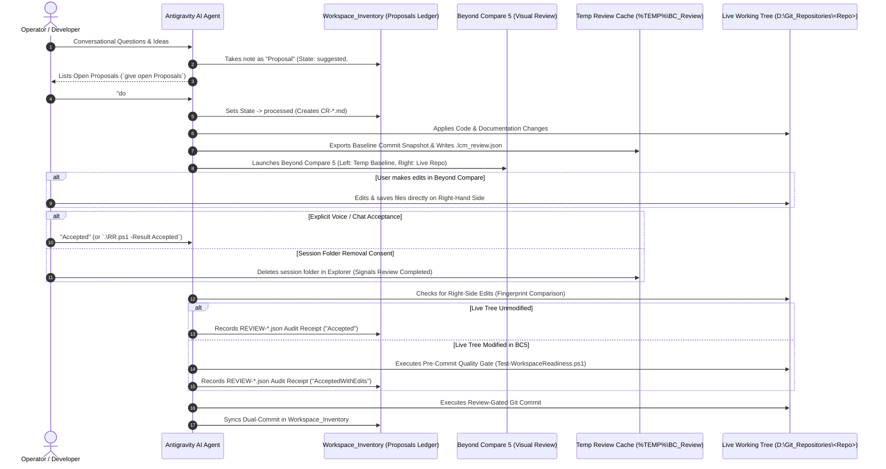

### 3.1 Visual Review Lifecycle & Acceptance Protocols

1. **Workspace Isolation (`%TEMP%\BC_Review\`)**:
   * Baseline commit snapshots are extracted to `%TEMP%\BC_Review\<RepoName>-<SHA>\`.
   * Each session writes an immutable `.lcm_review.json` recording `SessionStartedAt`, `BaseCommit`, and `CommitDate`.
   * The Left-Hand Side represents the read-only baseline commit; the Right-Hand Side represents the live working tree.
2. **Acceptance by Session Folder Removal**:
   * Deleting the specific repository review session folder in `%TEMP%\BC_Review\` by the user acts as an explicit signal of review completion and user consent.
3. **Automated Right-Side Edit & Save Detection (`AcceptedWithEdits`)**:
   * If the user modifies and saves files on the Right-Hand Side in Beyond Compare, the system automatically detects the difference against the pre-review fingerprint.
   * The review result is classified as `AcceptedWithEdits`, which automatically triggers a full pre-commit quality gate re-run to ensure syntax and test validity before committing.
4. **Maintenance Exemption**:
   * Running `.\Clear-BCReviewTemp.ps1 -All` is strictly classified as a **maintenance purge** across all sessions and never triggers review acceptance or commits.

### 3.2 Review Granularity & Exemption Hierarchy:
* **Review Granularity**: Configurable via `Invoke-ProposalAction.ps1 -SetGranularity <coarse|tight>`.
  * `coarse` (Default): Single review stop prior to commit across the change set.
  * `tight`: Stepwise review stops between intermediate sub-tasks.
* **Exemption Policy**: `Workspace_Inventory` is **the sole exempt repository** from visual diff review because it contains purely tool-generated CM ledger data. The Root Container and all child repositories strictly require Beyond Compare 5 visual review.

---

## 4. Configuration Management & Governance Diagnostics

Configuration Management is administered through specialized CLI tools in `Workspace_Inventory/tools/`:

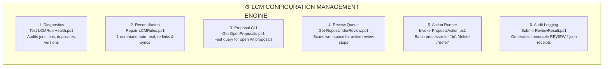

---

## 5. Standardized Repository Layout Standard

Every governed repository conforms to the standard LCM directory layout:

```
<GovernedRepository>/
├── .git/                     # Git distributed version control database
├── .agents/
│   └── rules                 # [NTFS Directory Junction] -> D:\Git_Repositories\.agents\rules
├── .lcm/
│   ├── config.json           # Target metadata, absorbed version (v5.0.1), execution context
│   └── overrides.json        # Documented rule deviations & custom hooks
├── .vscode/                  # Workspace IDE settings (CRLF, UTF-8, strict Pester)
├── docs/
│   ├── README.md             # Component summary & index linking tripartite docs
│   ├── Architecture.md       # User-facing mental model, workflows, topology
│   ├── Requirements.md       # Technical design constraints & normative invariants
│   ├── Implementation.md     # Code realization, modules, exported cmdlets, schemas
│   └── Proposals/            # 1-file-per-CR Markdown proposals (CR-*.md)
├── install/
│   └── Installation.md       # Procedural deployment, configuration & update runbook
├── modules/                  # Production PowerShell modules (*.psm1, *.psd1)
├── tools/                    # Operational and CLI runner scripts
├── tests/                    # Pester v5 test suites (*.Tests.ps1)
└── .gitignore                # Standard exclusions (includes .agents/, scratch/)
```

---

## 6. Governed Upgrade Workflow (`Invoke-LCMUpdate.ps1`)

Automated upgrades enforce a **Proposal-First Permission Model**:
1. **Default Mode (Proposal-Only)**: Calling `Invoke-LCMUpdate.ps1 -TargetRepository <Repo>` generates a proposal document in the target repo's `docs/Proposals/` and executes a read-only DryRun simulation.
2. **Execute Mode (`-Execute`)**: Requires explicit operator instruction (`do #n Proposals`) to deploy junctions, instantiate templates, execute quality gates, and stage the baseline commit.

---

## 7. Desktop REST Bridge Daemon & Command Hub Architecture

To bridge background agent workers, IDE processes, and interactive desktop GUI applications, the LCM container provides a dedicated **Desktop REST Bridge Daemon** and **Short-Name Command Hub**:

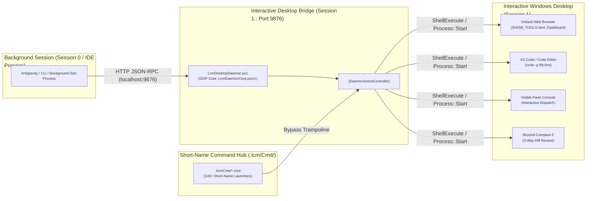

### Invariants:
1. **Session 1 Elevation & Focus Invariant**: UI tools launched from background agents execute via `http://127.0.0.1:9876` so they open with foreground focus in the operator's active Windows desktop session rather than hidden background workers.
2. **Short-Name Command Trampoline**: All command scripts in `.lcm/Cmd/<ShortName>.cmd` use deterministic relative resolution (`%~dp0..\..\<Path>`) to ensure identical behavior in standalone shells and IDE terminals.
3. **Creator Taxonomy Standard**: All tool creation utilities use the `Create-` verb (e.g. `Create-LcmTool.ps1` $\rightarrow$ `CreateTool`, `Create-WorkspaceBaseline.ps1` $\rightarrow$ `CreateWorkspaceBaseline`).
4. **Authoritative Synchronization**: `tools/Update-ToolCatalog.ps1` acts as the single compiler reconciling script ASTs, short-name aliases, HTML dashboard indices, and `tools/tool_catalog.json`.

---

## 8. Bottom-Up Tripartite (3-Tier) Documentation Methodology

Under the LCM framework, systems adhere to the **DOX Principle** (*Documentation Drives Implementation*). However, when onboarding existing codebases, absorbing rapid prototypes, or executing bottom-up Change Request Proposals (CRPs), documentation must frequently be synthesized retroactively from active code. 

The **Bottom-Up Tripartite Synthesis Methodology** defines the canonical 4-step derivation pipeline to generate comprehensive, cohesive tripartite specifications (`RULE-DOC-001` through `004`):

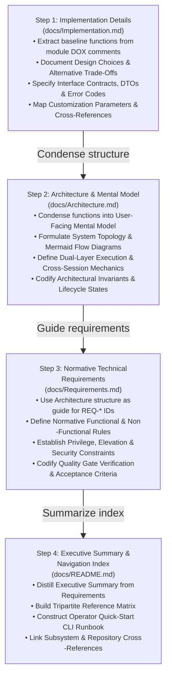

### Synthesis Execution Pipeline:

1. **Step 1: Implementation Details (`Implementation.md`)**:
   * **Source Baseline**: Harvest all exported functions, classes, parameter blocks, and comment help from source code.
   * **Design Choices & Alternatives**: Explicitly document each critical architectural decision (e.g. why HTTP REST on localhost vs Named Pipes; why `%~dp0..\..\` trampolines vs PATH pollution; why `Create-` verb vs `New-`), contrasting it against rejected alternatives.
   * **Interface Contracts**: Detail exact JSON-RPC schemas, request/response DTO structures, HTTP methods, and status codes.
   * **Customization**: Document environment variable overrides, CLI switches, and configuration files.
   * **Traceability**: Provide clickable file and line links to concrete source files.

2. **Step 2: Architecture & User Mental Model (`Architecture.md`)**:
   * **User-Facing View**: Abstract concrete code into what the solution *looks like* to the operator and what it *accomplishes*.
   * **System Topology**: Construct Mermaid diagrams showing component boundaries, data flows, and IPC bridges.
   * **Workflows & Invariants**: Detail operator interaction patterns (CLI, GUI, Agent) and immutable system invariants.

3. **Step 3: Normative Technical Requirements (`Requirements.md`)**:
   * **Normative Derivation**: Using the structural domains established in `Architecture.md`, write clear `REQ-*` requirements using normative RFC 2119 keywords (`MUST`, `MUST NOT`, `SHOULD`, `MAY`).
   * **Archetype & Policy Rules**: Specify taxonomy naming standards, elevation constraints (`RULE-ELEV-001`), console persistence (`RULE-ELEV-005`), and StrictMode rules (`RULE-PS-001`).

4. **Step 4: Executive Summary & Directory Index (`README.md`)**:
   * **Executive Summary**: Synthesize the high-level purpose and core capabilities from `Requirements.md`.
   * **Tripartite Matrix**: Provide an authoritative table linking `Architecture.md`, `Requirements.md`, and `Implementation.md`.
   * **Quick-Start Runbook**: Provide immediate, copy-pasteable CLI commands for the most common operator workflows.

---

## 9. Automated Regression CRP Lifecycle & Cycle Governance ([CRP-135](file:///D:/Git_Repositories/Workspace_Inventory/docs/Proposals/CRP-135-LCM-v7.5.0-Determining-And-Enforcing-Regression-CRPs.md))

To manage cross-repository ripple effects deterministically, LCM implements automated regression proposal derivation and Directed Acyclic Graph (DAG) cycle governance established by [CRP-135](file:///D:/Git_Repositories/Workspace_Inventory/docs/Proposals/CRP-135-LCM-v7.5.0-Determining-And-Enforcing-Regression-CRPs.md):

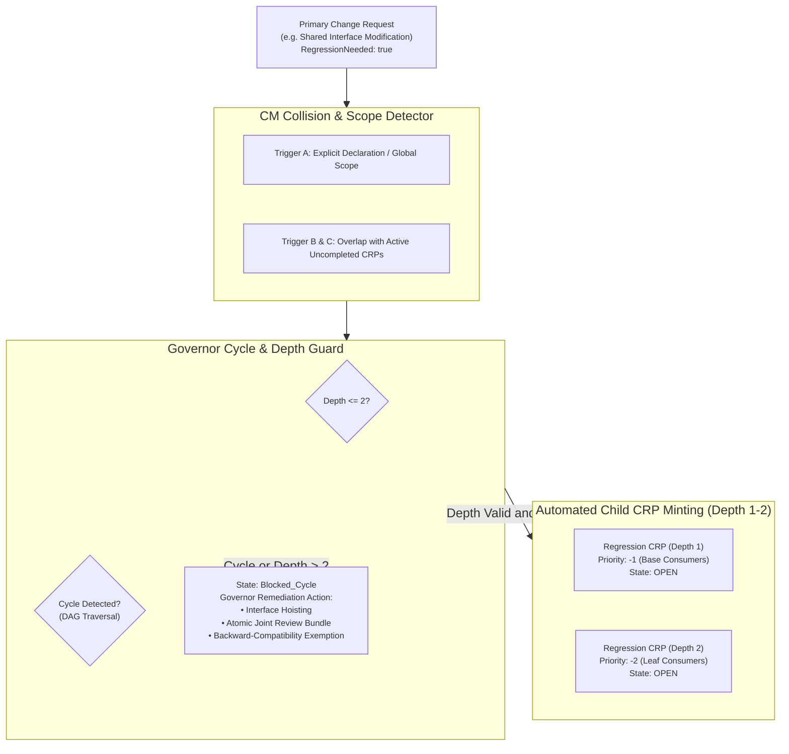

### Core Architecture Invariants:
1. **Automated Child CRP Generation**: Child regression proposals (`Regression: <Area> for CRP-<ParentId>`) are generated in the `suggested` (`OPEN`) state per `RULE-LCM-015`.
2. **Topological Negative-Priority Sorting**: Downstream tasks in `ListOfChangesRequired` are assigned negative priorities (`-1`, `-2`, `-3`...) reflecting execution dependencies from foundational base layers (`-1`) out to leaf consumers.
3. **Deterministic Depth Ceiling (`MaxRegressionDepth = 2`)**: Derivative regressions are strictly bounded to 2 hops from the primary proposal.
4. **Governor Remedial Action on `Blocked_Cycle`**: When mutual circular coupling occurs, the CM Governor halts cascading mutations and instantiates a specialized **Cycle Resolution Proposal** offering interface hoisting, atomic joint review bundling, or one-way backward compatibility exemption.

---

## 10. App-Centric Architectural Decomposition, Active Context Engine & Cross-App Problem Governance ([CRP-048](file:///D:/Git_Repositories/Workspace_Inventory/docs/Proposals/CRP-048-LCM-v7.5.0-App-Centric-Architecture-Engine.md))

As governed repositories scale from single-purpose scripts into multifaceted systems, monolithic tripartite documentation creates cognitive friction, documentation sprawl, and excessive LLM context consumption during automated code generation. 

Under the LCM framework's **DOX Principle** (*Documentation Drives Implementation*), documentation is the primary specification and code generation blueprint—a "Super-CRP". **CRP-048** formalizes the **App-Centric Architectural Decomposition**, an **Active Context Engine (`Workon:`)**, and **Cross-App Problem Management**:

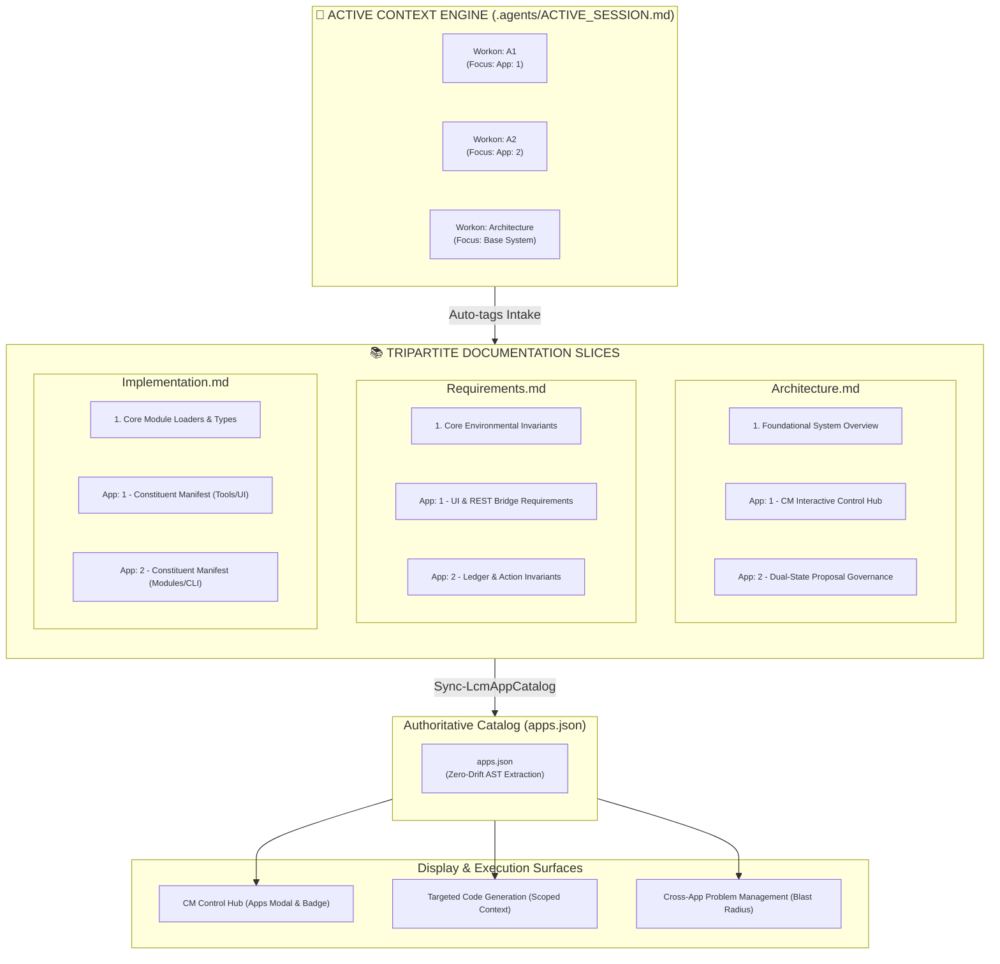

---

### 10.1 Architectural Decisions & Trade-Offs Matrix (Concluded Alternatives)

During the formalization of CRP-048, several architectural approaches were evaluated:

| Architectural Option | Alternative Evaluated | Final Decision | Rationale & Trade-Off |
| :--- | :--- | :--- | :--- |
| **Discussion Capture** | Raw Discussion Logging (AADD transcripts / meeting notes) | **Feature/App-Driven Synthesis** | *Rejected*: Raw transcripts accumulate noise, lack cohesion, and decay rapidly. *Adopted*: Conclusive discussions synthesize directly into named `App: #` sections upon `ACCEPT`. |
| **Directory Structure** | Subdirectory Sprawl (`docs/App1/`, `docs/App2/`) | **Flat In-Document Section Slices** | *Rejected*: Directory sprawl fragments the clean single-entrypoint tripartite standard (`RULE-DOC-001`). *Adopted*: In-document `App: #` headers inside tripartite specs; folders reserved strictly for autonomous subsystems. |
| **Prefix Syntax** | Angle/Square Brackets (`<App: 1>`, `[App: 1]`) | **Hyphenated Colon Format (`App: 1 - <Title>`)** | *Rejected*: Brackets add typing friction in CLI/markdown. *Adopted*: Clean plain-text `App: 1 - <Title>` and shorthand `A1`. |
| **Domain Nomenclature** | Commercial "Feature" naming (`Feat1`) | **Neutral "App" Slice Taxonomy (`App: 1`)** | *Rejected*: "Feature" carries end-user product bias unsuitable for low-level tooling/governance. *Adopted*: Versatile `App` (Application Slice / Architectural Increment). |

---

### 10.2 The `App:` Syntax & Active Context Engine (`Workon:`)

#### 1. Creation Operators:
- **`App: <Title>`** (Auto-numbering): Automatically resolves the next available integer (e.g. `App: 3 - Realtime Streamer`) and scaffolds the section across `Architecture.md`, `Requirements.md`, and `Implementation.md`.
- **`App: <Number> - <Title>`** (Explicit numbering): Binds an explicit identifier.

#### 2. Active Context Switching:
- **`Workon: A1` (or `Workon: 1`)**: Sets the active focus in `.agents/ACTIVE_SESSION.md`. Any new proposal intake (`crp: ...`, `bug: ...`) automatically inherits `app_id: "App: 1"`.
- **`Workon: Architecture` (or `Workon: Base`)**: Clears App slicing and targets the foundational, unpartitioned system architecture and core primitives.

---

### 10.3 3-Tier Code-to-App Mapping & Authoritative Catalog (`apps.json`)

To establish 100% bidirectional traceability between documentation and code without AST re-parsing on every request:

1. **Tier 1 (Specification Manifest)**: Each `App: #` in `Implementation.md` maintains a **Constituent Manifest Table** listing relative paths, architectural roles, entrypoints, and test suites.
2. **Tier 2 (In-Code DOX Header Annotation)**: Every script and module declares its parent App in its header comment:
   ```powershell
   <#
   .DESCRIPTION
       Module: modules/ProposalManager.psm1
       App: App: 2 - Dual-State Proposal Governance
   #>
   ```
3. **Tier 3 (Machine-Readable Catalog `apps.json`)**: Compiled automatically by `Sync-LcmAppCatalog.ps1` into `Workspace_Inventory/data/catalog/apps.json` for sub-10ms queries by daemons, CLI runners, and HTML dashboards.

---

### 10.4 Impact on Code Generation & LLM Context Scoping

Partitioning specifications into `App: #` slices transforms automated code generation:
- **Scoped Context Windows**: When generating or modifying code for `App: 1`, code generation engines load *only* the `App: 1` sections across `Architecture.md`, `Requirements.md`, and `Implementation.md`.
- **Zero-Regression Invariant**: Isolating context eliminates unintended side-effects and hallucinations across unrelated repository modules.
- **Deterministic 1-to-1 Translation**: Code generation operates directly from the explicit parameter tables, schemas, and cmdlet lists in `Implementation.md`.

---

### 10.5 Cross-App Problem Management & Blast Radius Governance

Real-world problems frequently cross modular boundaries. Problem management is governed across four topologies:

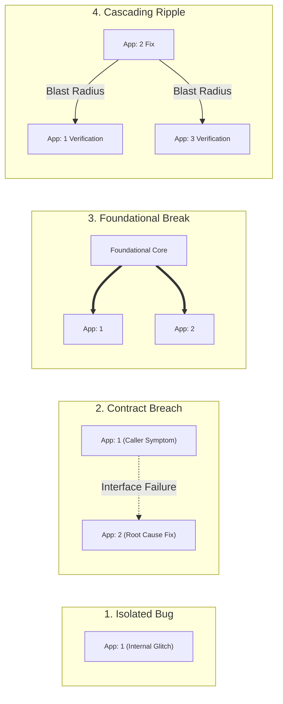

#### Problem Governance Rules:
1. **Multi-App Decoupling**: Bug proposals (`BUG-###`) explicitly declare `primary_app` (where the root cause is resolved) and `affected_apps` (the observed symptom or caller blast radius).
2. **Automated Blast Radius Probing**: When a fix touches `App: 2`, the AST Reverse Dependency Engine (`CRP-121` WUD) scans all callers in `App: 1` and `App: 3` and flags them for verification.
3. **Joint Multi-App Verification Gate**: A multi-App bug cannot be marked `completed` or `committed` until the unit tests of the primary App *and* the integration tests of all affected Apps pass 100%.
4. **Multi-Section Synthesis on `ACCEPT`**: The `ACCEPT <id>` command updates `Implementation.md` under `## App: 2` and `Requirements.md` under `## App: 1` in a single atomic lifecycle step.

---

### 10.6 High-Order Lifecycle Operators

To manage large-scale architectural restructuring, LCM provides high-order operators:

- **`Split-LcmArchitectureToApps.ps1`**: Decomposes legacy monolithic tripartite documents into structured `App: #` sections with constituent tables.
- **`Merge-RepositoriesToApps.ps1`**: Ingests external child repositories into an umbrella repo, preserving their tripartite specifications, code history, and tests as distinct `App: #` slices.
- **`Sync-LcmAppCatalog.ps1`**: Executes AST zero-drift verification between `Implementation.md`, file headers, and `apps.json`.

---

### 10.7 Git & GitHub Version Control Mapping

- **Commit Message Format**: `feat(App: 1): <summary> [CRP-###]` (enabling instant filtering via `git log --grep="App: 1"`).
- **GitHub Labels**: Structured labels (`app: 1`, `app: 2`, `app: architecture`) for Issue and PR tracking.
- **Grouped GitHub Releases**: Release notes generated via `gh release` automatically group changelogs under `### App: 1`, `### App: 2`, and `### Foundational Architecture`.

---

### 10.8 Inter-App Contract Governance (The "Glue")

To prevent modular repositories from degenerating into tight, unmaintainable coupling, **Apps must never communicate through implicit private state or ad-hoc internals**. All inter-App interactions are governed by formal, registered **Interface Contracts**:

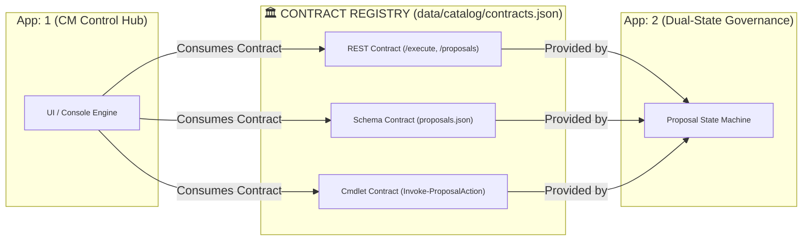

#### The Four Contract Archetypes:
1. **Cmdlet Export Contracts (`Type: Cmdlet`)**: Formally exported public cmdlets using approved verbs, typed parameters, strict `ValidateSet` bounds, and structured pipeline output.
2. **Schema Contracts (`Type: Schema`)**: Versioned JSON schemas governing shared serialized state (e.g. `proposals.json`, `active_session.json`).
3. **REST JSON-RPC Contracts (`Type: REST`)**: Route paths, HTTP verbs, request/response DTOs, and CORS/Private Network Access (PNA) security invariants.
4. **Broadcast Event Contracts (`Type: Broadcast`)**: IPC broadcast channels (e.g. `BroadcastChannel`) and typed event payload definitions.

#### Contract Inventory & Automated Drift Auditing:
- Every App in `apps.json` explicitly declares its `provides_contracts` and `consumes_contracts`.
- The Rule Health checker (`Test-LCMRuleHealth.ps1`) and AST Dependency Prober (`CRP-121`) audit all cross-file calls. Any inter-App invocation bypassing a declared public contract is flagged as an **Unsanctioned Coupling Violation**.

---

### 10.9 The Atomic Assembly Paradigm — The Ultimate Goal of LCM

The ultimate goal of the Lifecycle Model (LCM) methodology is to transform software development from **handcrafted, bespoke coding** into **Deterministic Atomic Assembly**:

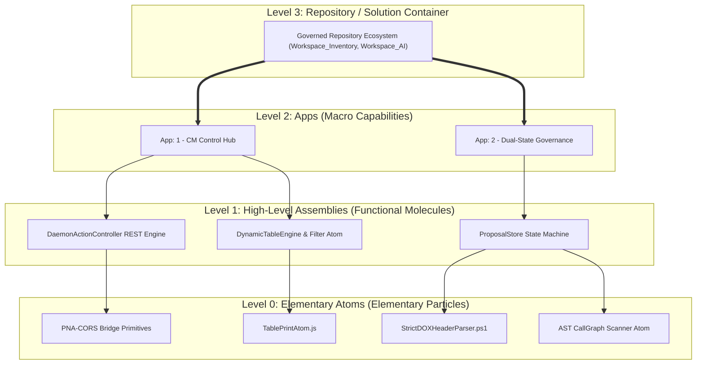

#### The Composition Hierarchy:
1. **Level 0: Elementary Atoms (Particles)**: Pure, single-purpose, side-effect-free primitives (e.g., table renderer atoms, header parsers, AST tokens, string normalizers, REST encoders).
2. **Level 1: High-Level Assemblies (Molecules)**: Cohesive functional building blocks composed of atoms (e.g., `ProposalStore`, `DaemonActionController`, `RegressionDAGOrder`).
3. **Level 2: Apps (Organisms)**: Complete, marketable capability slices composed of assemblies and atoms (e.g., `App: 1 - CM Interactive Control Hub`, `App: 2 - Dual-State Proposal Governance`).
4. **Level 3: Repository Ecosystem**: The coordinated constellation of Apps bound together by formal inter-App contracts.

#### User & Operator Perspective (Why This is the Ultimate Payoff):
- **Zero-Hallucination AI Code Synthesis**: When an operator commands `App: <Title>`, the AI agent does not generate fragile, boilerplate code from scratch. Instead, it **assembles pre-verified atomic particles and high-level assemblies** according to the contractual blueprint in `Implementation.md`.
- **Lego-Brick Composability & Portability**: High-level assemblies can be reused, reconfigured, or merged across repositories (`Merge-RepositoriesToApps`) with guaranteed behavioral integrity.
- **True Isolation & Non-Breaking Maintenance**: Updating an underlying atom or assembly automatically enhances all consuming Apps while contract boundaries prevent cross-domain breakage.


