# LCM_AI Lifecycle Model (LCM) System Architecture

Module: docs/Architecture.md  
Purpose: Authoritative architectural specification for the Lifecycle Model (LCM) multi-repository governance framework.  
Path: D:/Git_Repositories/LCM_AI/docs/Architecture.md  
Authors: Rolf, LCM_AI Engine  
Version: 8.5.0  
Status: Authoritative Architecture  
Date: 2026-09-19  

---

## 1. System Topology & Decoupled Governance Architecture

The Lifecycle Model operates across the current physical LCM roots under
`D:\Git_Repositories\`. It separates **baseline authority (`LCM_AI`)**,
**operational configuration management (`LCM_Inventory`)**, **reusable modules
(`LCM_Shared`)**, and the dedicated backup and supervision subsystems.

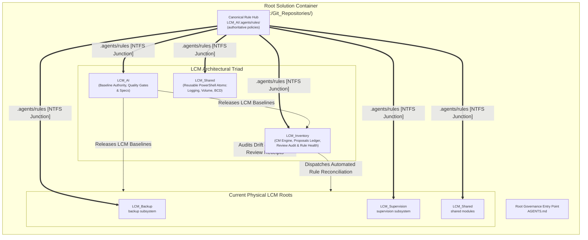
```mermaid
graph TB
    classDef default font-size:8pt;
    subgraph RootContainer["Root Solution Container<br/>(D:/Git_Repositories/)"]
        direction TB
        CanonicalHub["Canonical Rule Hub<br/>LCM_AI/.agents/rules/<br/>(authoritative policies)"]
        RootEntry["Root Governance Entry Point<br/>AGENTS.md"]
        
        subgraph LCMTriad["LCM Architectural Triad"]
            WAI["LCM_AI<br/>(Baseline Authority, Quality Gates<br/>& Specs)"]
            WI["LCM_Inventory<br/>(CM Engine, Proposals Ledger,<br/>Review Audit & Rule Health)"]
            SM["LCM_Shared<br/>(Reusable PowerShell Atoms:<br/>Logging, Volume, BCD)"]
        end

        subgraph GovernedRepos["Current Physical LCM Roots"]
            COMP1["LCM_Backup<br/>backup subsystem"]
            COMP2["LCM_Supervision<br/>supervision subsystem"]
            COMP3["LCM_Shared<br/>shared modules"]
        end
    end

    CanonicalHub ==>|".agents/rules [NTFS Junction]"| WAI
    CanonicalHub ==>|".agents/rules [NTFS Junction]"| WI
    CanonicalHub ==>|".agents/rules [NTFS Junction]"| SM
    CanonicalHub ==>|".agents/rules [NTFS Junction]"| COMP1
    CanonicalHub ==>|".agents/rules [NTFS Junction]"| COMP2
    CanonicalHub ==>|".agents/rules [NTFS Junction]"| COMP3
    WAI -->|"Releases LCM Baselines"| WI
    WAI -->|"Releases LCM Baselines"| GovernedRepos
    WI -->|"Audits Drift & Manages Review Receipts"| RootContainer
    WI -->|"Dispatches Automated Rule Reconciliation"| GovernedRepos
```

---

## 2. Hub-and-Spoke Rule Discovery Architecture

To eliminate rule divergence across multi-repository workspaces, LCM employs a **Hub-and-Spoke NTFS Junction Projection** model:

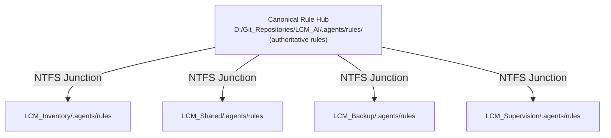
```mermaid
graph TD
    classDef default font-size:8pt;
    Hub["Canonical Rule Hub<br/>D:/Git_Repositories/LCM_AI/.agents/rules/<br/>(authoritative rules)"]
    
    Hub -->|NTFS Junction| J1["LCM_Inventory/.agents/rules"]
    Hub -->|NTFS Junction| J2["LCM_Shared/.agents/rules"]
    Hub -->|NTFS Junction| J3["LCM_Backup/.agents/rules"]
    Hub -->|NTFS Junction| J4["LCM_Supervision/.agents/rules"]


```

### Invariants:
1. **Single Source of Truth (`RULE-AUTHORITY`)**: The authoritative rule files reside canonically at `D:\Git_Repositories\LCM_AI\.agents\rules\`.
2. **Zero Drift Spoke Deployment**: Each current governed LCM root projects
   `.agents\rules` from the canonical hub as required by its active governance
   configuration.
3. **Mandatory Matrix Sync**: Any rule modification requires corresponding updates to both [`AGENTS.md`](file:///d:/Git_Repositories/AGENTS.md) and [`LCM_AI/docs/LCM-Rules-Cross-Reference.md`](file:///d:/Git_Repositories/LCM_AI/docs/LCM-Rules-Cross-Reference.md).
4. **Git Insulation**: `.agents/` is included in each child repository's `.gitignore` to prevent committing physical rule duplicates during git pulls or clones.

---

## 3. Two-Tier Proposal & Review Governance Stream

The LCM review engine establishes a structured, non-blocking two-tier proposal and review workflow (`RULE-LCM-001` through `RULE-LCM-006`):

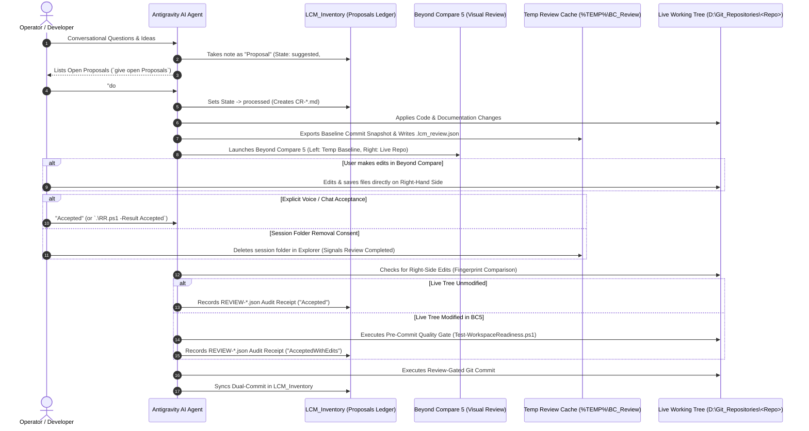
```mermaid
sequenceDiagram
    autonumber
    actor User as Operator / Developer
    participant Agent as Antigravity AI Agent
    participant PL as LCM_Inventory (Proposals Ledger)
    participant BC as Beyond Compare 5 (Visual Review)
    participant Temp as Temp Review Cache (%TEMP%\BC_Review)
    participant Live as Live Working Tree (D:\Git_Repositories\<Repo>)

    User->>Agent: Conversational Questions & Ideas
    Agent->>PL: Takes note as "Proposal" (State: suggested, #n)
    Agent-->>User: Lists Open Proposals (`give open Proposals`)
    User->>Agent: "do #n Proposal(s)"
    Agent->>PL: Sets State -> processed (Creates CR-*.md)
    Agent->>Live: Applies Code & Documentation Changes
    Agent->>Temp: Exports Baseline Commit Snapshot & Writes .lcm_review.json
    Agent->>BC: Launches Beyond Compare 5 (Left: Temp Baseline, Right: Live Repo)
    
    alt User makes edits in Beyond Compare
        User->>Live: Edits & saves files directly on Right-Hand Side
    end

    alt Explicit Voice / Chat Acceptance
        User->>Agent: "Accepted" (or `.\RR.ps1 -Result Accepted`)
    else Session Folder Removal Consent
        User->>Temp: Deletes session folder in Explorer (Signals Review Completed)
    end

    Agent->>Live: Checks for Right-Side Edits (Fingerprint Comparison)
    alt Live Tree Unmodified
        Agent->>PL: Records REVIEW-*.json Audit Receipt ("Accepted")
    else Live Tree Modified in BC5
        Agent->>Live: Executes Pre-Commit Quality Gate (Test-WorkspaceReadiness.ps1)
        Agent->>PL: Records REVIEW-*.json Audit Receipt ("AcceptedWithEdits")
    end
    Agent->>Live: Executes Review-Gated Git Commit
    Agent->>PL: Syncs Dual-Commit in LCM_Inventory


```

### 3.1 Visual Review Lifecycle & Acceptance Protocols

1. **Workspace Isolation (`%TEMP%\BC_Review\`)**:
   * Baseline commit snapshots are extracted to `%TEMP%\BC_Review\<RepoName>-<SHA>\`.
   * Each session writes an immutable `.lcm_review.json` recording `SessionStartedAt`, `BaseCommit`, and `CommitDate`.
   * The Left-Hand Side represents the read-only baseline commit; the Right-Hand Side represents the live working tree.
2. **Acceptance by Session Folder Removal**:
   * Deleting the specific repository review session folder in `%TEMP%\BC_Review\` by the user acts as an explicit signal of review completion and user consent.
3. **Automated Right-Side Edit & Save Detection (`AcceptedWithEdits`)**:
   * If the user modifies and saves files on the Right-Hand Side in Beyond Compare, the system automatically detects the difference against the pre-review fingerprint.
   * The review result is classified as `AcceptedWithEdits`, which automatically triggers a full pre-commit quality gate re-run to ensure syntax and test validity before committing.
4. **Maintenance Exemption**:
   * Running `.\Clear-BCReviewTemp.ps1 -All` is strictly classified as a **maintenance purge** across all sessions and never triggers review acceptance or commits.

### 3.2 Review Granularity & Exemption Hierarchy:
* **Review Granularity**: Configurable via `Invoke-ProposalAction.ps1 -SetGranularity <coarse|tight>`.
  * `coarse` (Default): Single review stop prior to commit across the change set.
  * `tight`: Stepwise review stops between intermediate sub-tasks.
* **Exemption Policy**: `LCM_Inventory` is **the sole exempt repository** from visual diff review because it contains purely tool-generated CM ledger data. The Root Container and all child repositories strictly require Beyond Compare 5 visual review.

### 3.3 Visual Review Scope and Operational Evidence

Beyond Compare filters determine visual review materiality only. They do not
determine whether a tracked operational artifact is legitimate. Operational
records such as proposal-ledger entries, activity logs, review receipts,
inventories, and baseline evidence may change or remain temporarily
uncommitted during prototyping, testing, and release preparation.

Proposal bundles and their walkthroughs may hold provisional delivery knowledge
between review cycles. The authoritative methodology is reconciled from that
knowledge after meaningful delivery or at release closure, no later than a
major-version push. This reconciliation boundary does not define lifecycle
state transitions or Control Hub actions.

### 3.4 Control Hub Lifecycle and Execution Ledger

The Control Hub presents a compact lifecycle rail to operators and maintains a
separate execution ledger for the work required to advance a proposal. The rail
is a decision surface, not a trace of every implementation detail. Validation,
baseline preparation, review-session setup, receipt generation, local commits,
and publication checks remain auditable internal facts.

#### Proposed Control Hub Facets and Actions

The proposed target state presents `Status`, `Plan State`, and `Progress Status`
as separate visible facets. `Status` is the lifecycle rail; `Plan State` records
the governance decision for the plan; and `Progress Status` reports current
execution, including `Busy doing <phase>` and `Failed for <reason>` without
creating additional lifecycle states. Priority is an integer from $0$ through
$10$, with $10$ highest. Cohorts are ordered by numeric priority; a technical
recommendation based on dependencies, risk, reversibility, and validation cost
is advisory only and never overrides the operator's sequence.

The proposed work area exposes the effective execution switches, including
verification depth, testing mode, review granularity, BCR display scope, trace
mode, and logging mode. Each execution run records the selected values as
evidence. `Review Decision` is the operator-facing checkpoint for the `Review`
state. `Publish` is the visible action, while `PUSH` remains a compatible
command alias.

### 3.4.1 Review Snapshot Chain

An accepted BCompare review captures an immutable snapshot of the reviewed
right-hand state in the CRP-specific review store. This capture creates only a
new left-hand comparison candidate and never changes the live right-hand
working tree. Each snapshot records its parent baseline or snapshot, scope,
source review session, disposition, timestamp, and content manifest.

Refreshed BCompare sessions may select any retained snapshot as the left-hand
side and compare it with the current live right-hand tree. Selecting an earlier
snapshot supports manual backtracking when later review decisions invalidate
interstitial work. The pushed baseline to final live tree comparison remains
mandatory before local commit, regardless of intermediate acceptances.

| Visible status | Operator meaning | Valid primary actions |
| :--- | :--- | :--- |
| `Open` | Recorded work that has not started. | Start, Hold, Cancel |
| `Active` | Design, implementation, or verification is underway. | Review, Hold, Cancel |
| `Review` | A BCompare review is open or awaits a disposition. | Accept, Request Changes, Hold |
| `Complete` | Review was accepted and a local commit was created. | Push, Reopen |
| `Published` | The local commit was pushed successfully. | Open Review |
| `Held` | Work is intentionally paused with a required reason. | Resume, Cancel |
| `Cancelled` | Work was abandoned or superseded. | Open Review |

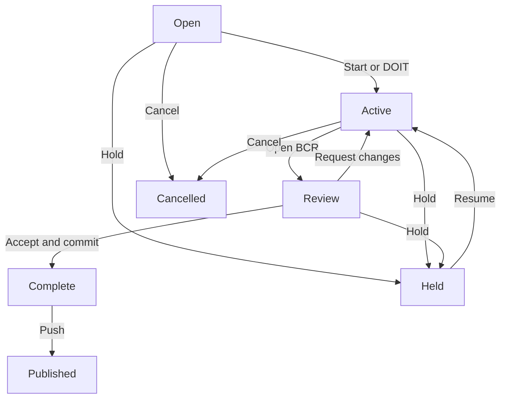
```mermaid
flowchart TB
    Open[Open] -->|Start or DOIT| Active[Active]
    Active -->|Open BCR| Review[Review]
    Review -->|Accept and commit| Complete[Complete]
    Review -->|Request changes| Active
    Complete -->|Push| Published[Published]
    Open -->|Hold| Held[Held]
    Active -->|Hold| Held
    Review -->|Hold| Held
    Held -->|Resume| Active
    Open -->|Cancel| Cancelled[Cancelled]
    Active -->|Cancel| Cancelled
```

`Held` has a reason category of `deferred`, `blocked`, or `failed`; these are
not separate lifecycle statuses. `Open Review` is an inspection tool, not a
state transition. Fast completion is an exceptional, receipted action within
`Active`, not an additional visible status.

The execution ledger records the following phases and artifacts without placing
them on the visible rail: scope selection, baseline checkpoint, change manifest,
verification evidence, BCompare package and disposition, local commit receipt,
and publication receipt. Verification depth is recorded as `Fast`, `Focused`,
`Standard`, `Deep`, or `Deferred`; deferred verification requires a reason and
a later gate.

BCompare compares the pushed baseline to the live working tree. Its exclusions
are display defaults, not evidence boundaries: the reviewer may widen the
horizon with `Peek` and use supplied hints for useful secondary checks. A failed
test, requested review change, or failed local commit returns the proposal to
`Active`; a failed push leaves it `Complete`.

#### Proposed Post-Commit Review Cleanup

After a successful local commit is recorded, the proposed lifecycle may run a
scoped BCR cleanup for the explicit proposal or bug and repository. It removes
only that dynamic named session, review cache, and live/baseline junction
artifacts after preview and ownership verification. Cleanup preserves unrelated
saved sessions, open windows, and other proposals' artifacts. A cleanup failure
is recorded as operational evidence and does not reverse a successful commit or
publication state.

#### Proposed Query Index Scenarios

The proposed LCM Query Index catalogs versioned tool-research scenarios with
inputs, expected artifacts, preferred provider, fallback provider, provenance,
and result contract. Eligible scenarios prefer `es.exe`; they use `rg` when
Everything is unavailable or cannot supply the required indexed-content
coverage or query semantics. Direct NTFS access remains authoritative; the
index is a projection and scenario catalog, not a replacement data store.

---

## 4. Configuration Management & Governance Diagnostics

Configuration Management is administered through specialized CLI tools in `LCM_Inventory/tools/`:

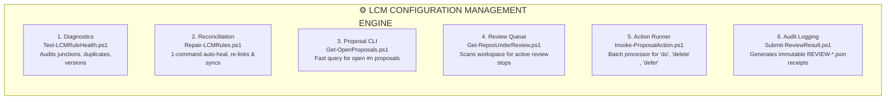
```mermaid
flowchart TD
    classDef default font-size:8pt;
    subgraph ENGINE["⚙️ LCM CONFIGURATION MANAGEMENT<br/>ENGINE"]
        direction TB
        D1["1. Diagnostics<br/>Test-LCMRuleHealth.ps1<br/>Audits junctions, duplicates,<br/>versions"]
        D2["2. Reconciliation<br/>Repair-LCMRules.ps1<br/>1-command auto-heal, re-links &<br/>syncs"]
        D3["3. Proposal CLI<br/>Get-OpenProposals.ps1<br/>Fast query for open #n proposals"]
        D4["4. Review Queue<br/>Get-ReposUnderReview.ps1<br/>Scans workspace for active review<br/>stops"]
        D5["5. Action Runner<br/>Invoke-ProposalAction.ps1<br/>Batch processor for 'do', 'delete'<br/>, 'defer'"]
        D6["6. Audit Logging<br/>Submit-ReviewResult.ps1<br/>Generates immutable REVIEW-*.json<br/>receipts"]
    end

```

---

## 5. Standardized Repository Layout Standard

Every governed repository conforms to the standard LCM directory layout:

```
<GovernedRepository>/
├── .git/                     # Git distributed version control database
├── .agents/
│   └── rules                 # [NTFS Directory Junction] -> D:\Git_Repositories\.agents\rules
├── .lcm/
│   ├── config.json           # Target metadata, absorbed version (v5.0.1), execution context
│   └── overrides.json        # Documented rule deviations & custom hooks
├── .vscode/                  # Workspace IDE settings (CRLF, UTF-8, strict Pester)
├── docs/
│   ├── README.md             # Component summary & index linking tripartite docs
│   ├── Architecture.md       # User-facing mental model, workflows, topology
│   ├── Requirements.md       # Technical design constraints & normative invariants
│   ├── Implementation.md     # Code realization, modules, exported cmdlets, schemas
│   └── Proposals/            # 1-file-per-CR Markdown proposals (CR-*.md)
├── install/
│   └── Installation.md       # Procedural deployment, configuration & update runbook
├── modules/                  # Production PowerShell modules (*.psm1, *.psd1)
├── tools/                    # Operational and CLI runner scripts
├── tests/                    # Pester v5 test suites (*.Tests.ps1)
└── .gitignore                # Standard exclusions (includes .agents/, scratch/)
```

---

## 6. Governed Upgrade Workflow (`Invoke-LCMUpdate.ps1`)

Automated upgrades enforce a **Proposal-First Permission Model**:
1. **Default Mode (Proposal-Only)**: Calling `Invoke-LCMUpdate.ps1 -TargetRepository <Repo>` generates a proposal document in the target repo's `docs/Proposals/` and executes a read-only DryRun simulation.
2. **Execute Mode (`-Execute`)**: Requires explicit operator instruction (`do #n Proposals`) to deploy junctions, instantiate templates, execute quality gates, and stage the baseline commit.

---

## 7. Desktop REST Bridge Daemon & Command Hub Architecture

To bridge background agent workers, IDE processes, and interactive desktop GUI applications, the LCM container provides a dedicated **Desktop REST Bridge Daemon** and **Short-Name Command Hub**:

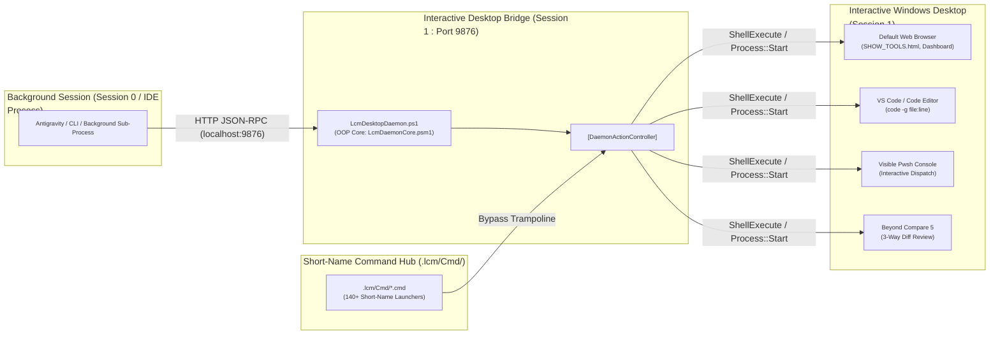
```mermaid
graph LR
    classDef default font-size:8pt;
    subgraph AgentWorker["Background Session (Session 0 / IDE<br/>Process)"]
        Agent["Antigravity / CLI / Background Sub-<br/>Process"]
    end

    subgraph DesktopDaemon["Interactive Desktop Bridge (Session<br/>1 : Port 9876)"]
        Daemon["LcmDesktopDaemon.ps1<br/>(OOP Core: LcmDaemonCore.psm1)"]
        Controller["[DaemonActionController]"]
        Daemon --> Controller
    end

    subgraph InteractiveDesktop["Interactive Windows Desktop<br/>(Session 1)"]
        Browser["Default Web Browser<br/>(SHOW_TOOLS.html, Dashboard)"]
        VSCode["VS Code / Code Editor<br/>(code -g file:line)"]
        Console["Visible Pwsh Console<br/>(Interactive Dispatch)"]
        BC["Beyond Compare 5<br/>(3-Way Diff Review)"]
    end

    subgraph CommandHub["Short-Name Command Hub (.lcm/Cmd/)"]
        Cmds[".lcm/Cmd/*.cmd<br/>(140+ Short-Name Launchers)"]
    end

    Agent -->|"HTTP JSON-RPC (localhost:9876)"| Daemon
    Controller -->|"ShellExecute / Process::Start"| Browser
    Controller -->|"ShellExecute / Process::Start"| VSCode
    Controller -->|"ShellExecute / Process::Start"| Console
    Controller -->|"ShellExecute / Process::Start"| BC
    Cmds -->|"Bypass Trampoline"| Controller


```

### Invariants:
1. **Session 1 Elevation & Focus Invariant**: UI tools launched from background agents execute via `http://127.0.0.1:9876` so they open with foreground focus in the operator's active Windows desktop session rather than hidden background workers.
2. **Short-Name Command Trampoline**: All command scripts in `.lcm/Cmd/<ShortName>.cmd` use deterministic relative resolution (`%~dp0..\..\<Path>`) to ensure identical behavior in standalone shells and IDE terminals.
3. **Creator Taxonomy Standard**: All tool creation utilities use the `Create-` verb (e.g. `Create-LcmTool.ps1` $\rightarrow$ `CreateTool`, `Create-WorkspaceBaseline.ps1` $\rightarrow$ `CreateWorkspaceBaseline`).
4. **Authoritative Synchronization**: `tools/Update-ToolCatalog.ps1` acts as the single compiler reconciling script ASTs, short-name aliases, HTML dashboard indices, and `tools/tool_catalog.json`.

---

## 8. Bottom-Up Tripartite (3-Tier) Documentation Methodology

Under the LCM framework, systems adhere to the **DOX Principle** (*Documentation Drives Implementation*). However, when onboarding existing codebases, absorbing rapid prototypes, or executing bottom-up Change Request Proposals (CRPs), documentation must frequently be synthesized retroactively from active code. 

The **Bottom-Up Tripartite Synthesis Methodology** defines the canonical 4-step derivation pipeline to generate comprehensive, cohesive tripartite specifications (`RULE-DOC-001` through `004`):

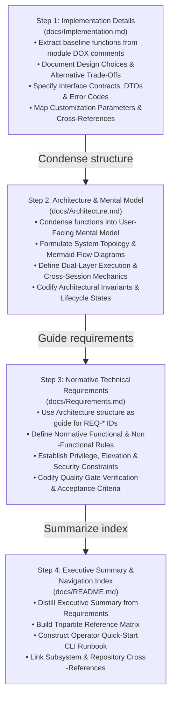
```mermaid
graph TD
    classDef default font-size:8pt;
    Step1["Step 1: Implementation Details<br/>(docs/Implementation.md)<br/>• Extract baseline functions from<br/>module DOX comments<br/>• Document Design Choices &<br/>Alternative Trade-Offs<br/>• Specify Interface Contracts, DTOs<br/>& Error Codes<br/>• Map Customization Parameters &<br/>Cross-References"]
    
    Step2["Step 2: Architecture & Mental Model<br/>(docs/Architecture.md)<br/>• Condense functions into User-<br/>Facing Mental Model<br/>• Formulate System Topology &<br/>Mermaid Flow Diagrams<br/>• Define Dual-Layer Execution &<br/>Cross-Session Mechanics<br/>• Codify Architectural Invariants &<br/>Lifecycle States"]
    
    Step3["Step 3: Normative Technical<br/>Requirements<br/>(docs/Requirements.md)<br/>• Use Architecture structure as<br/>guide for REQ-* IDs<br/>• Define Normative Functional & Non<br/>-Functional Rules<br/>• Establish Privilege, Elevation &<br/>Security Constraints<br/>• Codify Quality Gate Verification<br/>& Acceptance Criteria"]
    
    Step4["Step 4: Executive Summary &<br/>Navigation Index<br/>(docs/README.md)<br/>• Distill Executive Summary from<br/>Requirements<br/>• Build Tripartite Reference Matrix<br/>• Construct Operator Quick-Start<br/>CLI Runbook<br/>• Link Subsystem & Repository Cross<br/>-References"]

    Step1 -->|"Condense structure"| Step2
    Step2 -->|"Guide requirements"| Step3
    Step3 -->|"Summarize index"| Step4


```

### Synthesis Execution Pipeline:

1. **Step 1: Implementation Details (`Implementation.md`)**:
   * **Source Baseline**: Harvest all exported functions, classes, parameter blocks, and comment help from source code.
   * **Design Choices & Alternatives**: Explicitly document each critical architectural decision (e.g. why HTTP REST on localhost vs Named Pipes; why `%~dp0..\..\` trampolines vs PATH pollution; why `Create-` verb vs `New-`), contrasting it against rejected alternatives.
   * **Interface Contracts**: Detail exact JSON-RPC schemas, request/response DTO structures, HTTP methods, and status codes.
   * **Customization**: Document environment variable overrides, CLI switches, and configuration files.
   * **Traceability**: Provide clickable file and line links to concrete source files.

2. **Step 2: Architecture & User Mental Model (`Architecture.md`)**:
   * **User-Facing View**: Abstract concrete code into what the solution *looks like* to the operator and what it *accomplishes*.
   * **System Topology**: Construct Mermaid diagrams showing component boundaries, data flows, and IPC bridges.
   * **Workflows & Invariants**: Detail operator interaction patterns (CLI, GUI, Agent) and immutable system invariants.

3. **Step 3: Normative Technical Requirements (`Requirements.md`)**:
   * **Normative Derivation**: Using the structural domains established in `Architecture.md`, write clear `REQ-*` requirements using normative RFC 2119 keywords (`MUST`, `MUST NOT`, `SHOULD`, `MAY`).
   * **Archetype & Policy Rules**: Specify taxonomy naming standards, elevation constraints (`RULE-ELEV-001`), console persistence (`RULE-ELEV-005`), and StrictMode rules (`RULE-PS-001`).

4. **Step 4: Executive Summary & Directory Index (`README.md`)**:
   * **Executive Summary**: Synthesize the high-level purpose and core capabilities from `Requirements.md`.
   * **Tripartite Matrix**: Provide an authoritative table linking `Architecture.md`, `Requirements.md`, and `Implementation.md`.
   * **Quick-Start Runbook**: Provide immediate, copy-pasteable CLI commands for the most common operator workflows.

---

## 9. Automated Regression CRP Lifecycle & Cycle Governance ([CRP-135](file:///D:/Git_Repositories/LCM_Inventory/docs/Proposals/CRP-135-LCM-v7.5.0-Determining-And-Enforcing-Regression-CRPs.md))

To manage cross-repository ripple effects deterministically, LCM implements automated regression proposal derivation and Directed Acyclic Graph (DAG) cycle governance established by [CRP-135](file:///D:/Git_Repositories/LCM_Inventory/docs/Proposals/CRP-135-LCM-v7.5.0-Determining-And-Enforcing-Regression-CRPs.md):

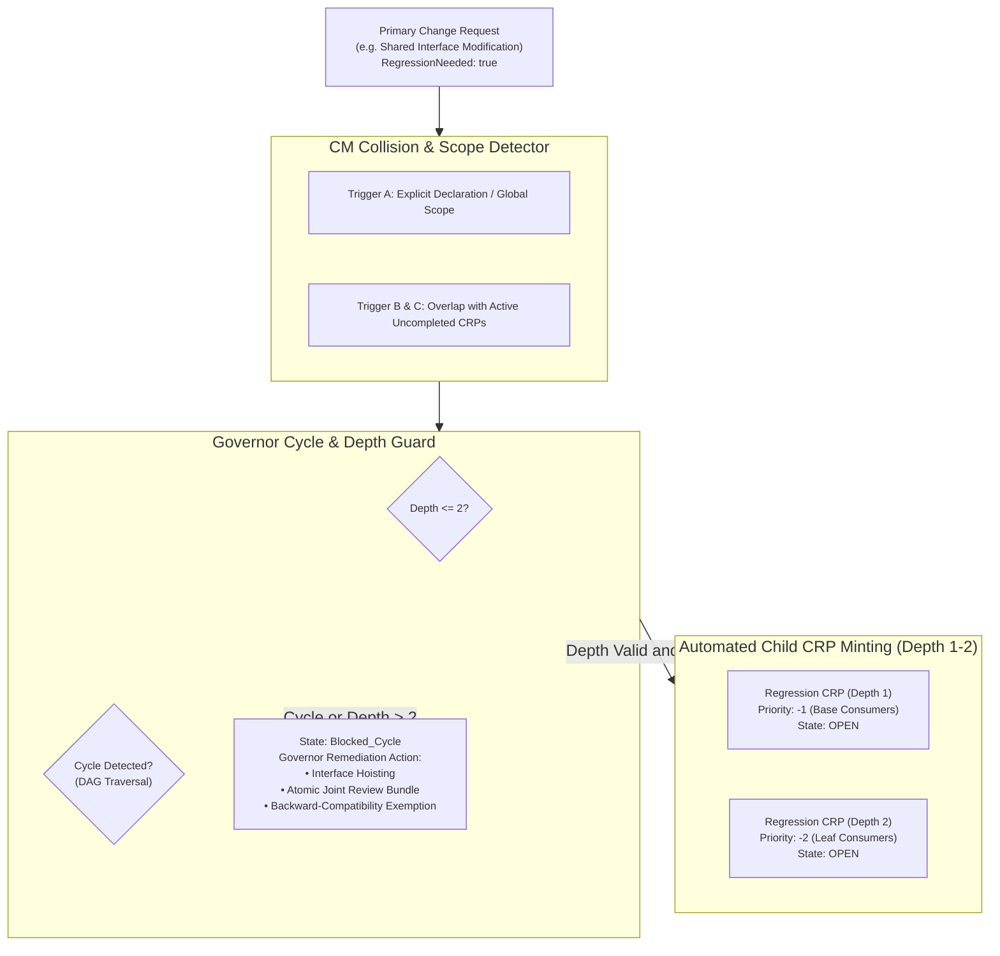
```mermaid
graph TD
    classDef default font-size:8pt;
    ParentCRP["Primary Change Request<br/>(e.g. Shared Interface Modification)<br/>RegressionNeeded: true"]
    
    subgraph DetectionEngine["CM Collision & Scope Detector"]
        Check1["Trigger A: Explicit Declaration / Global Scope"]
        Check2["Trigger B & C: Overlap with Active Uncompleted CRPs"]
    end

    subgraph ChildGeneration["Automated Child CRP Minting (Depth 1-2)"]
        Child1["Regression CRP (Depth 1)<br/>Priority: -1 (Base Consumers)<br/>State: OPEN"]
        Child2["Regression CRP (Depth 2)<br/>Priority: -2 (Leaf Consumers)<br/>State: OPEN"]
    end

    subgraph SafetyGuard["Governor Cycle & Depth Guard"]
        DepthCheck{"Depth <= 2?"}
        CycleCheck{"Cycle Detected?<br/>(DAG Traversal)"}
        BlockedCycle["State: Blocked_Cycle<br/>Governor Remediation Action:<br/>• Interface Hoisting<br/>• Atomic Joint Review Bundle<br/>• Backward-Compatibility Exemption"]
    end

    ParentCRP --> DetectionEngine
    DetectionEngine --> SafetyGuard
    SafetyGuard -->|"Depth Valid and No Cycle"| ChildGeneration
    SafetyGuard -->|"Cycle or Depth > 2"| BlockedCycle

```

### Core Architecture Invariants:
1. **Automated Child CRP Generation**: Child regression proposals (`Regression: <Area> for CRP-<ParentId>`) are generated in the `suggested` (`OPEN`) state per `RULE-LCM-015`.
2. **Topological Negative-Priority Sorting**: Downstream tasks in `ListOfChangesRequired` are assigned negative priorities (`-1`, `-2`, `-3`...) reflecting execution dependencies from foundational base layers (`-1`) out to leaf consumers.
3. **Deterministic Depth Ceiling (`MaxRegressionDepth = 2`)**: Derivative regressions are strictly bounded to 2 hops from the primary proposal.
4. **Governor Remedial Action on `Blocked_Cycle`**: When mutual circular coupling occurs, the CM Governor halts cascading mutations and instantiates a specialized **Cycle Resolution Proposal** offering interface hoisting, atomic joint review bundling, or one-way backward compatibility exemption.

---

## 10. App-Centric Architectural Decomposition, Active Context Engine & Cross-App Problem Governance ([CRP-048](file:///D:/Git_Repositories/LCM_Inventory/docs/Proposals/CRP-048-LCM-v7.5.0-App-Centric-Architecture-Engine.md))

As governed repositories scale from single-purpose scripts into multifaceted systems, monolithic tripartite documentation creates cognitive friction, documentation sprawl, and excessive LLM context consumption during automated code generation. 

Under the LCM framework's **DOX Principle** (*Documentation Drives Implementation*), documentation is the primary specification and code generation blueprint—a "Super-CRP". **CRP-048** formalizes the **App-Centric Architectural Decomposition**, an **Active Context Engine (`Workon:`)**, and **Cross-App Problem Management**:

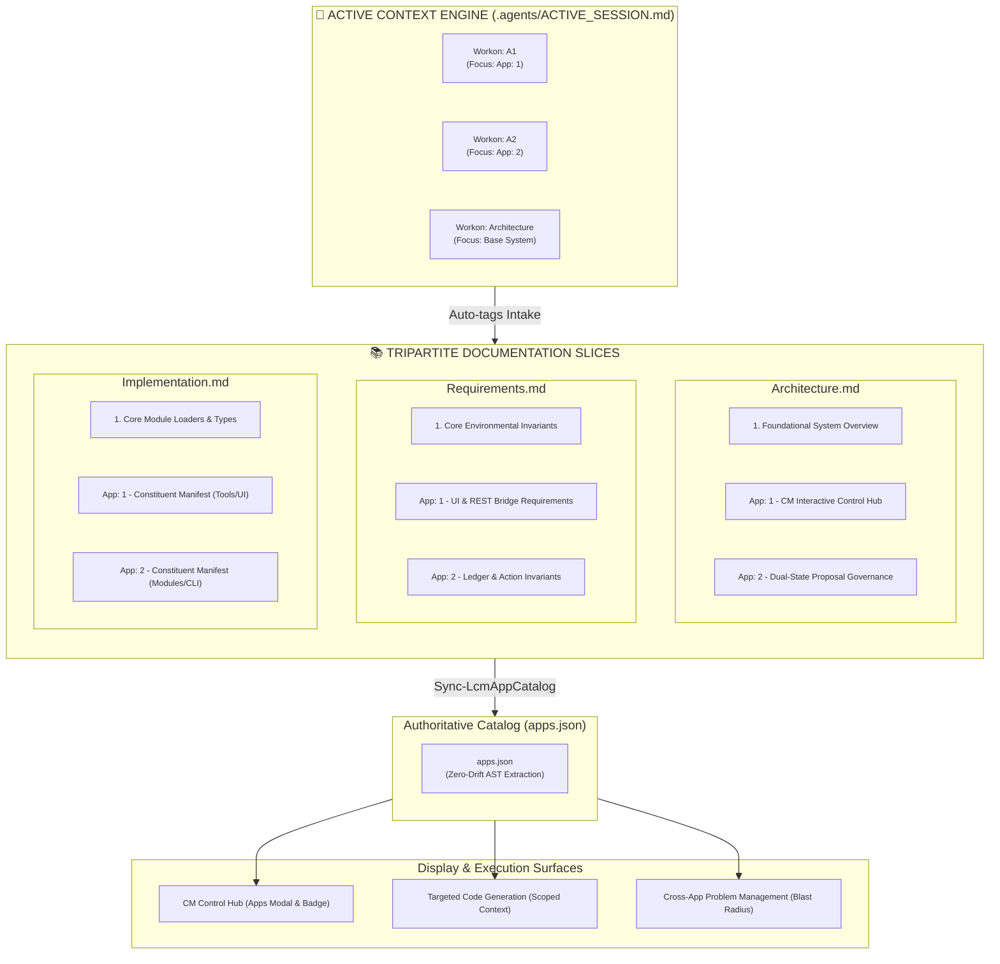
```mermaid
flowchart TB
    classDef default font-size:8pt;
    subgraph CONTEXT["🎯 ACTIVE CONTEXT ENGINE (.agents/ACTIVE_SESSION.md)"]
        direction LR
        W1["Workon: A1<br/>(Focus: App: 1)"]
        W2["Workon: A2<br/>(Focus: App: 2)"]
        W0["Workon: Architecture<br/>(Focus: Base System)"]
    end

    subgraph DOCS["📚 TRIPARTITE DOCUMENTATION SLICES"]
        direction TB
        subgraph ARCH["Architecture.md"]
            A0["1. Foundational System Overview"]
            A1["App: 1 - CM Interactive Control Hub"]
            A2["App: 2 - Dual-State Proposal Governance"]
        end
        subgraph REQ["Requirements.md"]
            R0["1. Core Environmental Invariants"]
            R1["App: 1 - UI & REST Bridge Requirements"]
            R2["App: 2 - Ledger & Action Invariants"]
        end
        subgraph IMP["Implementation.md"]
            I0["1. Core Module Loaders & Types"]
            I1["App: 1 - Constituent Manifest (Tools/UI)"]
            I2["App: 2 - Constituent Manifest (Modules/CLI)"]
        end
    end

    subgraph CATALOG["Authoritative Catalog (apps.json)"]
        AC["apps.json<br/>(Zero-Drift AST Extraction)"]
    end

    subgraph SURFACES["Display & Execution Surfaces"]
        S1["CM Control Hub (Apps Modal & Badge)"]
        S2["Targeted Code Generation (Scoped Context)"]
        S3["Cross-App Problem Management (Blast Radius)"]
    end

    CONTEXT -->|"Auto-tags Intake"| DOCS
    DOCS -->|"Sync-LcmAppCatalog"| CATALOG
    CATALOG --> S1
    CATALOG --> S2
    CATALOG --> S3
```

---

### 10.1 Architectural Decisions & Trade-Offs Matrix (Concluded Alternatives)

During the formalization of CRP-048, several architectural approaches were evaluated:

| Architectural Option | Alternative Evaluated | Final Decision | Rationale & Trade-Off |
| :--- | :--- | :--- | :--- |
| **Discussion Capture** | Raw Discussion Logging (AADD transcripts / meeting notes) | **Feature/App-Driven Synthesis** | *Rejected*: Raw transcripts accumulate noise, lack cohesion, and decay rapidly. *Adopted*: Conclusive discussions synthesize directly into named `App: #` sections upon `ACCEPT`. |
| **Directory Structure** | Subdirectory Sprawl (`docs/App1/`, `docs/App2/`) | **Flat In-Document Section Slices** | *Rejected*: Directory sprawl fragments the clean single-entrypoint tripartite standard (`RULE-DOC-001`). *Adopted*: In-document `App: #` headers inside tripartite specs; folders reserved strictly for autonomous subsystems. |
| **Prefix Syntax** | Angle/Square Brackets (`<App: 1>`, `[App: 1]`) | **Hyphenated Colon Format (`App: 1 - <Title>`)** | *Rejected*: Brackets add typing friction in CLI/markdown. *Adopted*: Clean plain-text `App: 1 - <Title>` and shorthand `A1`. |
| **Domain Nomenclature** | Commercial "Feature" naming (`Feat1`) | **Neutral "App" Slice Taxonomy (`App: 1`)** | *Rejected*: "Feature" carries end-user product bias unsuitable for low-level tooling/governance. *Adopted*: Versatile `App` (Application Slice / Architectural Increment). |

---

### 10.2 The `App:` Syntax & Active Context Engine (`Workon:`)

#### 1. Creation Operators:
- **`App: <Title>`** (Auto-numbering): Automatically resolves the next available integer (e.g. `App: 3 - Realtime Streamer`) and scaffolds the section across `Architecture.md`, `Requirements.md`, and `Implementation.md`.
- **`App: <Number> - <Title>`** (Explicit numbering): Binds an explicit identifier.

#### 2. Active Context Switching:
- **`Workon: A1` (or `Workon: 1`)**: Sets the active focus in `.agents/ACTIVE_SESSION.md`. Any new proposal intake (`crp: ...`, `bug: ...`) automatically inherits `app_id: "App: 1"`.
- **`Workon: Architecture` (or `Workon: Base`)**: Clears App slicing and targets the foundational, unpartitioned system architecture and core primitives.

---

### 10.3 3-Tier Code-to-App Mapping & Authoritative Catalog (`apps.json`)

To establish 100% bidirectional traceability between documentation and code without AST re-parsing on every request:

1. **Tier 1 (Specification Manifest)**: Each `App: #` in `Implementation.md` maintains a **Constituent Manifest Table** listing relative paths, architectural roles, entrypoints, and test suites.
2. **Tier 2 (In-Code DOX Header Annotation)**: Every script and module declares its parent App in its header comment:
   ```powershell
   <#
   .DESCRIPTION
       Module: modules/ProposalManager.psm1
       App: App: 2 - Dual-State Proposal Governance
   #>
   ```
3. **Tier 3 (Machine-Readable Catalog `apps.json`)**: Compiled automatically by `Sync-LcmAppCatalog.ps1` into `LCM_Inventory/data/catalog/apps.json` for sub-10ms queries by daemons, CLI runners, and HTML dashboards.

---

### 10.4 Impact on Code Generation & LLM Context Scoping

Partitioning specifications into `App: #` slices transforms automated code generation:
- **Scoped Context Windows**: When generating or modifying code for `App: 1`, code generation engines load *only* the `App: 1` sections across `Architecture.md`, `Requirements.md`, and `Implementation.md`.
- **Zero-Regression Invariant**: Isolating context eliminates unintended side-effects and hallucinations across unrelated repository modules.
- **Deterministic 1-to-1 Translation**: Code generation operates directly from the explicit parameter tables, schemas, and cmdlet lists in `Implementation.md`.

---

### 10.5 Cross-App Problem Management & Blast Radius Governance

Real-world problems frequently cross modular boundaries. Problem management is governed across four topologies:

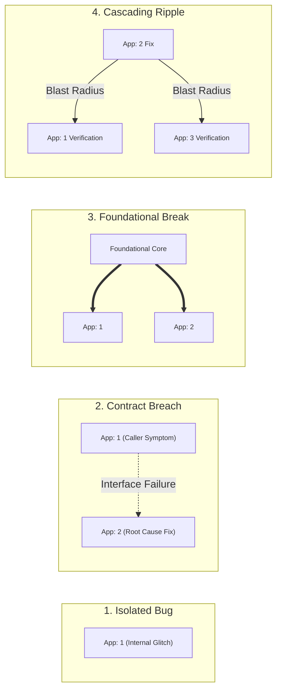
```mermaid
flowchart LR
    classDef default font-size:8pt;
    subgraph P1["1. Isolated Bug"]
        A1["App: 1 (Internal Glitch)"]
    end
    subgraph P2["2. Contract Breach"]
        B1["App: 1 (Caller Symptom)"] -.->|Interface Failure| B2["App: 2 (Root Cause Fix)"]
    end
    subgraph P3["3. Foundational Break"]
        C0["Foundational Core"] ==> C1["App: 1"] & C2["App: 2"]
    end
    subgraph P4["4. Cascading Ripple"]
        D2["App: 2 Fix"] -->|Blast Radius| D1["App: 1 Verification"] & D3["App: 3 Verification"]
    end
```

#### Problem Governance Rules:
1. **Multi-App Decoupling**: Bug proposals (`BUG-###`) explicitly declare `primary_app` (where the root cause is resolved) and `affected_apps` (the observed symptom or caller blast radius).
2. **Automated Blast Radius Probing**: When a fix touches `App: 2`, the AST Reverse Dependency Engine (`CRP-121` WUD) scans all callers in `App: 1` and `App: 3` and flags them for verification.
3. **Joint Multi-App Verification Gate**: A multi-App bug cannot be marked `completed` or `committed` until the unit tests of the primary App *and* the integration tests of all affected Apps pass 100%.
4. **Multi-Section Synthesis on `ACCEPT`**: The `ACCEPT <id>` command updates `Implementation.md` under `## App: 2` and `Requirements.md` under `## App: 1` in a single atomic lifecycle step.

---

### 10.6 High-Order Lifecycle Operators

To manage large-scale architectural restructuring, LCM provides high-order operators:

- **`Split-LcmArchitectureToApps.ps1`**: Decomposes legacy monolithic tripartite documents into structured `App: #` sections with constituent tables.
- **`Merge-RepositoriesToApps.ps1`**: Ingests external child repositories into an umbrella repo, preserving their tripartite specifications, code history, and tests as distinct `App: #` slices.
- **`Sync-LcmAppCatalog.ps1`**: Executes AST zero-drift verification between `Implementation.md`, file headers, and `apps.json`.

---

### 10.7 Git & GitHub Version Control Mapping

- **Commit Message Format**: `feat(App: 1): <summary> [CRP-###]` (enabling instant filtering via `git log --grep="App: 1"`).
- **GitHub Labels**: Structured labels (`app: 1`, `app: 2`, `app: architecture`) for Issue and PR tracking.
- **Grouped GitHub Releases**: Release notes generated via `gh release` automatically group changelogs under `### App: 1`, `### App: 2`, and `### Foundational Architecture`.

---

### 10.8 Inter-App Contract Governance (The "Glue")

To prevent modular repositories from degenerating into tight, unmaintainable coupling, **Apps must never communicate through implicit private state or ad-hoc internals**. All inter-App interactions are governed by formal, registered **Interface Contracts**:

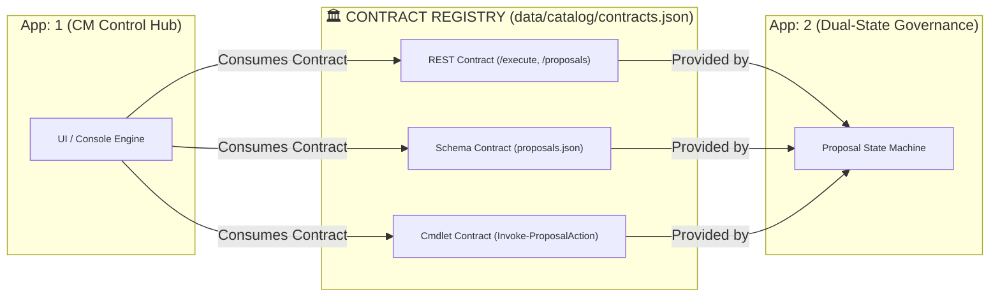
```mermaid
flowchart LR
    classDef default font-size:8pt;
    subgraph APP1["App: 1 (CM Control Hub)"]
        UI["UI / Console Engine"]
    end

    subgraph GLUE["🏛️ CONTRACT REGISTRY (data/catalog/contracts.json)"]
        C1["REST Contract (/execute, /proposals)"]
        C2["Schema Contract (proposals.json)"]
        C3["Cmdlet Contract (Invoke-ProposalAction)"]
    end

    subgraph APP2["App: 2 (Dual-State Governance)"]
        ENG["Proposal State Machine"]
    end

    UI -->|"Consumes Contract"| C1 & C2 & C3
    C1 & C2 & C3 -->|"Provided by"| ENG
```

#### The Four Contract Archetypes:
1. **Cmdlet Export Contracts (`Type: Cmdlet`)**: Formally exported public cmdlets using approved verbs, typed parameters, strict `ValidateSet` bounds, and structured pipeline output.
2. **Schema Contracts (`Type: Schema`)**: Versioned JSON schemas governing shared serialized state (e.g. `proposals.json`, `active_session.json`).
3. **REST JSON-RPC Contracts (`Type: REST`)**: Route paths, HTTP verbs, request/response DTOs, and CORS/Private Network Access (PNA) security invariants.
4. **Broadcast Event Contracts (`Type: Broadcast`)**: IPC broadcast channels (e.g. `BroadcastChannel`) and typed event payload definitions.

#### Contract Inventory & Automated Drift Auditing:
- Every App in `apps.json` explicitly declares its `provides_contracts` and `consumes_contracts`.
- The Rule Health checker (`Test-LCMRuleHealth.ps1`) and AST Dependency Prober (`CRP-121`) audit all cross-file calls. Any inter-App invocation bypassing a declared public contract is flagged as an **Unsanctioned Coupling Violation**.

---

### 10.9 The Atomic Assembly Paradigm — The Ultimate Goal of LCM

The ultimate goal of the Lifecycle Model (LCM) methodology is to transform software development from **handcrafted, bespoke coding** into **Deterministic Atomic Assembly**:

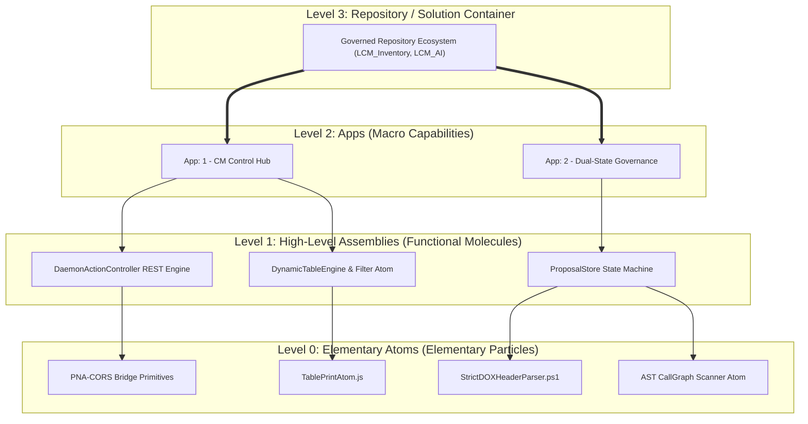
```mermaid
graph TB
    classDef default font-size:8pt;
    subgraph LEVEL3["Level 3: Repository / Solution Container"]
        REPO["Governed Repository Ecosystem (LCM_Inventory, LCM_AI)"]
    end

    subgraph LEVEL2["Level 2: Apps (Macro Capabilities)"]
        A1["App: 1 - CM Control Hub"]
        A2["App: 2 - Dual-State Governance"]
    end

    subgraph LEVEL1["Level 1: High-Level Assemblies (Functional Molecules)"]
        M1["ProposalStore State Machine"]
        M2["DaemonActionController REST Engine"]
        M3["DynamicTableEngine & Filter Atom"]
    end

    subgraph LEVEL0["Level 0: Elementary Atoms (Elementary Particles)"]
        ATOM1["TablePrintAtom.js"]
        ATOM2["StrictDOXHeaderParser.ps1"]
        ATOM3["PNA-CORS Bridge Primitives"]
        ATOM4["AST CallGraph Scanner Atom"]
    end

    REPO ==> A1 & A2
    A1 --> M2 & M3
    A2 --> M1
    M1 --> ATOM2 & ATOM4
    M2 --> ATOM3
    M3 --> ATOM1
```

#### The Composition Hierarchy:
1. **Level 0: Elementary Atoms (Particles)**: Pure, single-purpose, side-effect-free primitives (e.g., table renderer atoms, header parsers, AST tokens, string normalizers, REST encoders).
2. **Level 1: High-Level Assemblies (Molecules)**: Cohesive functional building blocks composed of atoms (e.g., `ProposalStore`, `DaemonActionController`, `RegressionDAGOrder`).
3. **Level 2: Apps (Organisms)**: Complete, marketable capability slices composed of assemblies and atoms (e.g., `App: 1 - CM Interactive Control Hub`, `App: 2 - Dual-State Proposal Governance`).
4. **Level 3: Repository Ecosystem**: The coordinated constellation of Apps bound together by formal inter-App contracts.

#### User & Operator Perspective (Why This is the Ultimate Payoff):
- **Zero-Hallucination AI Code Synthesis**: When an operator commands `App: <Title>`, the AI agent does not generate fragile, boilerplate code from scratch. Instead, it **assembles pre-verified atomic particles and high-level assemblies** according to the contractual blueprint in `Implementation.md`.
- **Lego-Brick Composability & Portability**: High-level assemblies can be reused, reconfigured, or merged across repositories (`Merge-RepositoriesToApps`) with guaranteed behavioral integrity.
- **True Isolation & Non-Breaking Maintenance**: Updating an underlying atom or assembly automatically enhances all consuming Apps while contract boundaries prevent cross-domain breakage.

<!-- FixDocumentation: CRP-196 Architecture -->
### 3.4.2 Documentation Reconciliation Flow

`FixDocumentation <CRP/BUG scope>` reconciles explicit, repository-qualified
documentation payloads from selected proposal bundles. It produces a manifest
by default, applies only declared content with provenance markers when
authorized, and opens BCompare for every repository whose tripartite documents
change.
<!-- /FixDocumentation -->

---

## 11. Model-First Analysis Protocol & Implementation Gating Architecture (CRP-243)

To eliminate speculative code changes and unconstrained hallucinations during pair programming, the Lifecycle Model enforces strict modal separation between **READ-ONLY ANALYSIS** and **GOVERNED IMPLEMENTATION**.

### 11.1 Intent Wake Words & Phase Exclusion

```
[ User Prompt: "ANALYZE ..." ]
             │
             ▼
┌─────────────────────────────────────────┐
│        STATE 1: READ-ONLY ANALYSIS      │
│  - Model Formulation                    │
│  - Evidence Verification [VERIFIED/GAP] │◄──────────┐
│  - Interactive Decision Gates (A, B, C) │           │ (Ambiguity /
└────────────────────┬────────────────────┘           │  Conflict
                     │                                │  Encountered)
    [ User Prompt: "IMPLEMENT ..." ]                  │
                     │                                │
                     ▼                                │
┌─────────────────────────────────────────┐           │
│     STATE 2: GOVERNED IMPLEMENTATION    │           │
│  - Bound to Selected Analysis Path      │           │
│  - Standard LCM File / Patch Execution  │           │
│  - Pre-execution Feasibility Check     ───► [FAILS] ─┘
└────────────────────┬────────────────────┘
                     │ [SUCCEEDS]
                     ▼
┌─────────────────────────────────────────┐
│     STATE 3: VERIFICATION & AUDIT       │
│  - Permanent Log / State Recorded       │
└─────────────────────────────────────────┘
```

- **`ANALYZE` (Wake Word)**: Locks the session into `READ_ONLY_ANALYSIS`. File modification tools (`write_to_file`, `replace_file_content`, `multi_replace_file_content`), destructive shell commands, and Git mutation commands are strictly forbidden. The agent must first construct a structured model defining Entities, State Variables, Actions, and Constraints.
- **`IMPLEMENT` (Transition Word)**: Unlocks `GOVERNED_IMPLEMENTATION`. Execution is bound strictly to the conclusions, settled facts, and path consensus reached in the preceding `ANALYZE` phase.
- **Phase Exclusion**: During active `READ_ONLY_ANALYSIS`, formulating implementation CRPs or staging source code modifications is strictly prohibited.

> [!NOTE]
> **Operational Expectation: Mode `ANALYZE` at Review Gates & Suggested State**:  
> Operating in `READ_ONLY_ANALYSIS` mode is explicitly expected during the initial `suggested` proposal state and whenever paused at lifecycle review gates (Gate 1 Planning Gate per `RULE-LCM-014` and Gate 2 Visual Review Gate per `RULE-REV-001`). During these checkpoints, the assistant and operator evaluate specifications, audit gaps, and formulate models without speculative file mutations or premature commits.

### 11.2 The Circuit Breaker Protocol

When an implementation feasibility check fails (missing API parameter, inaccessible dependency, or constraint contradiction), execution halts immediately. Speculative workarounds are forbidden.

1. **State Drop**: Mode immediately drops from `GOVERNED_IMPLEMENTATION` to `CIRCUIT_BREAKER_HALT` and returns to `READ_ONLY_ANALYSIS`.
2. **Notification Contract**: Emits `### [ANALYSIS RESUMED] - Implementation Block Encountered` detailing the gap/conflict, invalidation impact, and 2–3 decision gate choices.
3. **Control Hub Register**: Alerts the operator with a resumption block until explicitly steered.

### 11.3 Runtime State Transparency & Telemetry Registers

Operating variables are synchronized to `active_session.json` and exposed directly to the LCM Control Hub:

| State Variable | Type | Allowed Values | Monitoring & Enforcement Rule |
| :--- | :--- | :--- | :--- |
| `LCM_OperatingMode` | String | `READ_ONLY_ANALYSIS`, `GOVERNED_IMPLEMENTATION`, `CIRCUIT_BREAKER_HALT` | Prominently displayed in UI. If `READ_ONLY_ANALYSIS`, write hooks and execution runners reject modifications. |
| `LCM_ActiveGate` | String | `STEP_001` .. `STEP_nnn` | Current position in interactive decision DAG. |
| `LCM_SearchRadius` | Integer | Max `2` (Default) | Fences search depth from target root. |
| `LCM_SettledFacts` | Array[ID] | e.g. `["F-001", "F-002"]` | Settled facts to avoid redundant rediscovery. |
| `LCM_OpenHypotheses` | Array[ID] | e.g. `["HYP-001", "HYP-002"]` | Contested hypotheses under active audit. |
| `LCM_CircuitBreaker` | Boolean | `true`, `false` | Tripped when feasibility checks fail; alerts user with resumption block. |

