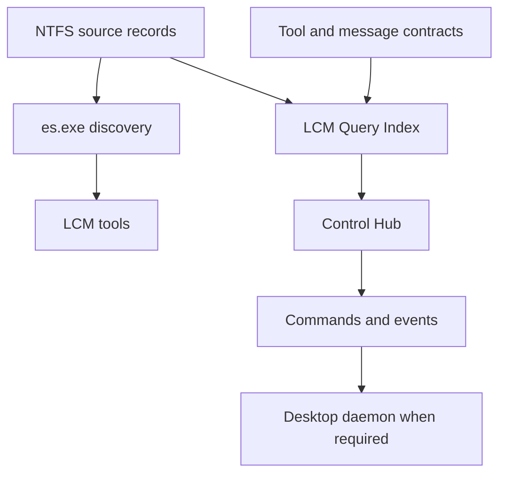

# LCM_AI Lifecycle Model (LCM) Implementation & Tooling Mapping

ModulePath: docs/Implementation.md  
Authors: Rolf, LCM_AI Engine  
Version: 8.0.0  
Status: Authoritative Implementation  
Date: 2026-09-19  

---

## 1. Directory Structure & Execution Topology

Under LCM v7.0.0, the governance and execution tooling is organized into functional categories across [`LCM_AI`](file:///D:/Git_Repositories/LCM_AI) (Governance Authority & Baseline Source) and [`LCM_Inventory`](file:///D:/Git_Repositories/LCM_Inventory) (Configuration Management Engine).

### A. PowerShell CLI Tools

| Repository | Tool Path | Version | Purpose |
| :--- | :--- | :---: | :--- |
| **`LCM_AI`** | [`tools/Test-WorkspaceReadiness.ps1`](file:///D:/Git_Repositories/LCM_AI/tools/Test-WorkspaceReadiness.ps1) | `1.0.0` | Comprehensive readiness runner and quality gate validator for `LCM_AI`. |
| **`LCM_AI`** | [`tools/Invoke-LCMOnboardRepo.ps1`](file:///D:/Git_Repositories/LCM_AI/tools/Invoke-LCMOnboardRepo.ps1) | `1.1.0` | 4-phase onboarding and update engine for onboarding target repositories into LCM. |
| **`LCM_Inventory`** | [`tools/Invoke-BeyondCompareReview.ps1`](file:///D:/Git_Repositories/LCM_Inventory/tools/Invoke-BeyondCompareReview.ps1) | `1.0.0` | Isolated visual comparison launcher comparing baseline commit snapshot against live repo. |
| **`LCM_Inventory`** | [`tools/Submit-ReviewResult.ps1`](file:///D:/Git_Repositories/LCM_Inventory/tools/Submit-ReviewResult.ps1) | `1.0.0` | Interactive review outcome recorder (`Accepted`, `AcceptedWithEdits`, `Rejected`, `Deferred`). |
| **`LCM_Inventory`** | [`tools/Invoke-WorkspaceAudit.ps1`](file:///D:/Git_Repositories/LCM_Inventory/tools/Invoke-WorkspaceAudit.ps1) | `1.0.0` | Multi-repository CM audit scanner; generates inventory JSON and dashboard markdown. |
| **`LCM_Inventory`** | [`tools/Invoke-LCMUpdate.ps1`](file:///D:/Git_Repositories/LCM_Inventory/tools/Invoke-LCMUpdate.ps1) | `1.0.0` | Governed LCM update tool; enforces proposal-first dry-run before live execution. |
| **`LCM_Inventory`** | [`tools/Find-ChangeRequest.ps1`](file:///D:/Git_Repositories/LCM_Inventory/tools/Find-ChangeRequest.ps1) | `1.0.0` | Query tool for searching Change Requests by text, repo, bundle, or status. |
| **`LCM_Inventory`** | [`tools/Create-WorkspaceBaseline.ps1`](file:///D:/Git_Repositories/LCM_Inventory/tools/Create-WorkspaceBaseline.ps1) | `1.1.0` | Snapshot tool capturing full workspace state into versioned JSON baselines. |
| **`LCM_Inventory`** | [`tools/Test-WorkspaceDrift.ps1`](file:///D:/Git_Repositories/LCM_Inventory/tools/Test-WorkspaceDrift.ps1) | `1.0.0` | Drift detection tool evaluating dirty copies, unpushed commits, and outdated LCM versions. |
| **`LCM_Inventory`** | [`tools/Clear-BCReviewTemp.ps1`](file:///D:/Git_Repositories/LCM_Inventory/tools/Clear-BCReviewTemp.ps1) | `1.5.0` | User command to inspect, list, and purge Beyond Compare temp review directories (`%TEMP%\BC_Review`). |
| **`LCM_Inventory`** | [`tools/Sync-IgnoredRepositories.ps1`](file:///D:/Git_Repositories/LCM_Inventory/tools/Sync-IgnoredRepositories.ps1) | `1.0.0` | Reconciles `git.ignoredRepositories` in `.vscode/settings.json` against workspace non-git directories. |
| **`LCM Hub (tools/)`** | [`tools/Create-LcmTool.ps1`](file:///D:/Git_Repositories/.lcm/tools/internal/Create-LcmTool.ps1) | `2.1.0` | Scaffolding engine creating standard `.ps1` tools, short names, and `.lcm/Cmd/` trampolines. |
| **`LCM Hub (tools/)`** | [`tools/LcmDesktopDaemon.ps1`](file:///D:/Git_Repositories/.lcm/tools/internal/LcmDesktopDaemon.ps1) | `2.1.0` | Lightweight high-performance Session 1 REST bridge daemon for cross-session GUI dispatch. |
| **`LCM Hub (tools/)`** | [`tools/Show-LcmDaemon.ps1`](file:///D:/Git_Repositories/.lcm/tools/internal/Show-LcmDaemon.ps1) | `1.1.0` | Real-time telemetry probe, live status monitor, read-only log viewer, and cleanup manager. |
| **`LCM Hub (tools/)`** | [`tools/Show-Tools.ps1`](file:///D:/Git_Repositories/.lcm/tools/internal/Show-Tools.ps1) | `3.1.0` | Interactive LCM Tool Explorer dashboard runner with ShortName default view. |
| **`LCM Hub (tools/)`** | [`tools/Update-ToolCatalog.ps1`](file:///D:/Git_Repositories/.lcm/tools/internal/Update-ToolCatalog.ps1) | `2.0.0` | Tool catalog sync engine parsing AST dependencies, taxonomy short names, and `.lcm/Cmd/` trampolines. |

---

### B. Beyond Compare Review Architecture & Session Metadata

Each review session launched via `Invoke-BeyondCompareReview.ps1` produces an isolated, read-only baseline export in `%TEMP%\BC_Review\<RepoName>-<SHA>\` with a session metadata token (`.lcm_review.json`):

```json
{
  "RepositoryName": "LCM_AI",
  "RepositoryPath": "D:\\Git_Repositories\\LCM_AI",
  "BaseCommit": "3ae7621",
  "CommitMessage": "feat(docs): implement CR-2026-014 tripartite templates...",
  "CommitDate": "2026-08-20T19:00:00+02:00",
  "SessionStartedAt": "2026-08-20T22:12:00+02:00"
}
```

* **Session Folder Deletion as User Consent**: Deletion of `%TEMP%\BC_Review\<RepoName>-<SHA>\` by the operator signals review completion and consent.
* **Right-Side Edit Detection**: Compares working tree status against pre-review state; if modified, classifies disposition as `AcceptedWithEdits` and runs `Test-WorkspaceReadiness.ps1` before committing.
* **Maintenance Purge**: `Clear-BCReviewTemp.ps1 -All` purges all temp session directories and is excluded from triggering review acceptance.

### C. Documentation and Operational Evidence

The authoritative methodology is maintained in `LCM_AI/docs/Architecture.md`,
`Requirements.md`, `Implementation.md`, and `LCM-Configuration-Management.md`.
Proposal bundles in `docs/Proposals/` and append-oriented CM records in
`LCM_Inventory/data/` and `LCM_Inventory/logs/` support incremental
delivery and auditability; they are not equivalent to permanent implementation
assets for BCompare review purposes.

At release closure, and no later than a major-version push, accepted delivery
knowledge is reconciled from proposal bundles and walkthroughs into the
authoritative methodology. Historical-log retention and cleanup remain
maintenance operations, not rewriting of operational evidence.

---

### D. PowerShell Modules

| Repository | Module Path | Version | Exported Functions & Scope |
| :--- | :--- | :---: | :--- |
| **`LCM_AI`** | [`tools/Onboarding/LCMOnboarding.psm1`](file:///D:/Git_Repositories/LCM_AI/tools/Onboarding/LCMOnboarding.psm1) | `1.0.0` | `Test-LCMPreFlight`, `New-LCMGovernanceLinks`, `Expand-LCMTemplate`, `Test-LCMIntegrity`, `Invoke-LCMOnboardRepo` |
| **`LCM_AI`** | [`tools/QualityGates/WorkspaceQualityGates.psm1`](file:///D:/Git_Repositories/LCM_AI/tools/QualityGates/WorkspaceQualityGates.psm1) | `1.0.0` | `Test-WorkspaceQualityGates`, `Test-GovernanceRules`, `Test-DryRunEngine` |
| **`LCM_Inventory`** | [`modules/WorkspaceCM.psm1`](file:///D:/Git_Repositories/LCM_Inventory/modules/WorkspaceCM.psm1) | `1.1.0` | `Get-WorkspaceRoot`, `Get-WorkspaceAIState`, `Get-RepoCMState`, `Update-WorkspaceInventory`, `Test-WorkspaceDrift`, `Create-WorkspaceBaseline`, `Write-CMLog` |
| **`LCM_Inventory`** | [`modules/ChangeRequestManager.psm1`](file:///D:/Git_Repositories/LCM_Inventory/modules/ChangeRequestManager.psm1) | `2.0.0` | `Sync-CRJunctions`, `Get-ChangeRequests`, `Find-ChangeRequest`, `New-ChangeRequest`, `Get-CRBundles`, `New-CRBundle`, `Add-CRToBundle`, `Export-ChangeRequestDashboard` |
| **`LCM Hub (tools/)`** | [`tools/modules/LcmDaemonCore.psm1`](file:///D:/Git_Repositories/.lcm/tools/internal/modules/LcmDaemonCore.psm1) | `2.1.0` | Strongly-typed OOP domain model: `DaemonEnvironment`, `DaemonActionController`, DTO classes, and `Send-DaemonJsonResponse`. |
| **`LCM Hub (tools/)`** | [`tools/modules/LcmToolCatalog.psm1`](file:///D:/Git_Repositories/.lcm/tools/internal/modules/LcmToolCatalog.psm1) | `2.0.0` | HTML compiler, catalog rendering engine, switched short-name table view, and 8-mode action dropdown router. |

---

## 2. Intended Control Hub Data World

This section describes the target data model for the Control Hub redesign. It
is an architectural implementation target, not a claim that the current tools
already provide these interfaces.

### A. Authority and Query Layers

NTFS files are the authoritative local data plane. Proposal bundles, ledgers,
receipts, manifests, JSON, XML, and local databases are read directly by tools.
The desktop daemon on port 9876 transports commands and events; it is not a
generic file-data transport.

`es.exe` is the primary discovery partner for tools. It locates system and
workspace files and indexed text using Everything query syntax. The LCM Query
Index is a structured projection for fast Control Hub queries; it relates
governed facts without replacing their authoritative source records. A future
local database is an appropriate implementation candidate for that projection.



### B. Index Projections

| Projection | Purpose |
| :--- | :--- |
| `ProposalIndexEntry` | Proposal identity, scope, visible status, hold reason, current run, and bundle location. |
| `RepositoryIndexEntry` | Repository location, branch, pushed SHA, working-tree summary, and LCM classification. |
| `ExecutionRunProjection` | Current internal phase, checkpoint, verification depth, baseline SHA, and outcome. |
| `ArtifactLocator` | Typed pointer to specifications, plans, manifests, verification, review, commit, and publication evidence. |
| `ActionProjection` | Valid actions, blocking conditions, and next required evidence for a proposal or selected cohort. |

### C. Contracts and Interfaces

The index also catalogs tool interfaces so sequential tools can discover the
objects and messages they may produce or consume. A JSON file is one possible
serialization of an interface; it is not the interface definition by itself.

| Contract | Required index relationship |
| :--- | :--- |
| `ToolContractIndexEntry` | Tool identity, version, input/output interfaces, supported transports, source path, and source hash. |
| `InterfaceContract` | Interface identity, version, shape, required fields, producers, consumers, authoritative path, and schema hash. |
| `MessageContract` | Parameter, file, or daemon-event transport with request/response interfaces, correlation, and failure behavior. |
| `WorkflowContract` | Ordered tools, preconditions, input interfaces, produced artifacts, and postconditions. |

The Control Hub consumes visible status and action projections. It does not
derive lifecycle meaning from an unstructured content search at render time.
IDE services may enrich a source location with symbols, references, or
diagnostics, but remain optional semantic providers rather than lifecycle
authority.

### D. Proposed Control Hub and Review Contracts

The proposed Control Hub presentation separates `Status`, `Plan State`, and
`Progress Status`. It renders numeric priority $0$ through $10$, the active
busy phase, a recoverable failure indicator, and the effective execution
switches. Numeric priority determines cohort order; technical sequencing is
advisory within equal-priority cohorts. The recorded switch set includes
verification depth, testing mode, review granularity, BCR display scope, trace
mode, and logging mode.

`Review Decision` is the proposed review checkpoint. The visible `Publish`
action maps to the compatible `PUSH` command. An accepted decision appends an
immutable CRP-specific snapshot with parent baseline or snapshot, accepted
scope, source review session, disposition, timestamp, and content manifest.
Snapshots are BCompare left-side candidates only; selecting one never changes
the live right-hand tree. Before a local commit, the final review compares the
pushed baseline with the final live tree.

### E. Proposed Cleanup and Query Scenarios

The proposed post-commit cleanup accepts an explicit repository and CRP or BUG
identifier, previews the owned dynamic BCR session, cache, and junction
artifacts, then removes only those artifacts after the local commit is recorded.
Its structured result records failure without changing the commit or publication
outcome.

A proposed `QueryScenarioContract` supplies scenario inputs, expected
artifacts, preferred and fallback providers, provider-selection evidence,
fallback reason, provenance, and result shape. Eligible scenarios use `es.exe`
first and fall back to `rg` when availability, content coverage, or query
semantics require it. These contracts belong in the LCM Query Index projection;
they do not replace authoritative NTFS reads or imply deployed adapters.

---

## 3. Setup Python for Google Antigravity

Google Antigravity provides agentic AI pair programming capabilities. The Python virtual environment is established at the workspace root container level.

### Setup Instructions

1. **Prerequisites**:
   * Python 3.10+ installed on Windows (available in `PATH`).

2. **Initialize Virtual Environment**:
   ```powershell
   pwsh -Command "
   cd D:\Git_Repositories
   python -m venv .venv
   .\.venv\Scripts\Activate.ps1
   python -m pip install --upgrade pip
   "
   ```

3. **Install Antigravity SDK & Dependencies**:
   ```powershell
   pwsh -Command "
   .\.venv\Scripts\Activate.ps1
   pip install google-antigravity
   "
   ```

4. **Verify Installation**:
   ```powershell
   pwsh -Command "
   .\.venv\Scripts\Activate.ps1
   agy --version
   "
   ```

---

## 4. Data Schemas & Configurations

### A. Repository-Local Configuration (`.lcm/config.json`)
Instantiated in each governed repository during Phase 3 of onboarding:
```json
{
  "meta": {
    "module": "config.json",
    "version": "1.0.0",
    "config_type": "lcm-target-repository-config"
  },
  "repository": {
    "name": "VolumeInventory",
    "primary_language": "PowerShell",
    "module_root": "src",
    "onboarded_at": "2026-08-15T23:11:48+02:00"
  },
  "governance": {
    "lcm_version": "4.1.0",
    "workspace_authority": "D:\\Git_Repositories\\LCM_AI",
    "immutable_links": {
      "junctions": [
        ".agents/rules/core",
        ".copilot/Rules/core"
      ],
      "hardlinks": [
        "AGENTS.md",
        "GEMINI.md",
        ".copilot/instructions.md"
      ]
    }
  }
}
```

### B. Machine-Readable Inventory (`LCM_Inventory/data/inventory.json`)
Generated automatically by `Update-WorkspaceInventory` during full scans.

### C. Change Request Test Bundles (`LCM_Inventory/data/bundles/`)
Groups related CRs into single test sequence milestones (e.g., `BUNDLE-2026-01.json` for LCM v7.0.0 Baseline, `BUNDLE-2026-02.json` for CM Initialization).

---

## 5. Requirement Traceability Matrix

| Requirement ID | Requirement Name | Implemented By Control / Tool | Status |
| :--- | :--- | :--- | :---: |
| **`LCM-REQ-SYS-001`** | Authoritative PowerShell Runtime | `pwsh.exe 7.0+` enforced in all `.ps1`/`.psm1` headers & execution policies | **Active** |
| **`LCM-REQ-SYS-002`** | Git Version Control | `Get-RepoCMState` Git inspection; Pre-LCM baseline commit phase | **Active** |
| **`LCM-REQ-SYS-003`** | NTFS Filesystem & Links | `New-LCMGovernanceLinks` (NTFS junctions & hardlinks) | **Active** |
| **`LCM-REQ-SYS-004`** | Python for Antigravity | `D:\Git_Repositories\.venv` (`google-antigravity`, `agy`) | **Active** |
| **`LCM-REQ-001`** | Canonical Authority Root | `LCM_AI` authority defined; `.agents/rules/core` junctions | **Active** |
| **`LCM-REQ-002`** | Precedence Hierarchy | `Workspace-Rules.md` & `LanguagePolicy.md` invariants | **Active** |
| **`LCM-REQ-004`** | Repository Local Overrides | `.lcm/overrides.json` parsed by `Expand-LCMTemplate` & `Test-RepoReadiness` | **Active** |
| **`LCM-REQ-010`** | Explicit Classification | `Get-RepoCMState` classification in `WorkspaceCM.psm1` | **Active** |
| **`LCM-REQ-011`** | Guarded State Transitions | `Invoke-LCMUpdate.ps1` default proposal mode with dry-run preview | **Active** |
| **`LCM-REQ-021`** | 1-File-Per-CR Standard | `New-ChangeRequest` single-file generation (`Docs/Methods/Proposals/`) | **Active** |
| **`LCM-REQ-022`** | LCM Timestamp Naming | `CR-yyyyMMdd_HHmmss.md` format in `ChangeRequestManager.psm1` | **Active** |
| **`LCM-REQ-023`** | Change Request Bundles | `data/bundles/*.json` batch test suites | **Active** |
| **`LCM-REQ-030`** | Self-Readiness Quality Gate | `Test-WorkspaceReadiness.ps1` in `LCM_AI` | **Active** |
| **`LCM-REQ-032`** | Drift Evaluation | `Test-WorkspaceDrift.ps1` in `LCM_Inventory` | **Active** |

---

## 6. Design Choices & Implementation Rationale

| Design Choice | Approach Selected | Alternative Considered | Rationale & Trade-Off Analysis |
| :--- | :--- | :--- | :--- |
| **Defect Intake Gate** | **Mandatory `OPEN` State on `BUG:` / `CRP:` Designators (`RULE-LCM-015`)** | Immediate analysis, plan generation, or immediate code modification | Operator bug enumerations are reports, not work orders. Immediate execution causes credit exhaustion, premature code mutations, and unapproved refactorings. Mandating `OPEN` state ensures complete intake and explicit operator control. |
| **Activation Trigger Scope** | **Directional `PROCEED ALL` (strictly applies ABOVE keyword) (`RULE-LCM-016`)** | Global `PROCEED ALL` applying to all items in prompt or active session | Operators often provide subsequent notes, deferred items, or caveats below `PROCEED ALL`. Restricting `PROCEED ALL` strictly to items listed *above* the marker guarantees no unintended downstream items are executed. |
| **Single-Item Activation** | **`PROCEED <Item/ID>` (`RULE-LCM-016`)** | Automatic batch cascading | Authorizing single items allows tight, discrete step-by-step verification without consuming full session quota across unreviewed items. |
| **Runtime Bug Remediations** | **Autonomous Exception strictly for Critical System/Transport Issues (`RULE-LCM-017`)** | Universal strict stop on all errors, OR uncontrolled autonomous patching | A hard stop on every transient local connection blip (e.g. REST daemon Port 9876 drop) freezes automation unnecessarily. Restricting autonomous proceed strictly to critical system/transport issues avoids deadlock while preventing runaway code rewrites. |
| **Runaway Loop Protection** | **Hard 2-Attempt Loop Breaker (`RULE-LCM-017`)** | Unlimited retry attempts, or heuristic retry counts | If a runtime defect cannot be resolved in 2 attempts, the failure is structural or environmental. Halting immediately and marking the item `blocked`/`open` stops token exhaustion and prevents catastrophic file thrashing. |
| **Batch Size Execution Guard** | **Discrete Batch Granularity (`RULE-LCM-018`)** | Monolithic multi-proposal execution | Monolithic execution of large defect lists risks mid-flight credit/token exhaustion, leaving repositories in an uncommitted, dirty, broken state. Discrete batches ensure each accepted change is safely verified and committed. |

<!-- FixDocumentation: CRP-196 Implementation -->
### 2.1 Scoped Documentation Reconciliation

`LCM_Inventory/tools/Fix-Documentation.ps1` reads declared CRP/BUG
payloads, writes a dry-run manifest or an applied receipt under the
repository-scoped temporary log root, and dispatches BCompare per changed
repository. `.lcm/Cmd/FixDocumentation.cmd` exposes the bare-word command.
<!-- /FixDocumentation -->

