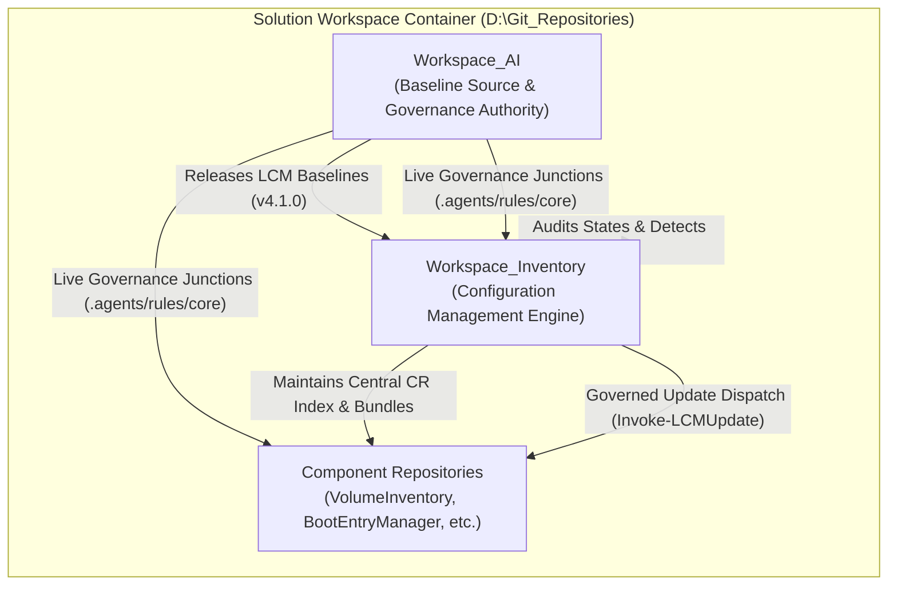

# Lifecycle Model (LCM) Configuration Management & Multi-Repository Architecture

Module: docs/LCM-Configuration-Management.md  
Authors: Rolf, Workspace_AI Engine  
Version: 7.3.1  
Date: 2026-08-17  
Status: Authoritative Methodology Specification  

---

## 1. Overview & Vision

In a solution containing multiple independent component repositories, Configuration Management (CM) ensures global architectural integrity, version consistency, change traceability, and drift detection.

The **`Workspace_Inventory`** repository serves as the authoritative CM operational engine, while **`Workspace_AI`** serves as the authoritative methodology, governance rule standard, and template baseline source.



---

## 2. CM Roles & Responsibilities

| Role | Authoritative Repository | Scope & Duties |
| :--- | :--- | :--- |
| **Methodology & Governance Authority** | [`Workspace_AI`](file:///D:/Git_Repositories/Workspace_AI) | Defines LCM standards, quality gates, prompt instructions, core rules (`.agents/rules/`), and reusable repository scaffold templates. |
| **Configuration Management (CM) Engine** | [`Workspace_Inventory`](file:///D:/Git_Repositories/Workspace_Inventory) | Audits all workspace directories, tracks absorbed/current LCM versions, records commit/push status, manages NTFS junction mirrors for Change Requests, and executes drift evaluations. |
| **Reusable PowerShell Functional Atoms** | [`SharedModules`](file:///D:/Git_Repositories/SharedModules) | Central, decoupled library of reusable functional PowerShell modules: `Logging.psm1`, `VolumeAtoms.psm1`, `BcdAtoms.psm1`, `PrivatePaths.psm1`, and `TranscriptTools.psm1`. |
| **Component Repositories** | `VolumeInventory`, `BootEntryManager`, etc. | Implements specific product features, maintains local `Docs/Methods/Proposals/`, and inherits governance rules via junctions. |

---

## 3. Change Request (CR) Architecture

### A. NTFS Junction Link Mirroring
* To maintain a single source of truth without duplicating files or copying content across repositories, `Workspace_Inventory` establishes directory junctions in `change_requests/<RepoName>` linking directly to `<TargetRepo>/Docs/Methods/Proposals`.
* `Workspace_Inventory` possesses real-time filesystem visibility into every repository's proposals.

### B. 1-File-Per-CR Specification
* Monolithic multi-CR files are strictly forbidden.
* Every Change Request is stored in its own dedicated Markdown document formatted with YAML frontmatter + Markdown body:
  * Naming standard: `CR-yyyyMMdd_HHmmss.md` (e.g. `CR-20260815_231129.md`).
  * Required frontmatter attributes: `cr_id`, `origin_repo`, `title`, `status`, `target_lcm_version`, `bundle_id`, `author`, `created_at`.

### C. Change Request Bundles (Batch Test Suites)
* To prevent test sequence explosion across multiple micro-changes, related Change Requests are aggregated into test bundles under `data/bundles/` (e.g. `BUNDLE-2026-01.json`).
* Bundles specify target milestones, member CR IDs, and the automated verification test suite (e.g. `Test-WorkspaceReadiness.ps1` or `Invoke-WorkspaceAudit.ps1`).

---

## 4. Governed LCM Upgrade Workflow

Automated tools must never mutate target repositories without prior proposal and operator review. The governed upgrade flow follows strict stages:

```
[ Step 1: Proposal Generation ]
      │ Invoke-LCMUpdate.ps1 -TargetRepository <Repo> (Default)
      │ └─► Creates CR-yyyyMMdd_HHmmss.md in <Repo>/Docs/Methods/Proposals/
      │ └─► Runs 4-phase DryRun simulation (read-only preview)
      ▼
[ Step 2: Operator Review & CR Approval ]
      │ Review proposal document & dry-run log
      ▼
[ Step 3: Governed Execution ]
      │ Invoke-LCMUpdate.ps1 -TargetRepository <Repo> -Execute
      │ └─► Deploys rule junctions (.agents/rules/core, .copilot/Rules/core)
      │ └─► Instantiates parameterized templates (.lcm/, .vscode/, docs/, tools/)
      │ └─► Validates physical integrity
      │ └─► Creates baseline commit in target repository
      │ └─► Updates CR status to 'implemented'
      ▼
[ Step 4: CM Dashboard Refresh ]
      └─► Re-runs Invoke-WorkspaceAudit.ps1 and updates INVENTORY_DASHBOARD.md
```

---

## 5. Drift Detection & Baseline Snapshots

1. **Configuration Drift (`Test-WorkspaceDrift`)**:
   * Evaluates dirty working copies across all repositories.
   * Identifies unpushed commits (`ahead` of GitHub remotes).
   * Flags outdated LCM versions (`current_lcm_version` $\ne$ `GlobalLCMVersion`).
   * Validates junction link health.

2. **Baseline Snapshots (`New-WorkspaceBaseline`)**:
   * Captures machine-readable JSON snapshots of the entire workspace state under `data/baselines/` (e.g., `BASELINE-v4.1.0-20260815.json`).
   * Records every repository's exact commit SHA, branch, and LCM version for release certification.

---

## 6. Operational Working Context & Repository Priming Protocol

To eliminate cold-start discovery scans and maintain instant conversational continuity across IDE sessions:

1. **Root Workspace Manifest ([.agents/ACTIVE_CONTEXT.md](file:///d:/Git_Repositories/.agents/ACTIVE_CONTEXT.md))**:
   * Maintains persistent, single-source operational state (active Python venv, IDE execution policies, active migration/feature streams).
2. **Authoritative Priming Policy ([.agents/rules/RepositoryContextPolicy.md](file:///d:/Git_Repositories/.agents/rules/RepositoryContextPolicy.md))**:
   * `RULE-CTX-001` (Active Scope Detection): Ingests the target repository path from the active document in IDE metadata.
   * `RULE-CTX-002` (Fast-Tier Ingestion): Automatically inspects `<TargetRepo>/.lcm/config.json`, `README.md`, and pending proposals in `docs/Methods/Proposals/` in a single targeted step.
   * `RULE-CTX-003` (Zero Redundant Scan Invariant): Forbids multi-step recursive searches across sibling directories when focused on a single repository.
   * `RULE-CTX-004` (Methodology Awareness): Enforces continuous awareness of the `Workspace_AI` / `Workspace_Inventory` / `SharedModules` triad.


