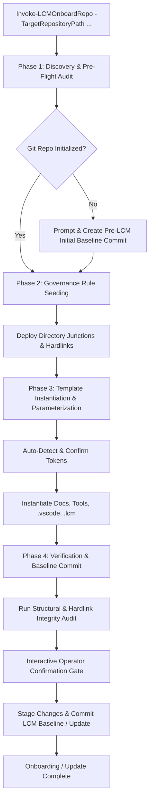

# Lifecycle Model (LCM) Onboarding Engine Architecture

Module: LCM-Onboarding-Architecture.md
Purpose: Architectural specification for the modular 4-Phase Lifecycle Model (LCM) Repository Onboarding & Update Engine.
Path: D:/Git_Repositories/Workspace_AI/docs/LCM-Onboarding-Architecture.md
Authors: Rolf, Workspace_AI Engine
Version: 1.1.0
Changelog:
- 2026-08-15: Codified 4-state Workspace_AI lifecycle, LCM repository inventory, and Update mode.
- 2026-08-15: Initial architectural specification and interface definition.

---
title: LCM Onboarding Engine Architecture
updated: 2026-08-15T20:13:00
created: 2026-08-15T17:46:00
---

## 1. Executive Overview & Scope

The **Lifecycle Model (LCM) Onboarding Engine** (`Invoke-LCMOnboardRepo`) standardizes, governs, and upgrades software repositories under `D:\Git_Repositories` managed by the parent solution workspace `D:\VSCode-Workspaces\Solution.code-workspace`.

`Workspace_AI` serves as the Git-tracked design and engineering workshop where all rules, methodologies, operational templates, and onboarding tooling live.

---

## 2. Workspace_AI 4-State Lifecycle Model

`Workspace_AI` is not an ordinary component repository and is never self-onboarded. It operates across four distinct lifecycle states:

```mermaid
stateDiagram-v2
    [*] --> State1_ActiveWorkshop: Initialize / Unlock
    State1_ActiveWorkshop: State 1 - Active Development & Design Workshop
    State1_ActiveWorkshop: Rules, tools & templates under modification
    State1_ActiveWorkshop: Self-onboarding blocked; consistency iterating

    State1_ActiveWorkshop --> State2_Verification: Quality gates pass
    State2_Verification: State 2 - Verification & Release Preparation
    State2_Verification: Test-WorkspaceReadiness OK; version bump committed

    State2_Verification --> State3_ReleasedBaseline: Released & Published
    State3_ReleasedBaseline: State 3 - Active Global LCM Baseline
    State3_ReleasedBaseline: Workspace_AI dormant & read-only
    State3_ReleasedBaseline: Serves as immutable source for all child repos

    State3_ReleasedBaseline --> State4_UnlockedProposal: Initiate Change Proposal
    State4_UnlockedProposal: State 4 - Unlocked for LCM Evolution
    State4_UnlockedProposal --> State1_ActiveWorkshop: Transition to active development
```



1. **State 1: Active Development & Design Workshop (`Workspace_AI` Unlocked)**:
   * Rules, tools, and templates are actively modified, verified, and reviewed.
   * Self-onboarding is blocked by `Test-LCMPreFlight`.
2. **State 2: Verification & Release Preparation**:
   * All quality gates (`Test-WorkspaceReadiness`) and syntax checks pass.
   * Semantic version increment is executed (`docs/version-bump-procedure.md`).
   * Final verification commit and tag are prepared.
3. **State 3: Released State / Global LCM Baseline (`Workspace_AI` Dormant)**:
   * The released state becomes the authoritative standard for all child repositories in `Solution.code-workspace`.
   * `Workspace_AI` remains dormant and read-only until the next change proposal.
4. **State 4: Unlocking for Change Proposals**:
   * When an LCM change proposal is approved, `Workspace_AI` is unlocked, returning to State 1.

---

## 3. The 4-Phase Onboarding Sequence



### Phase 1: Discovery & Pre-Flight Audit (`Test-LCMPreFlight`)
* **Target Validation & Self-Onboarding Guard**: Verifies target exists under `D:\Git_Repositories\<TargetRepo>` and immediately blocks self-onboarding on `Workspace_AI` or legacy directories (`Workspace_AC`, `Workspace_GC`).
* **LCM Inventory & Version Detection**:
  * Inspects target for `.lcm/config.json`.
  * If present, extracts `lcm_version` and determines whether the repository is up-to-date or requires an **Update / Refresh**.
* **Git Status & Baseline Initialization**:
  * If `.git` is missing: Interactively prompts the operator to run `git init -b main`, writes standard `.gitignore`, stages existing files, and creates an initial `pre-LCM` baseline commit before applying governance links.
* **Volume & Path Flexibility**: Directory junctions seamlessly span local and cross-drive targets; file links automatically fall back to symbolic links or copies when spanning separate drives.
* **Token Auto-Discovery**: Detects `{{REPO_NAME}}`, `{{PRIMARY_LANG}}`, `{{MODULE_ROOT}}`, `{{AUTHOR}}`, `{{DATE}}`, `{{TIMESTAMP}}`, `{{DESCRIPTION}}`.

### Phase 2: Governance Rule Seeding (`New-LCMGovernanceLinks`)
Deploys the **Hybrid Link Model**:
* **Directory Junctions**:
  * `<TargetRepo>/.agents/rules/core` $\rightarrow$ `D:\Git_Repositories\Workspace_AI\.agents\rules`
  * `<TargetRepo>/.copilot/Rules/core` $\rightarrow$ `D:\Git_Repositories\Workspace_AI\.copilot\Rules`
* **File Hardlinks**:
  * `<TargetRepo>/AGENTS.md` $\rightarrow$ `D:\Git_Repositories\Workspace_AI\AGENTS.md`
  * `<TargetRepo>/GEMINI.md` $\rightarrow$ `D:\Git_Repositories\Workspace_AI\GEMINI.md`
  * `<TargetRepo>/.copilot/instructions.md` $\rightarrow$ `D:\Git_Repositories\Workspace_AI\.copilot\instructions.md`
* **Operator Link Tooling & Inspection**:
  * **Junction Link Magic**: The designated interactive Windows GUI utility for scanning, verifying, creating, and managing NTFS directory junctions, reparse points, and hardlinks across all repository drives. All programmatic junctions created by `LCMOnboarding.psm1` are fully compatible with and verifiable in Junction Link Magic.

### Phase 3: Template Instantiation & Parameterization (`Expand-LCMTemplate`)
* Substitutes detected/supplied tokens across all `.template` files in `templates/repo-scaffold/`.
* Instantiates `docs/`, `tools/`, `.vscode/`, `.github/agents/`, `.lcm/config.json`, and `.lcm/overrides.json`.
* In **Update Mode** (`-Update`), updates standard tools and documentation templates while strictly preserving target-specific entries in `.lcm/overrides.json`.

### Phase 4: Verification & Baseline Commit (`Test-LCMIntegrity`)
* **Structural & Link Integrity**: Validates all junction targets, hardlinks, JSON syntax, and PowerShell script tokens.
* **DryRun Simulation Support**: In `-DryRun` mode, validates coverage of planned actions without requiring physical files on disk.
* **Interactive Review Gate**: Presents a summary of changes and requests explicit operator confirmation.
* **Commit Generation**:
  * Onboarding: `LCM-001: Initial LCM Governance Onboarding Baseline`
  * Update: `LCM-002: LCM Governance Version Update`

---

## 4. CLI Usage Reference

```powershell
# Initial Onboarding (Interactive step-by-step)
.\tools\Invoke-LCMOnboardRepo.ps1 -TargetRepositoryPath "D:\Git_Repositories\<TargetRepo>" -StepByStep

# Read-Only Dry-Run Preview
.\tools\Invoke-LCMOnboardRepo.ps1 -TargetRepositoryPath "D:\Git_Repositories\<TargetRepo>" -DryRun

# Update / Upgrade Existing Onboarded Repository to Latest LCM Release
.\tools\Invoke-LCMOnboardRepo.ps1 -TargetRepositoryPath "D:\Git_Repositories\<TargetRepo>" -Update
```
