# Workspace_AI Lifecycle Model Implementation and Tooling

Module: LCM-Proposal/Implementation-and-Tooling.md
Purpose: Maps proposed LCM requirements to the current Workspace_AI implementation, tools, controls, and evidence.
Path: docs/LCM-Proposal/Implementation-and-Tooling.md
Authors: Workspace_AI documentation proposal
Version: 0.3.0
Status: Proposal
Date: 2026-08-15

## 1. Status Vocabulary

| Status | Meaning |
|---|---|
| `Implemented` | An executable control or machine-validated state currently provides direct evidence. |
| `Partial` | Some control exists, but requirement coverage or evidence is incomplete. |
| `Policy only` | A document states the behavior, but no complete executable enforcement was identified. |
| `Not supported` | The current model intentionally blocks or does not implement the behavior. |
| `Conflict` | Current active-looking sources prescribe incompatible behavior or authority. |

Status describes the current repository, not the desired final state.

---

## 2. Intended Governance Control Flows

The Lifecycle Model (LCM) operates via two primary, deterministic control flows:

```mermaid
graph TD
    subgraph Flow A: LCM Repository Onboarding Engine
        A1[Target Directory Discovery] --> A2[Phase 1: Pre-Flight Audit & Git Init]
        A2 --> A3[Phase 2: Governance Rule Seeding via Junctions & Hardlinks]
        A3 --> A4[Phase 3: Template Instantiation & Parameterization]
        A4 --> A5[Phase 4: Structural & Link Integrity Verification]
        A5 --> A6[Operator Review Gate & LCM-001 Baseline Commit]
    end

    subgraph Flow B: Day-to-Day Governed Operations & Change Requests
        B1[Readiness & State Preflight] --> B2[Target Method Profile Inspection]
        B2 --> B3[Read-Only Impact Analysis]
        B3 --> B4[Markdown Proposal Generation]
        B4 --> B5{Operator Accept Gate}
        B5 -->|Accept| B6[Apply Approved Changes Doc/Code]
        B5 -->|Reject/Modify| B7[Block / Return to Proposal]
        B6 --> B8[Focused Quality Gate Validation]
        B8 --> B9[Durable Logging & Void Proposal Cleanup]
    end
```



### 2.1 Flow A: Repository Onboarding Sequence (`Invoke-LCMOnboardRepo`)

Used when bringing any target repository under formal LCM governance:

```text
Target Repository Path + Workspace Authority Root
  -> Phase 1: Discovery & Pre-Flight Audit (Test-LCMPreFlight)
       - Validate target path under D:\Git_Repositories\<TargetRepo>
       - Detect Git status (prompt to initialize 'git init -b main' & create pre-LCM baseline commit if non-git)
       - NTFS volume audit (same-volume check for hardlinks and junctions)
       - Parameter token discovery (REPO_NAME, PRIMARY_LANG, MODULE_ROOT, AUTHOR, DATE)
  -> Phase 2: Governance Rule Seeding (New-LCMGovernanceLinks)
       - Deploy directory junctions: .agents/rules/core, .copilot/Rules/core
       - Deploy file hardlinks: AGENTS.md, GEMINI.md, .copilot/instructions.md
       - Verify Read & Execute (RX) semantics
  -> Phase 3: Template Instantiation & Parameterization (Expand-LCMTemplate)
       - Expand templates from templates/repo-scaffold/ into target
       - Generate .lcm/config.json and .lcm/overrides.json
       - Generate local docs/, tools/, .vscode/, .github/agents/
  -> Phase 4: Verification & Baseline Commit (Test-LCMIntegrity)
       - Structural self-test (JSON parse, PowerShell tokenization, UTF-8 CRLF encoding)
       - Hardlink & junction resolution audit
       - Interactive operator review gate
       - Stage all changes & commit: 'LCM-001: Initial LCM Governance Onboarding Baseline'
```

### 2.2 Flow B: Day-to-Day Operation & Change Request Sequence

Used when modifying or enhancing an active governed repository:

```text
rules + state + target identity
  -> Phase 1: Readiness & Pre-Flight Eligibility (Test-WorkspaceReadiness / Test-RepoReadiness)
       - Asserts canonical rule compliance, ignored non-git directories, and stabilization state
  -> Phase 2: Target-Local Method Instance / Profile Inspection (Docs/Methods or .lcm/config)
       - Verifies target-local ownership of logs, results, and proposals
  -> Phase 3: Read-Only Impact Analysis & Change Preview (cr-01 / cr-02)
       - Compares target surfaces against baseline; classifies actions without modifying files
  -> Phase 4: Markdown Proposal Generation & Explicit Review Gate (cr-03 / cr-04)
       - Target-local Markdown proposal created under Docs/Methods/Proposals
       - Strict review gate: stops and awaits human operator decision
  -> Phase 5: Accepted Implementation Step (cr-05 / cr-06)
       - Only executed upon explicit user 'Accept' decision
       - Applies approved documentation changes first, followed by code changes
  -> Phase 6: Focused Quality Gate Verification & Self-Readiness
       - Validates updated code, schemas, and formatting rules
  -> Phase 7: Durable Result Logging & Void Proposal Cleanup
       - Writes immutable entry to Workspace.log / Workspace.accepted.log
       - Removes void proposal from review queue (Test-RealRepoProposalCleanup)
```

---

## 3. Complete Directory Layout Specification

### 3.1 Workspace_AI (Design Workshop & Authority Root) Layout

```text
D:\Git_Repositories\Workspace_AI\
├── .agents/
│   ├── rules/                           <-- Canonical rule declarations (Markdown)
│   │   ├── CMDRules.md
│   │   ├── InvariantRules.md
│   │   ├── JsonRules.md
│   │   ├── LanguagePolicy.md
│   │   ├── macro-definitions.md
│   │   ├── PowerShellRules.md
│   │   └── RuleAuthority.md
│   └── skills/                          <-- Antigravity agent skill customizations
│       └── workspace-governance/
│           └── SKILL.md
├── .copilot/
│   ├── Atoms/                           <-- File-type and invariant verification atoms
│   │   ├── CMD.atom
│   │   ├── invariant.atom
│   │   ├── JSON.atom
│   │   └── PowerShell.atom
│   ├── Fixes/                           <-- Structured fix-module descriptors
│   │   └── Fix_S1E03.json
│   ├── History/
│   │   └── Logs/                        <-- Machine-readable registries and state records
│   │       ├── Proposals.json
│   │       ├── Proposals.validation.json
│   │       ├── RealRepoTestPlan.json
│   │       └── Stabilization.json
│   ├── Logs/                            <-- Authoritative governance execution logs
│   │   ├── Workspace.accepted.log
│   │   ├── Workspace.log
│   │   └── Workspace.step.log
│   ├── Rules/                           <-- Canonical governance mirror for Copilot
│   │   ├── CMDRules.md
│   │   ├── InvariantRules.md
│   │   ├── JsonRules.md
│   │   ├── LanguagePolicy.md
│   │   ├── macro-definitions.md
│   │   ├── PowerShellRules.md
│   │   └── RuleAuthority.md
│   ├── instructions.md                  <-- Copilot global operational instruction set
│   ├── MEMORY.md                        <-- Persistent state memory
│   ├── CopilotRules.md                  <-- Copilot behavior rules
│   ├── CopilotTools.md                  <-- Copilot tool registry
│   └── VSCode_Agent.md                  <-- VS Code agent role definition
├── .github/
│   └── agents/                          <-- Agent role definitions and workflow rules
│       ├── .AGENTS.Template.md
│       ├── ATOM-Building.md
│       ├── DirectoryRules.md
│       ├── DOX.agent.md
│       ├── MIGRATION-Rules.md
│       ├── RepoAgentIndex_Template.md
│       ├── SharedModulesRule.md
│       ├── WORKFLOW.md
│       ├── Workspace-Rules.md
│       ├── WorkspaceAgentIndex.md
│       ├── WorkspaceLog.agent.md
│       └── WorkspaceLogHistory.agent.md
├── .vscode/
│   ├── settings.json                    <-- VS Code settings & ignored non-git repos
│   └── tasks.json                       <-- VS Code default governance build tasks
├── docs/                                <-- Human-readable documentation & architecture
│   ├── LCM-Onboarding-Architecture.md   <-- Normative onboarding engine specification
│   ├── LCM-Proposal/                    <-- Formal LCM Proposal documentation
│   │   ├── Implementation-and-Tooling.md
│   │   ├── README.md
│   │   └── Requirements.md
│   ├── Logs/                            <-- 2-tier historical & continuous governance logs
│   │   ├── 01_Pre-AI-Evolution/         <-- Pre-AI crash recovery & AC/GC lineage summaries
│   │   │   ├── 01_Workspace_AC_System_Recovery_Lineage.md
│   │   │   ├── 02_Workspace_GC_Transitional_Governance.md
│   │   │   └── README.md
│   │   ├── 02_Method-and-Tooling-Evolution/ <-- _AI evolution, proposals & tooling history
│   │   │   ├── 01_Workspace_AI_Foundational_Milestones.md
│   │   │   ├── 02_Tooling_QualityGates_and_Onboarding_Engine.md
│   │   │   └── README.md
│   │   └── 03_Propagation-and-Continuous-History/ <-- Continuous ledger & major version rollups
│   │       ├── Continuous_Governance_Ledger.md
│   │       ├── Major_Version_Milestone_Rollup.md
│   │       └── README.md
│   ├── README.md                        <-- Workspace overview and map
│   ├── Standards.md                     <-- Technical formatting & naming standards
│   ├── Workspace Conventions.md         <-- Location & authority conventions
│   ├── Workspace-Location.md            <-- Canonical path declarations
│   ├── real-repo-dry-run.md             <-- Real-repository dry-run methodology
│   ├── version-bump-procedure.md        <-- Semantic version update rules
│   └── version-consistency-check.md     <-- Version consistency validation rules
├── templates/
│   └── repo-scaffold/                   <-- Target repository onboarding templates
│       ├── .github/agents/RepoAgentIndex.md.template
│       ├── .lcm/
│       │   ├── config.json.template
│       │   └── overrides.json.template
│       ├── .vscode/
│       │   ├── settings.json.template
│       │   └── tasks.json.template
│       ├── docs/
│       │   ├── Architecture.md.template
│       │   ├── Changelog.md.template
│       │   ├── README.md.template
│       │   └── Standards.md.template
│       └── tools/
│           ├── QualityGates/RepoQualityGates.psm1.template
│           └── Test-RepoReadiness.ps1.template
├── tools/                               <-- Executable governance tools & quality gates
│   ├── Onboarding/                      <-- Modular LCM Onboarding Engine
│   │   ├── LCMOnboarding.psd1
│   │   └── LCMOnboarding.psm1
│   ├── QualityGates/                    <-- Reusable quality gate assertion modules
│   │   ├── README.md
│   │   └── WorkspaceQualityGates.psm1
│   ├── APPLY.ps1                        <-- Atomic fix module executor
│   ├── Advance-Governance.ps1           <-- Governance cycle advancement
│   ├── Generate-Log.ps1                 <-- Deterministic governance log builder
│   ├── Get-RealRepoActionPlan.ps1       <-- Read-only action comparison preview
│   ├── Get-RealRepoTargetProfile.ps1    <-- Read-only target profile extractor
│   ├── Get-RealRepoTestPlan.ps1         <-- Real-repository candidate status reader
│   ├── Get-WorkspaceRepositories.ps1    <-- Sibling repository discovery
│   ├── Initialize-RealRepoMethodInstance.ps1 <-- Target-local method bootstrap
│   ├── Invoke-LCMOnboardRepo.ps1        <-- Top-level CLI onboarding runner
│   ├── Invoke-RealRepoDryRun.ps1        <-- 6-phase observation dry-run runner
│   ├── LoadAtoms.ps1                    <-- Verification atom loader
│   ├── LoadFixes.ps1                    <-- Fix module descriptor loader
│   ├── LoadMethods.ps1                  <-- Method metadata loader
│   ├── LoadRules.ps1                    <-- Governance rule loader
│   ├── Set-RealRepoTestPlan.ps1         <-- Candidate selection/clearing guard
│   ├── Test-RealRepoProposalCleanup.ps1 <-- Target proposal cleanup scanner
│   ├── Test-WorkspaceReadiness.ps1      <-- Primary workspace health self-test
│   ├── Update-Proposal.ps1              <-- Proposal registry updater
│   ├── Validate-CopilotProfile.ps1      <-- Profile & settings validator
│   └── ValidateRules.ps1                <-- Rule format and syntax validator
├── Working/                             <-- Local scratchpad (codified under LCM-REQ-006)
│   ├── 20260929 Copilot, Github, Workspace,md
│   ├── Completeness check for Antigravity Components.ps1
│   ├── Setup Python for Antigravity.ps1
│   └── WS_DIR.txt
├── Deletions/                           <-- Temporary quarantine for legacy cleanup
├── AGENTS.md                            <-- Root agent entry point & invariant summary
└── GEMINI.md                            <-- Root Gemini entry point & invariant summary
```

---

### 3.2 Directory & Path Reference Matrix (Requirement & Purpose Mapping)

| Directory / Path | Primary Purpose | Governing LCM Requirement | Status |
|---|---|---|---|
| `.agents/rules/` | Canonical rule declarations (Markdown) governing code, formatting, and operations. | `LCM-REQ-001`, `LCM-REQ-004`, `LCM-REQ-050`, `LCM-REQ-051` | Implemented |
| `.agents/skills/` | Agent skill customizations and cheatsheets. | `LCM-REQ-002`, `LCM-REQ-005`, `LCM-REQ-070` | Implemented |
| `.copilot/Atoms/` | Reusable verification building blocks for PowerShell, JSON, CMD, and invariants. | `LCM-REQ-050` | Implemented |
| `.copilot/Fixes/` | Structured, machine-readable fix-module descriptors. | `LCM-REQ-050` | Implemented |
| `.copilot/History/Logs/` | Machine-readable candidate state, stabilization policy, and proposal registries. | `LCM-REQ-010`, `LCM-REQ-011`, `LCM-REQ-062` | Implemented |
| `.copilot/Logs/` | Authoritative step-by-step and accepted governance execution logs. | `LCM-REQ-062` | Implemented |
| `.copilot/Rules/` | Copilot-compatible mirror of canonical governance rules. | `LCM-REQ-001`, `LCM-REQ-004` | Implemented |
| `.copilot/instructions.md` | Copilot operational directives and memory model. | `LCM-REQ-001`, `LCM-REQ-002` | Partial |
| `.copilot/MEMORY.md` | Persistent operational memory and session markers. | `LCM-REQ-001`, `LCM-REQ-002` | Implemented |
| `.github/agents/` | Specialized agent definitions, review workflows, and boundary rules. | `LCM-REQ-002`, `LCM-REQ-031`, `LCM-REQ-070` | Conflict / Partial |
| `.vscode/settings.json` | VS Code workspace settings and ignored sibling directory declarations. | `LCM-REQ-003`, `LCM-REQ-060` | Implemented |
| `.vscode/tasks.json` | VS Code build and governance task triggers. | `LCM-REQ-003`, `LCM-REQ-060` | Implemented |
| `docs/` | Human-readable documentation, architecture, and standards. | `LCM-REQ-002`, `LCM-REQ-052`, `LCM-REQ-053` | Implemented |
| `docs/LCM-Proposal/` | Two-level formal specification of LCM requirements and implementation controls. | `LCM-REQ-001` through `LCM-REQ-072` | Implemented |
| `docs/Logs/` | 2-tier historical lineage, tooling evolution, and continuous governance ledger. | `LCM-REQ-062` | Implemented |
| `docs/real-repo-dry-run.md` | Multi-phase dry-run methodology and candidate transition policy. | `LCM-REQ-010` to `LCM-REQ-023`, `LCM-REQ-040` | Implemented |
| `docs/LCM-Onboarding-Architecture.md` | 4-Phase onboarding sequence and link mechanics specification. | `LCM-REQ-010`, `LCM-REQ-021`, `LCM-REQ-060` | Implemented |
| `templates/repo-scaffold/` | Operational template source tree for target repo instantiation. | `LCM-REQ-021`, `LCM-REQ-050` | Implemented |
| `tools/` | Executable governance scripts, discovery tools, and quality gates. | `LCM-REQ-050`, `LCM-REQ-060`, `LCM-REQ-062` | Implemented |
| `tools/QualityGates/` | Reusable quality gate assertion functions and policies. | `LCM-REQ-060`, `LCM-REQ-064` | Implemented |
| `tools/Onboarding/` | Modular 4-phase LCM onboarding engine implementation. | `LCM-REQ-010`, `LCM-REQ-021`, `LCM-REQ-060` | Implemented |
| `Working/` | Standardized local scratchpad for ad-hoc notes, exploratory analysis, and temporary files. | `LCM-REQ-006` | Implemented |
| `Deletions/` | Temporary quarantine staging area holding isolated legacy crash-recovery artifacts. | `LCM-REQ-003` (Quarantine) | Temporary |
| `AGENTS.md` / `GEMINI.md` | Top-level agent discovery entrypoints and operational invariants summary. | `LCM-REQ-001`, `LCM-REQ-002`, `LCM-REQ-071` | Implemented |

---

## 4. Authority and Adapter Surfaces

| Artifact | Current role | Status | Notes |
|---|---|---|---|
| `.copilot/Rules/RuleAuthority.md` | Declares `.agents/rules` and `.copilot/Rules` mirror as canonical governance root. | Implemented | Reconciled canonical root across all agent entry points. |
| `.github/agents/Workspace-Rules.md` | Declares workspace authority order and review constraints. | Implemented | Reconciled: subordinates itself to canonical rules in `.agents/rules/`. |
| `AGENTS.md` | Agent discovery entry point and operational summary. | Implemented | Directs agents to canonical rules in `.agents/rules/` and `.copilot/Rules/`. |
| `.github/agents/WorkspaceAgentIndex.md` | Registry for active workspace agents. | Implemented | Provides agent discovery; complies with canonical rule precedence. |
| `.vscode/settings.json` | VS Code adapter surface and non-git discovery policy. | Implemented | Discovers only valid non-git directories; does not define independent authority. |
| `.copilot/instructions.md` | Command language, profiles, operators, memory model, and workspace path. | Implemented | Standardized on Workspace_AI authority. |

Requirements covered: `LCM-REQ-001` through `LCM-REQ-006`, `LCM-REQ-071`.

---

## 5. Lifecycle State and Transition Controls

### Baseline State

`.copilot/History/Logs/Stabilization.json` records:

- current phase;
- real-repository testing enablement;
- external write permission;
- protected paths;
- sibling-repository discovery policy.

Current values identify `self-stabilization`, disable real-repository testing, and disable external writes.

### Candidate and Dry-Run State

`.copilot/History/Logs/RealRepoTestPlan.json` is the machine-readable candidate and dry-run plan. The related tools are:

| Tool | Responsibility | Mutation boundary |
|---|---|---|
| `tools/Get-WorkspaceRepositories.ps1` | Discover workspace repositories. | Read-only. |
| `tools/Set-RealRepoTestPlan.ps1` | Select or clear the candidate under policy guards. | Updates baseline candidate state only. |
| `tools/Get-RealRepoTestPlan.ps1` | Report current selection and dry-run status. | Read-only. |
| `tools/Initialize-RealRepoMethodInstance.ps1` | Create approved target-local `Docs/Methods` structure and manifest. | Target-local structural write after explicit approval. |
| `tools/Get-RealRepoTargetProfile.ps1` | Inspect repository identity, branch, HEAD, status, and adapter presence. | Read-only; no write probe. |
| `tools/Invoke-RealRepoDryRun.ps1` | Run observation-only dry-run checks. | Read-only. |
| `tools/Get-RealRepoActionPlan.ps1` | Compare adapter surfaces and classify intended future actions. | Preview only; reports writes as disallowed. |
| `tools/Test-RealRepoProposalCleanup.ps1` | Find accepted and implemented Markdown proposals eligible for cleanup. | Read-only scanner; never deletes. |

Current coverage:

| Requirement | Status | Evidence or gap |
|---|---|---|
| `LCM-REQ-010` | Policy only | States are defined in `docs/real-repo-dry-run.md`; a single state record for every discovered repository was not identified. |
| `LCM-REQ-011` | Partial | Candidate state is structured, but a uniform transition record with source, target, operator, reason, and preflight is not established. |
| `LCM-REQ-012` | Implemented | Stabilization and action-plan controls preserve `write_allowed: false`. |
| `LCM-REQ-013` | Policy only | Per-step acceptance is required in documentation; one end-to-end decision protocol is not defined. |

---

## 6. Method Baseline and Target-Local Instance

`docs/real-repo-dry-run.md` defines baseline/instance ownership. `tools/Initialize-RealRepoMethodInstance.ps1` provisions the target-local structure after approval.

The expected target-local root is:

```text
Docs/Methods/
  DryRun/
  Logs/
  Results/
  Proposals/
  MethodInstance.json
```

Target-local proposal authority is Markdown. JSON sidecars are derived and non-authoritative. `Docs/Methods/Proposals` is a working queue; logs, results, implementation artifacts, and Git history retain durable evidence after a void proposal is removed.

| Requirement | Status | Evidence or gap |
|---|---|---|
| `LCM-REQ-020` | Partial | Ownership is documented and initialization exists; complete prevention of baseline storage of target outputs depends on tool coverage. |
| `LCM-REQ-021` | Implemented | Initializer and readiness checks validate the target-local method structure. |
| `LCM-REQ-022` | Policy only | Markdown-first authority and sidecar rules are documented; automated stale-sidecar detection was not identified. |
| `LCM-REQ-023` | Partial | Cleanup scanner recognizes accepted/implemented proposals, but a complete disposition schema and decision protocol are not universal. |

---

## 7. Proposal, Fix, Atom, and Log Artifacts

### Method-Baseline Proposals

`.copilot/History/Logs/Proposals.json` stores method-baseline step proposals, reasons, affected files, dispositions, disposition reasons, and final results. It is appropriate when Workspace_AI itself is the target. It is not the proposal store for ordinary target repositories.

### Fix Modules

`.copilot/Fixes/Fix_*.json` describes structured fixes. A fix module identifies metadata, scope, required atoms/methods/rules, ordered actions, and logging behavior.

`tools/APPLY.ps1` is the execution surface for supported fix action types. APPLY validates dependencies and dispatches defined actions; it is not evidence that arbitrary repository writes are generally enabled.

### Atoms

`.copilot/Atoms/` contains reusable constraints for PowerShell, JSON, CMD, and invariants. Loader tools expose these definitions:

- `tools/LoadAtoms.ps1`
- `tools/LoadFixes.ps1`
- `tools/LoadMethods.ps1`
- `tools/LoadRules.ps1`

### Logs

The repository currently uses several evidence surfaces:

- `.copilot/Logs/Workspace.log` (consolidated execution log);
- `.copilot/Logs/Workspace.step.log` (step-oriented governance trace);
- `.copilot/Logs/Workspace.accepted.log` (permanent accepted change ledger);
- `.copilot/History/Logs/*.json` (structured state and proposal registries);
- target-local `Docs/Methods/Logs` and `Docs/Methods/Results` (for repository-specific work).

---

## 8. Workflow Implementation

### Repository Onboarding Flow

The implemented and documented read-only sequence is:

```text
phase-01-structure
phase-02-repo-specifications
phase-03-level-map
phase-04-documentation-discrepancies
phase-05-documentation-change-requests
phase-06-later-implementation
```

The dry-run stops before implementation. Adapter comparisons classify future work as create, update, review, or unchanged by comparing source and target SHA256 hashes without performing the action.

### Concrete Change Request Flow

The documented sequence is:

```text
cr-01-analyze-request
cr-02-determine-impact
cr-03-propose-doc-changes
cr-04-propose-code-changes
cr-05-apply-approved-doc-changes
cr-06-apply-approved-code-changes
```

This sequence supports `LCM-REQ-030` but conflicts with older statements that agents must never modify documentation. Adoption requires one reconciled rule: approved documentation work is allowed only in a declared documentation or Reconciliation Phase.

Requirements `LCM-REQ-031` through `LCM-REQ-033` are primarily policy controls in `.github/agents/WORKFLOW.md`, `.github/agents/Workspace-Rules.md`, and `docs/real-repo-dry-run.md`.

---

## 9. Safety and Integrity Implementation

`docs/real-repo-dry-run.md` defines protected paths, prohibits selection of the baseline repository as its own target, prevents selection from enabling writes, and limits normal Git inspection to:

```text
git rev-parse --show-toplevel
git rev-parse --abbrev-ref HEAD
git rev-parse HEAD
git status --short
```

Escalated integrity checks are allowed only after a trigger or ambiguous cheap result and must be reported first. Hidden scans, periodic monitoring, write probes, and automatic restore repair are prohibited.

| Requirement | Status | Evidence or gap |
|---|---|---|
| `LCM-REQ-040` | Partial | Protected paths exist in stabilization policy and selection checks; complete blocking across every tool requires coverage verification. |
| `LCM-REQ-041` | Policy only | Cost tiers and triggers are documented; a unified preflight command and result schema were not identified. |
| `LCM-REQ-042` | Policy only | Prohibition is explicit; absence of hidden external behavior cannot be proven by documentation alone. |
| `LCM-REQ-043` | Policy only | External recovery is documented, with no internal rollback feature. |

---

## 10. Technical Standards and Loaders

| Source | Role |
|---|---|
| `.copilot/Rules/PowerShellRules.md` | PowerShell syntax, structure, encoding, error, and pipeline rules. |
| `.copilot/Rules/JsonRules.md` | JSON structure and deterministic formatting rules. |
| `.copilot/Rules/CMDRules.md` | CMD encoding, structure, and deterministic behavior. |
| `.copilot/Rules/InvariantRules.md` | Cross-format invariants. |
| `.copilot/Rules/macro-definitions.md` | Macro semantics and substitutions. |
| `docs/Standards.md` | Naming, metadata, documentation, and semantic-versioning summary. |
| `docs/version-bump-procedure.md` | Version increment procedure. |
| `docs/version-consistency-check.md` | Cross-control-file version parity expectations. |
| `tools/ValidateRules.ps1` | Rule validation entry point. |
| `tools/Validate-CopilotProfile.ps1` | Profile and command configuration validation. |
| `Junction Link Magic` | Designated Windows interactive GUI tool for scanning, verifying, and managing NTFS directory junctions and hardlinks. |

Current coverage for `LCM-REQ-050` through `LCM-REQ-053` is `Partial`: substantial rules and validators exist, but identity conflicts, path conflicts, and inconsistent metadata formats prevent a single proven conformance statement.

---

## 11. Readiness and Quality Gates

The public baseline readiness command is:

```powershell
.\tools\Test-WorkspaceReadiness.ps1
```

It imports `tools/QualityGates/WorkspaceQualityGates.psm1` and is the normal operator entry point. Reusable checks include ignored-repository policy, stabilization state, real-repository test-plan state, and stale authority references.

`tools/Advance-Governance.ps1` evaluates readiness for governance advancement, including proposal disposition, log separation, and target-local ownership constraints.

| Requirement | Status | Evidence or gap |
|---|---|---|
| `LCM-REQ-060` | Implemented | A single public readiness command exists and composes reusable gates. |
| `LCM-REQ-061` | Partial | Before/after readiness is required, but focused target test selection remains operation-specific. |
| `LCM-REQ-062` | Partial | Multiple logs provide evidence, but one authoritative event schema and retention rule are not defined. |
| `LCM-REQ-063` | Not supported | This proposal is the first consolidated requirement-to-control matrix; controls do not yet carry requirement IDs. |
| `LCM-REQ-064` | Partial | Readiness failures block advancement; uniform failure output across all tools requires verification. |

---

## 12. Agent Tooling

`.github/agents/` supplies specialized interaction and policy surfaces:

| Agent or file | Intended responsibility |
|---|---|
| `Workspace-Rules.md` | Workspace-wide governance and review boundaries. |
| `WorkspaceAgentIndex.md` | Active agent registry. |
| `DOX.agent.md` | Explicitly approved documentation work. |
| `MIGRATION-Rules.md` | Migration-specific constraints. |
| `ATOM-Building.md` | Atom construction rules. |
| `DirectoryRules.md` | Repository and directory structure. |
| `SharedModulesRule.md` | Shared-module ownership and use. |
| `WORKFLOW.md` | Deterministic evaluation, proposal, and patch sequence. |
| `WorkspaceLog.agent.md` | Canonical governance logging behavior. |
| `WorkspaceLogHistory.agent.md` | Governance log history support. |

---

## 13. Requirement-to-Control Summary

| Requirement group | Primary controls | Current status |
|---|---|---|
| `LCM-REQ-001` to `006` | RuleAuthority, Workspace-Rules, AGENTS, agent index, skills, working policy | Implemented / Conflict / Partial |
| `LCM-REQ-010` to `013` | stabilization state, real-repo test plan, dry-run documentation and tools | Implemented / Partial / Policy only |
| `LCM-REQ-020` to `023` | method initializer, target-local `Docs/Methods`, proposal cleanup scanner | Implemented / Partial / Policy only |
| `LCM-REQ-030` to `033` | WORKFLOW, concrete change-request flow, manual review | Policy only / Partial |
| `LCM-REQ-040` to `043` | protected paths, selection guards, integrity preflight policy | Partial / Policy only |
| `LCM-REQ-050` to `053` | canonical rules, atoms, validators, standards and version docs | Partial |
| `LCM-REQ-060` to `064` | readiness script, quality-gate module, governance advancement, logs | Implemented / Partial / Not supported |
| `LCM-REQ-070` to `072` | Workspace-Rules, DOX, proposal status, manual review | Policy only / Conflict |

---

## 14. Recommended Tooling Work After Adoption

1. Add a machine-readable LCM requirement registry keyed by the IDs in `Requirements.md`.
2. Add a validator that maps every active requirement to a control and verification method.
3. Resolve mirror precedence between `.copilot/Rules/` and `.agents/rules/`.
4. Define one acceptance-decision schema for proposal, implementation, verification, and cleanup steps.
5. Define one lifecycle-transition schema and validator.
6. Add stale Markdown/JSON sidecar detection.
7. Define authoritative log roles, event fields, retention, and target ownership.
8. Deploy the modular 4-phase `Invoke-LCMOnboardRepo` engine for target repository onboarding.
