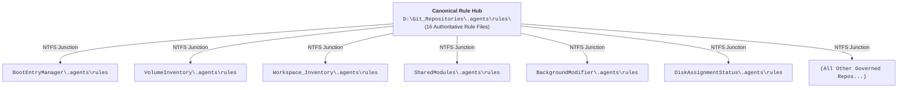

# Lifecycle Model (LCM) Rules Cross-Reference Matrix

**Document Path**: `Workspace_AI/docs/LCM-Rules-Cross-Reference.md`  
**Governance Authority**: `Workspace_AI` / `Workspace_Inventory`  
**LCM Governance Baseline**: `v6.1.1`  
**Author**: Rolf & Antigravity AI Assistant  
**Date**: 2026-08-29  

---

## 1. Rule Discovery & Junction Architecture

All LCM governance rules originate from the **Canonical Hub** at the workspace root and are automatically propagated to child repositories via **NTFS Junctions**:

---

## 2. Master LCM Rules Cross-Reference Table

| # | Rule File | Rule Identifiers | Category / Domain | Scope | Key Mandate & Invariants | Enforcing Tools / Quality Gates |
|:---:|:---|:---|:---|:---|:---|:---|
| **1** | [ProposalReviewFlowPolicy.md](file:///.agents/rules/ProposalReviewFlowPolicy.md) | `RULE-LCM-001` `RULE-LCM-002` `RULE-LCM-003` `RULE-LCM-004` `RULE-LCM-005` `RULE-LCM-006` `RULE-LCM-007` | **Proposal & Review Flow** | Workspace-wide & Child Repos | • Proposal-first intent (`suggested` state). • Batch operations (`do`, `delete`, `defer`). • Review granularity (`coarse` vs `tight`). • Beyond Compare 5 visual review gate. • Dual-commit & push synchronization. • Pause / resume mode controls. • **RULE-LCM-007**: Dual-State Proposal Lifecycle (Plan State + Progress State) & CM Plan Archive (`Workspace_Inventory/data/proposals/plans/`). | • `ProposalManager.psm1` • `Get-OpenProposals.ps1` • `Get-ReposUnderReview.ps1` • `Invoke-ProposalAction.ps1` |
| **2** | [PowerShellStandardsPolicy.md](file:///.agents/rules/PowerShellStandardsPolicy.md) | `RULE-PS-001` `RULE-PS-002` `RULE-PS-003` `RULE-PS-004` `RULE-PS-005` `RULE-PS-006` `RULE-PS-007` `RULE-PS-008` `RULE-PS-009` `RULE-PS-010` `RULE-PS-011` `RULE-PS-012` `RULE-PS-013` `RULE-PS-014` | **PowerShell Standards** | All `*.ps1`, `*.psm1`, `*.psd1` | • Mandatory `@(...)` array wrapping under StrictMode. • 100% Microsoft approved verb compliance (`Get-Verb`). • Colon-safe variable interpolation (`$($var):`). • Test suite elevation gating (`Test-IsAdmin`) & graceful skip. • Header metadata & date maintenance. • Structured logging & `-h` help handler. • Interactive desktop dispatch routing. • Prohibition of bare inline `(if ...)` and `Import-Module -Name`. • Smart Inheritance of parameters. | • `Assert-PesterV5Syntax` • `.githooks/pre-push` • `ProposalManager.Tests.ps1` |
| **3** | [PythonRules.md](file:///.agents/rules/PythonRules.md) | `RULE-PY-001` `RULE-PY-002` `RULE-PY-003` `RULE-PY-004` `RULE-PY-005` `RULE-PY-006` `RULE-PY-007` | **Python Standards** | All `*.py` | • No redundant f-strings (`F541`). • Strict standard library / 3rd party import separation. • Zero unused imports/variables (`F401`/`F841`). • Windows UTF-8 stdout reconfiguration (`sys.stdout.reconfigure`). | • Ruff linter • Subsystem test runners |
| **4** | [ReviewCommitGovernancePolicy.md](file:///.agents/rules/ReviewCommitGovernancePolicy.md) | `RULE-REV-001` `RULE-REV-002` `RULE-REV-003` `RULE-REV-004` `RULE-REV-005` | **Commit Gating & RR** | Governed Repos & Root | • Mandatory review-gated commits (`ACCEPTED`). • Readiness quality gate pass requirement. • Immediate halt on rejected/deferred states. • Universal audit receipts in `Workspace_Inventory/data/reviews/`. | • `Invoke-BeyondCompareReview.ps1` • `Submit-ReviewResult.ps1` • `RR.ps1` |
| **5** | [MethodEfficiencyPolicy.md](file:///.agents/rules/MethodEfficiencyPolicy.md) | `RULE-EFF-001` `RULE-EFF-002` `RULE-EFF-003` `RULE-EFF-004` `RULE-EFF-005` | **Method Efficiency** | CM Ledgers & Evidence | • Auto-acceptance of mechanical evidence (`inventory.json`, logs). • Zero-test cascade invariant on telemetry. • Quality gate short-circuiting on upstream failure. • Zero negative-outcome execution invariant. | • `WorkspaceCM.psm1` • `Invoke-WorkspaceAudit.ps1` |
| **6** | [ElevationPolicy.md](file:///.agents/rules/ElevationPolicy.md) | `RULE-ELEV-001` `RULE-ELEV-002` `RULE-ELEV-003` `RULE-ELEV-004` `RULE-ELEV-005` | **Security & Privileges** | Workspace-wide | • Least-privilege principle (User default). • Elevated runner delegation for admin tasks. • Auto-detection of privileged commands (`bcdedit`, `DiskPart`, `fltmc`). • Elevated console non-auto-close invariant. | • `Invoke-ElevatedTest.ps1` • `Get-RepoCMState` |
| **7** | [LanguagePolicy.md](file:///.agents/rules/LanguagePolicy.md) | `LANGUAGE-POLICY` | **Localization & Naming** | Global Workspace | • English language invariant for code, comments, documentation, and commit messages. • ASCII-only file and directory naming. | • `WorkspaceQualityGates.psm1` • Code reviewers |
| **8** | [RepositoryContextPolicy.md](file:///.agents/rules/RepositoryContextPolicy.md) | `RULE-CTX-001` `RULE-CTX-002` `RULE-CTX-003` `RULE-CTX-004` | **Context Scoping** | Child Repositories | • Active repository scope resolution. • Fast-tier repository context priming (`.lcm/config.json`). • Zero redundant recursive scans. • Global LCM triad awareness (`Workspace_AI`, `Workspace_Inventory`, `SharedModules`). | • `Get-WorkspaceRoot` • `WorkspaceCM.psm1` |
| **9** | [InvariantRules.md](file:///.agents/rules/InvariantRules.md) | `INVARIANT-RULES` | **Core Formatting & Output** | Workspace-wide | • Determinism: identical input $\rightarrow$ identical output. • Reproducibility and zero speculation. • ASCII default (Unicode allowed in `.md` & PS comments). • 2-space indentation, CRLF newlines, UTF-8 without BOM. | • Git hooks • AST syntax checkers |
| **10** | [RuleAuthority.md](file:///.agents/rules/RuleAuthority.md) | `RULE-AUTH-001` `RULE-AUTH-002` | **Governance Hierarchy** | Core Governance | • **RULE-AUTH-001**: Single source of truth at `D:\Git_Repositories\.agents\rules\`. • **RULE-AUTH-002**: **Mandatory Rule Matrix Synchronization** — whenever rules are added/modified, update both `AGENTS.md` and this cross-reference matrix. | • `Test-LCMRuleHealth.ps1` • `Repair-LCMRules.ps1` • Quality gates |
| **11** | [PowerShellRules.md](file:///.agents/rules/PowerShellRules.md) | `POWERSHELL-RULES` | **Scripting Standards** | PowerShell code | • `Set-StrictMode -Version Latest`. • `$ErrorActionPreference = 'Stop'`. • Explicit parameter typing and CmdletBinding. | • Pester test suites • Quality gates |
| **12** | [CMDRules.md](file:///.agents/rules/CMDRules.md) | `CMD-RULES` | **Windows Batch** | `*.cmd`, `*.bat` | • Explicit echo control (`@echo off`). • Error level verification (`if errorlevel 1`). • ASCII-only batch character sets. | • Batch execution runners |
| **13** | [JsonRules.md](file:///.agents/rules/JsonRules.md) | `JSON-RULES` | **Data Serialization** | `*.json` | • UTF-8 without BOM encoding. • 2-space indentation formatting. • `$schema` schema validation references. | • `ConvertTo-Json -Depth 5` |
| **14** | [DocumentationStandardsPolicy.md](file:///.agents/rules/DocumentationStandardsPolicy.md) | `RULE-DOC-001` `RULE-DOC-002` `RULE-DOC-003` `RULE-DOC-004` `RULE-DOC-005` `RULE-DOC-006` | **Documentation Standards** | All `*.md`, `docs/`, `install/` | • Mandatory tripartite core docs (`Architecture.md`, `Requirements.md`, `Implementation.md`). • Audience separation (User View vs Technical Design vs Code Representation). • DOX metadata header invariant across all docs. • Universal `install/Installation.md` 7-phase lifecycle runbook standard. • **RULE-DOC-005**: LCM Major Version Alignment Invariant (`M.Y.Z`). • **RULE-DOC-006**: Major Release Retention Horizon Policy ($M-2$) & Evolution History Taxonomy. | • `WorkspaceQualityGates.psm1` • `Sync-LcmModuleVersions.ps1` • `Flush-LcmLegacyLogs.ps1` |
| **15** | [SubsystemGovernancePolicy.md](file:///.agents/rules/SubsystemGovernancePolicy.md) | `RULE-SUB-001` `RULE-SUB-002` `RULE-SUB-003` `RULE-SUB-004` `RULE-SUB-005` `RULE-SUB-006` | **Subsystem Architecture** | Subsystem Repositories | • Disjunct domain classification & tripartite conformance. • Dedicated internal subsystem inventory engine. • Host-side physical disk hardware serial matching. • Safe Write 5-stage pipeline & JIT ephemeral authentication. • Strict PC vs Subsystem log segregation. • Subsystem Update-Gate & Breaking-Change CRP bundling. | • Subsystem inventory tools • Safe mutation runners • `Invoke-HaUpdateGate.ps1` |
| **16** | [macro-definitions.md](file:///.agents/rules/macro-definitions.md) | `MACRO-DEFS` | **Operator Macros** | Interactive Shell | • Shorthand activation macros: `@IRA`, `@THR`, `@RULEAUTH`, `@ml`. | • Governance CLI dispatcher |

---

## 3. Child Repository Junction Deployment Matrix

The following table lists the active NTFS junctions deployed across all governed child repositories, linking each repository's local `.agents\rules` directly to the Canonical Hub:

| Child Repository Name | Junction Path | Target Canonical Hub | Discovery Status |
|:---|:---|:---|:---:|
| `BackgroundModifier` | `BackgroundModifier\.agents\rules` | `D:\Git_Repositories\.agents\rules` | 🟢 Active |
| `BGMSAMVInv` | `BGMSAMVInv\.agents\rules` | `D:\Git_Repositories\.agents\rules` | 🟢 Active |
| `BootEntryManager` | `BootEntryManager\.agents\rules` | `D:\Git_Repositories\.agents\rules` | 🟢 Active |
| `DiskAssignmentStatus` | `DiskAssignmentStatus\.agents\rules` | `D:\Git_Repositories\.agents\rules` | 🟢 Active |
| `GetRecoveryVolume` | `GetRecoveryVolume\.agents\rules` | `D:\Git_Repositories\.agents\rules` | 🟢 Active |
| `InstallFonts` | `InstallFonts\.agents\rules` | `D:\Git_Repositories\.agents\rules` | 🟢 Active |
| `MacriumTemplateUpdater` | `MacriumTemplateUpdater\.agents\rules` | `D:\Git_Repositories\.agents\rules` | 🟢 Active |
| `MSG file conversion` | `MSG file conversion\.agents\rules` | `D:\Git_Repositories\.agents\rules` | 🟢 Active |
| `NextBootTray` | `NextBootTray\.agents\rules` | `D:\Git_Repositories\.agents\rules` | 🟢 Active |
| `OutlookVBAConversion` | `OutlookVBAConversion\.agents\rules` | `D:\Git_Repositories\.agents\rules` | 🟢 Active |
| `PowerBGInfo` | `PowerBGInfo\.agents\rules` | `D:\Git_Repositories\.agents\rules` | 🟢 Active |
| `ReEnableRadeonRx580` | `ReEnableRadeonRx580\.agents\rules` | `D:\Git_Repositories\.agents\rules` | 🟢 Active |
| `SharedModules` | `SharedModules\.agents\rules` | `D:\Git_Repositories\.agents\rules` | 🟢 Active |
| `TimeStamper` | `TimeStamper\.agents\rules` | `D:\Git_Repositories\.agents\rules` | 🟢 Active |
| `VolumeInventory` | `VolumeInventory\.agents\rules` | `D:\Git_Repositories\.agents\rules` | 🟢 Active |
| `Workspace_Inventory` | `Workspace_Inventory\.agents\rules` | `D:\Git_Repositories\.agents\rules` | 🟢 Active |

---

## 4. Rule Precedence and Exception Hierarchy

1. **Safety & Review Invariant (`RULE-REV-001` / `RULE-LCM-004`)**:
   * Beyond Compare 5 visual review is strictly required before any Git commit.
   * **Sole Exemption**: `Workspace_Inventory` is exempt from visual review because it is purely agent/tool-controlled CM ledger data.
2. **Efficiency Invariant (`RULE-EFF-001` - `RULE-EFF-004`)**:
   * Mechanical telemetry, logs, and audit files are auto-accepted and never trigger test cascades or review pauses.
3. **Execution Integrity (`RULE-PS-001` - `RULE-PS-006`)**:
   * Strict mode array wrapping, Microsoft verb compliance, pipeline hygiene, and Pester v5 hyphenated syntax are non-negotiable quality gate invariants across all repositories.
4. **Governance Synchronization (`RULE-AUTH-001` - `RULE-AUTH-002`)**:
   * Single source of truth with mandatory synchronization of top-level `AGENTS.md` and this cross-reference matrix upon any rule modification.

