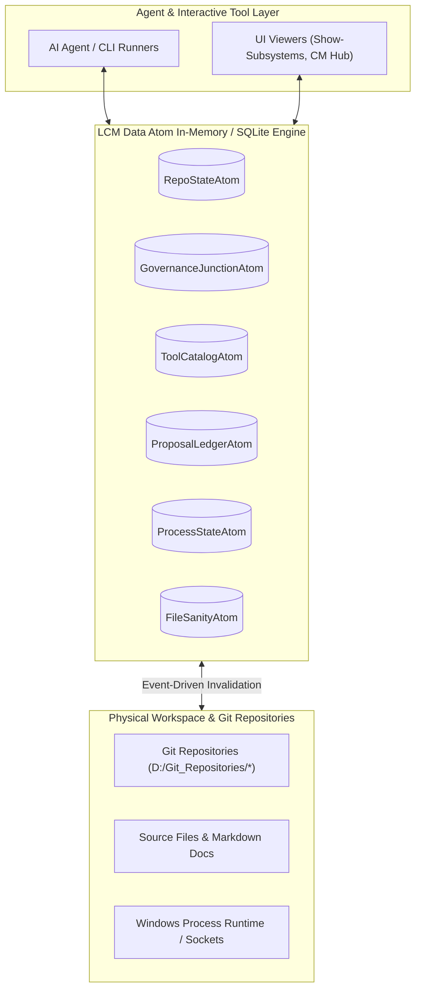

# Reusable Data Atoms & Behavioral Patterns for Optimization

Module: docs/Optimizations/Data-Atoms-and-Design-Patterns.md  
Authors: Rolf, Workspace_AI Engine  
Version: 1.0.0  
Status: Authoritative Design Document  
Date: 2026-09-28  

---

## 1. Executive Summary

A critical finding from session telemetry across both the active run (`f0c912b4...`) and the preceding session (`d70cb53b...`) is that execution time is heavily dominated by **redundant, brute-force state discovery**. 

Agents repeatedly re-query git repository boundaries, parse the 400KB `proposals.json` ledger, re-scan directory trees for NTFS junctions, and poll process tables using transient PowerShell scripts. By formalizing these repeated information needs into **Data Atoms** (comparable to functional atoms in the Lifecycle Model), we can design a high-performance in-memory cache and future relational database schema that drastically reduces turn duration and agent tool churn.

---

## 2. Identified Data Atoms & Schema Specifications

### Atom 1: `RepoStateAtom` (Git Repository Matrix)

* **Behavioral Pattern Observed**:
  * Repeated execution of `Get-ChildItem -Directory | ForEach-Object { git rev-parse; git status }` across 24 directories in `D:\Git_Repositories`.
  * Occurred dozens of times across both sessions to verify clean working trees and branch tracking.
* **Proposed Entity Schema**:
  ```json
  {
    "repo_name": "SharedModules",
    "root_path": "D:/Git_Repositories/SharedModules",
    "is_git": true,
    "current_branch": "main",
    "head_commit": "a1b2c3d",
    "is_dirty": false,
    "ahead_count": 0,
    "behind_count": 0,
    "absorbed_lcm_version": "1.4.0",
    "last_scanned_at": "2026-09-28T20:30:00Z"
  }
  ```
* **Optimization Impact**:
  Replaces 72+ individual shell subprocess calls (`git rev-parse`, `git status`) per audit pass with a single indexed state lookup, invalidating only when a git hook or commit runner fires.

---

### Atom 2: `GovernanceJunctionAtom` (NTFS Junction & Hardlink Registry)

* **Behavioral Pattern Observed**:
  * Ad-hoc script loops verifying whether `.agents/rules` is a junction pointing to `Workspace_AI/.agents/rules`, whether `.mcp.json` is a hard link, and checking for orphaned junction targets.
* **Proposed Entity Schema**:
  ```json
  {
    "repo_name": "SharedModules",
    "link_path": ".agents/rules",
    "link_type": "Junction",
    "target_path": "D:/Git_Repositories/Workspace_AI/.agents/rules",
    "is_healthy": true,
    "checked_at": "2026-09-28T20:00:00Z"
  }
  ```
* **Optimization Impact**:
  Enables O(1) workspace compliance checks without running recursive file system tests across all sibling repositories.

---

### Atom 3: `ToolCatalogAtom` (Tool Manifest & Command Trampoline Registry)

* **Behavioral Pattern Observed**:
  * Continuous crawling of `.lcm/tools/` and `Workspace_Inventory/tools/`, invoking AST parsers to extract parameters and descriptions, and generating `.cmd` trampolines.
  * Repeated regex parsing led to prefix recursion bugs (`LCMLCMLCM...ClearBCReviewTemp.cmd`).
* **Proposed Entity Schema**:
  ```json
  {
    "tool_id": "Show-Subsystems",
    "script_path": "D:/Git_Repositories/.lcm/tools/hub/Show-Subsystems.ps1",
    "short_name": "ShowSubsystems",
    "prefixed_short_name": "LCMShowSubsystems",
    "category": "Hub",
    "requires_elevation": false,
    "has_help_flag": true,
    "trampoline_files": [
      "D:/Git_Repositories/.lcm/Cmd/ShowSubsystems.cmd",
      "D:/Git_Repositories/.lcm/Cmd/LCMShowSubsystems.cmd"
    ],
    "is_retired": false,
    "hash_sha256": "e3b0c44298fc1c149afbf4c8996fb92427ae41e4649b934ca495991b7852b855"
  }
  ```
* **Optimization Impact**:
  Eliminates speculative trampoline generation and race conditions. Changes are only committed when the tool's SHA-256 hash changes.

---

### Atom 4: `ProposalLedgerAtom` (CRP & Change Request Ledger)

* **Behavioral Pattern Observed**:
  * In both sessions, `proposals.json` (9,180+ lines, ~404 KB) was deserialized from disk repeatedly just to inspect the state or `origin_repo` of 1 or 2 proposals.
* **Proposed Entity Schema**:
  ```json
  {
    "id": 185,
    "title": "Decouple .lcm operational logs and consolidate to Workspace_Inventory",
    "origin_repo": "Workspace_Inventory",
    "state": "in_progress",
    "priority": "P1",
    "author": "Rolf",
    "plan_path": "Workspace_Inventory/data/proposals/plans/Proposal-185_Plan.md",
    "created_at": "2026-09-28T18:00:00Z",
    "updated_at": "2026-09-28T20:15:00Z"
  }
  ```
* **Optimization Impact**:
  Transitioning this ledger to an indexed store (or SQLite backing file) enables millisecond point-queries by `id` or `state` rather than parsing 400KB of JSON on every turn.

---

### Atom 5: `ProcessStateAtom` (Daemon & Background Service Health)

* **Behavioral Pattern Observed**:
  * Multiple queries across sessions checking whether `LcmDesktopDaemon.ps1` was running, identifying its PID (e.g. 29336), and determining which port (9876) it bound to.
  * Attempting file operations on logs while the process was still alive caused file lock contention.
* **Proposed Entity Schema**:
  ```json
  {
    "service_name": "LcmDesktopDaemon",
    "pid": 29336,
    "listening_port": 9876,
    "session_id": 1,
    "command_line": "pwsh ... LcmDesktopDaemon.ps1",
    "status": "Online",
    "active_log_file": "D:/Git_Repositories/Workspace_Inventory/data/logs/lcm-internal/LcmDesktopDaemon-20260928.log",
    "started_at": "2026-09-28T19:30:00Z"
  }
  ```
* **Optimization Impact**:
  Provides single-source truth for daemon management, preventing duplicate spawns and handle collision.

---

### Atom 6: `FileSanityAtom` (Encoding, Line-Ending & BOM Registry)

* **Behavioral Pattern Observed**:
  * Repeated execution of byte-array readers (`[System.IO.File]::ReadAllBytes()`) across markdown files to detect UTF-8 BOM (`0xEF, 0xBB, 0xBF`) and non-CRLF line endings (`\n` without `\r`).
* **Proposed Entity Schema**:
  ```json
  {
    "file_path": "docs/Requirements.md",
    "size_bytes": 4855,
    "has_bom": false,
    "has_crlf": true,
    "has_lf_only": false,
    "is_clean_ascii_or_utf8": true,
    "hash_sha256": "f8d1c7..."
  }
  ```
* **Optimization Impact**:
  Quality gates can check sanity incrementally by comparing file modification timestamps against cached hashes rather than performing byte-level scans of the entire workspace.

---

## 3. Architecture Roadmap for Database Integration



### Proposed Next Phase Implementation Steps
1. **Unified State Cache Module (`LcmDataAtoms.psm1`)**: Implement a fast, in-memory caching module backed by a lightweight SQLite db or local JSON key-value store in `Workspace_Inventory/data/cache/`.
2. **Event-Driven Cache Invalidation**: Update Git review runner (`Invoke-BeyondCompareReview.ps1`) and push conductor (`Invoke-WorkspacePush.ps1`) to invalidate only the affected atoms upon commit/push.
3. **Zero-Subprocess Query API**: Replace raw `pwsh` ad-hoc string commands with structured cmdlet calls (e.g. `Get-LcmRepoState -Repo SharedModules`).
