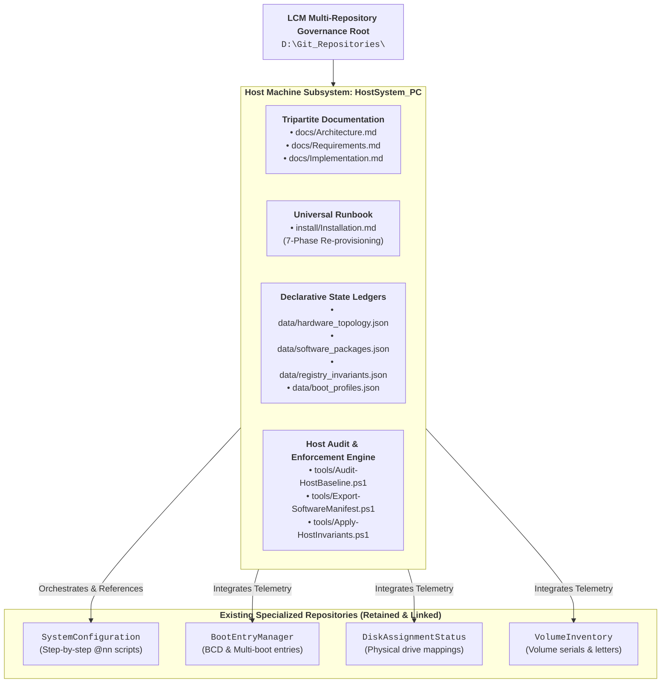

# Architectural Proposal: PC Host Subsystem Repository (`HostSystem_PC`)

Module: PC_Host_Subsystem_Architecture_Proposal.md  
Purpose: Authoritative architectural proposal and specification for modeling the physical Host PC as a dedicated Lifecycle Model (LCM) Subsystem.  
Path: Workspace_AI/docs/PC_Host_Subsystem_Architecture_Proposal.md  
Authors: Rolf, Workspace_AI Architecture Engine  
Version: 1.0.0  
Status: Architectural Proposal  
Date: 2026-08-27  

---

## 1. Executive Summary & Problem Statement

Currently, configuration management across the developer PC is distributed among several specialized tools and scripts:
* **Customization scripts** (`@00` through `@22`) in `SystemConfiguration/Source`.
* **Hardware stability & anti-flicker policies** in `Restore-SystemSettings.ps1` and `Set-MouseFlickerInvariants.ps1`.
* **Disk, partition, and boot manager data** in `DiskAssignmentStatus`, `VolumeInventory`, and `BootEntryManager`.
* **Tool registry & runtime daemons** in `tools/`.

However, the physical machine itself—its hardware topology, firmware baselines, multi-boot layout, installed software packages (WinGet, Scoop, portable tools, commercial installers), and exact disaster-recovery re-provisioning procedure—lacks a single, authoritative repository container.

By modeling the **Host PC itself as a first-class Lifecycle Model Subsystem (`HostSystem_PC`)**, we bring the exact same rigor, tripartite documentation (`Architecture.md`, `Requirements.md`, `Implementation.md`), automated drift reconciliation (`data/host_inventory.json`), and universal runbook (`install/Installation.md`) to the host environment as we do for domain subsystems like `HaSSD06`.

---

## 2. High-Level Architecture & Domain Boundaries



---

## 3. Core Component Manifest & Declarative Ledgers

The `HostSystem_PC` repository will maintain declarative JSON ledgers in `data/` describing the complete state of the host:

### 3.1 Hardware & Firmware Baseline (`data/hardware_topology.json`)
* **Host Identity**: System UUID, Computer Name (`D5P0-SSD980-Z`), Motherboard Model, BIOS version.
* **CPU & RAM**: Processor model, core topology, total physical memory, DIMM timings.
* **GPU & Display Topology**: AMD Radeon RX 580 (PCIe bus ID, Driver version `Adrenalin`), connected display outputs, refresh rates, and color profiles.
* **Storage Controllers & NVMe Drives**: Samsung SSD 980 Pro, SATA controllers, disk serial numbers, partition layout table.

### 3.2 Software Package Registry (`data/software_packages.json`)
Consolidates all software tiers into a single declarative manifest:
1. **WinGet Packages**: Managed via `winget export -o data/winget_packages.json` (VSCode, Git, PowerShell 7, 7-Zip, PowerToys, etc.).
2. **Scoop / CLI Toolchains**: Python runtime versions, Node.js, Rust, Go, ripgrep, Everything CLI.
3. **Portable & Workspace Tools**: `D:\Tools\...` (Notepad++, Beyond Compare 5, Lopesoft FileMenuTools, Rufus).
4. **Licensed & Commercial Software**: Registered commercial packages with version baselines and licensing recovery notes.

### 3.3 System Invariants & Customizations (`data/registry_invariants.json`)
* **Security Policies**: `EnableSecureUIPaths = 0`, UAC Prompt Behavior, Secure Desktop Dimming (`PromptOnSecureDesktop = 0`).
* **Display & Driver Invariants**:
  - `DisableULPS = 1` (Ultra Low Power State disabled for RX 580).
  - `OverlayTestMode = 5` (DWM Multi-Plane Overlay stability lock).
* **Shell & Explorer Extensions**:
  - Context menu `New -> PowerShell Script (.ps1)`.
  - FileMenuTools shell handlers.
  - Windows Explorer column layouts and ribbon preferences.
* **Font Registry**: Fira Code, Fira Mono, Cascadia Code system-wide installation records.

### 3.4 Multi-Boot & Partition Matrix (`data/boot_profiles.json`)
* Master BCD identifiers and boot menu hierarchy.
* Volume drive letter assignments across multi-boot instances (`A:`, `C:`, `D:`, `P:`, `Z:`).
* AI memory shared linkage (`A:\.gemini` mapped to `%USERPROFILE%\.gemini`).

---

## 4. Universal 7-Phase Re-Provisioning Runbook (`install/Installation.md`)

Per `RULE-DOC-004`, `HostSystem_PC` will implement the standard 7-phase runbook enabling 100% reproducible bare-metal or disaster recovery setup:

| Phase | Title | Scope & Actions |
|:---:|:---|:---|
| **Phase 1** | **Pre-Requisites & Hardware Verification** | Motherboard BIOS settings, TPM bypass flags (`@00-Skip_TPM_Check`), UEFI boot configuration, SATA/NVMe controller modes. |
| **Phase 2** | **OS Installation & Base Partitioning** | Windows 11 base image deployment, disk partitioning, EFI system partition setup, secure volume drive letter anchoring (`Set-SecureDVolume.ps1`). |
| **Phase 3** | **Core Toolchain & Package Installation** | Automated WinGet / Scoop batch installation (`winget import -i data/winget_packages.json`), PowerShell 7 runtime, Git, Beyond Compare 5. |
| **Phase 4** | **Hardware Drivers & Invariant Locking** | AMD Radeon RX 580 driver deployment, ULPS suppression, DWM MPO overlay lock (`Set-MouseFlickerInvariants.ps1`), Logitech update suppression (54/54 items). |
| **Phase 5** | **System Personalization & Shell Setup** | Master execution of `00-Apply_All_Customizations.ps1` (steps `@00` through `@22`), Fira fonts installation, shell context menus, Explorer settings. |
| **Phase 6** | **LCM Workspace & Tooling Registration** | Cloning `D:\Git_Repositories`, configuring NTFS rule junctions, registering `LcmDesktopDaemon` (Port 9876 auto-start and auto-restart policy), compiling `tool_catalog.json`. |
| **Phase 7** | **Post-Install Verification & Baseline Audit** | Running `Invoke-WorkspaceAudit.ps1` and `Audit-HostBaseline.ps1` to confirm 100% drift-free operational readiness. |

---

## 5. Automated Host Baseline Audit Engine (`Audit-HostBaseline.ps1`)

The repository will include an automated audit tool that performs non-destructive verification:
```powershell
# Run full host baseline audit against committed declarative state
pwsh -File tools/Audit-HostBaseline.ps1

# Export fresh live state to JSON ledger (telemetry / auto-accepted)
pwsh -File tools/Audit-HostBaseline.ps1 -Export
```

* **Drift Detection**: Detects any unrecorded software installations, altered registry policies, reverted hardware stability flags, or missing fonts.
* **Auto-Reconciliation**: Generates Change Request Proposals (CRPs) or offers one-click invariant remediation (`tools/Apply-HostInvariants.ps1`).

---

## 6. Implementation Roadmap & Next Steps

1. **Step 1: Initialize Repository**:
   - Create `D:\Git_Repositories\HostSystem_PC` (or `PC_Host_Configuration`).
   - Establish `.lcm/config.json` with `type = "subsystem"` and `domain = "host_pc"`.
   - Deploy canonical `.agents/rules` NTFS junction.
2. **Step 2: Generate Core Tripartite Documents**:
   - `docs/Architecture.md`: Detailed hardware, OS, and software layer models.
   - `docs/Requirements.md`: Invariant rules, stability baselines, and performance thresholds.
   - `docs/Implementation.md`: Script call graphs, automation workflows, and registry mappings.
3. **Step 3: Export Live Host Baselines**:
   - Capture live WinGet packages, registry keys, driver versions, and disk topologies into `data/*.json`.
4. **Step 4: Author Universal Installation Runbook**:
   - Build `install/Installation.md` conforming to the 7-phase standard.
5. **Step 5: Register in Workspace Tool Catalog**:
   - Index `HostSystem_PC` audit and management tools in `tools/tool_catalog.json` and `tools/README.md`.
